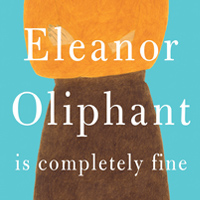
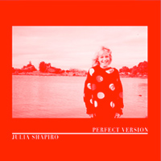
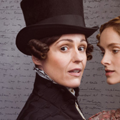
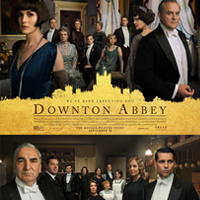
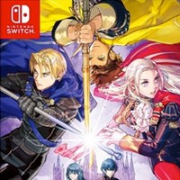
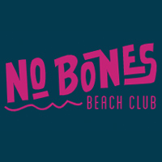
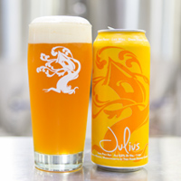

+++
date = "2020-01-25T10:31:38-04:00"
draft = false
title = "2019 Favorites"
categories = ["Yearly Favorites"]
tags = ["Movies", "TV", "Books", "Video Games"]
summary = "My favorite books, TV shows, movies, and more from 2019."
+++

I really enjoy end-of-year lists, and so before it gets too far into 2020, here are my favorites from 2019. Some of these were released in 2019, some were just things I happened to enjoy in 2019.

## Book

  

I read [a lot of fantasy](https://www.goodreads.com/user_challenges/14830197) this year. I really enjoyed the sprawling, at times ultra-violent sci-fi series Red Rising by Pierce Brown,
in particular the first and third books. We Were Eight Years in Power, a collection of essays from Obama's presidency by Ta-Nehisi Coates was also a moving read.

My favorite book overall, though, was Eleanor Oliphant is Completely Fine by Gail Honeyman. This book managed to be that rare combination of hilarious (truly laugh-out-loud funny at times) and heartbreaking.

## Music

  

Spotify said my most-listened to album was Julia Shapiro's Perfect Version,
and that sounds about right for my favorite music of the year. Listen to it on [Spotify](https://open.spotify.com/album/43FQQVHJfUZzflPXa0Fg82?si=74S4e2hkTA-wZfGxbP52Cw) or get it on [Bandcamp](https://juliashapiro.bandcamp.com/album/perfect-version).

I also listened to a lot of Chastity Belt, Big Thief,
Sleater-Kinney, and Team Dresch (whose albums made it to Spotify for the first time
this year!) Lizzo gets honorable mention as well, 2019 was really her year.

## TV

  

My favorite TV show was Gentleman Jack, which is based on the historical diaries of Anne Lister. The show is a drama but has a comedic tone to it that I appreciate. It's also gay, which I likewise appreciate.

I also really enjoyed Dickinson (the first few episodes in particular are so funny)
and Unbelievable (a moving, important drama based on a true story.)

## Movie

  

I don't watch a lot of movies. TV has ruined me in some ways because there's so
much good TV out there that I often prefer to dig into a TV show than watch a movie. But, I did really enjoy the Downton Abbey movie! I suspect if you aren't a fan of the TV show the movie will be lost on
you, but it was perfect as a capstone to the show: just enough drama, some banter, some sweeping shots of the English countryside, and everything neatly buttoned-up by the end.

Other movies I enjoyed this year: The Florida Project and The Irishman.

## Video Game

  

I really enjoyed Fire Emblem: Three Houses (for the Switch.) I had never
played a Fire Emblem game before, but a friend recommended this one to me, and I'm
addicted to it. It's part turn-based tactics, part min/maxing RPG, part teaching
simulator, and part...dating sim? (Team Edelgard, by the way.) Honestly, it's so
great, and one of those games I would never have tried if no one had actually recommended
it to me.

## Website

  

I finally ponied up for a subscription to [The Athletic](https://theathletic.com/), and it's an
amazing blend of all the sports coverage I enjoy: NFL, including great beat reporting
on the Packers, fantasy football, and women's soccer (both NWSL and UK.) There's really no other site that caters to my kind of oddball sports needs, and I'm very glad to be able to support women's soccer coverage in particular.

## Meal

  

I ate at lots of great restaurants this year (turns out being close to New York City is great for good food.) But, I'm going to say [No Bones Beach Club](https://nobonesbeachclub.com/) in Seattle, a vegan tiki bar (I'm not vegan, for the record, but I do love vegan food.)
I had an amazing meal there with my friend when I visited this fall: vegan nachos,
buffalo tempeh, and the most amazing coconut milk daiquiris. A lot of meals are about context,
and the context of this was so nice: a quiet afternoon, catching up with a dear
friend over a long meal.

## Beer

  

The best beer I had this year was Julius by Tree House Brewing
from Massachusetts. This beer is very popular for good reason: it embodies everything
I love about New England IPAs: hazy, juicy, perfectly balanced. The worst thing about this beer is that you can only get it at the brewery.

