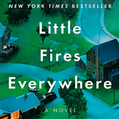
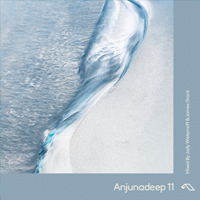
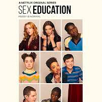
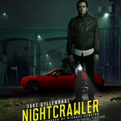
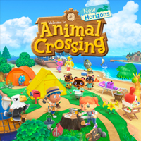
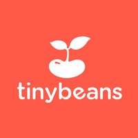
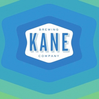

+++
date = "2021-01-10T08:31:38-04:00"
draft = false
title = "2020 Favorites"
categories = ["Yearly Favorites"]
tags = ["Movies", "TV", "Books", "Video Games"]
featured = ["true"]
summary = "My favorite books, TV shows, movies, and more from 2020."
+++

2020 was...a year. I don't want to rehash it, you all know the COVID-19 pandemic changed so many of our lives in big and small ways. I felt my privilege even more than usual in 2020 as my employment wasn't affected, but the changes still wore on me, as they did for so many people. We also had a baby in 2020, which changed my life profoundly. Maybe I'll write more about that here at some point.

All that being said...I would still like to reflect on my favorite media and other things from the year. Some of these categories certainly ended up different than I thought they would because of the unusual circumstances that this year brought.

## Book

  

I set a goal of reading 35 books and [missed it by quite a bit](https://www.goodreads.com/user_challenges/19673326) (23/35.) I ended up not reading as much in the early days of being a parent, which makes sense, I think! I still read a lot of fantasy, including re-reading the Lord of the Rings for the first time in 19 years. I also threw a couple parenting books into the mix.

But my favorite book was Little Fires Everywhere by Celeste Ng. I loved the constantly shifting narrator and the way she used different timescales. The setting reminded me a bit of the small Ohio town I grew up in as well.

## Music

  

I didn't feel like I listened to or explored as much new music this year as I have in previous years. I would pin my favorite album as [Anjunadeep 11](https://anjunadeep.bandcamp.com/album/anjunadeep-11), a relaxing, melodic electronic dance music compilation from the Anjunadeep label. I wasn't familiar with them before this, but I came back to it again and again in 2020.

Honorable mention goes to Squirrel Flower, who happened to attend my Alma mater, and I heard about her via our alumni network. Her 2020 album, [I Was Born Swimming](https://squirrelflower.bandcamp.com/album/i-was-born-swimming), is well worth a listen, and I'm looking forward to whatever she does next.

## TV

  

My favorite TV show in 2020 came early, season 2 of Sex Education on Netflix. It's a great blend of comedy and drama. It captures how wonderfully awkward adolescence can be. At the same time, this season addressed some really important issues in surprisingly thoughtful ways.

I also really enjoyed the German TV Netflix released this year: I watched season 1 of Dark (season 2 got a little too...out there for me) and also really enjoyed both seasons of How to Sell Drugs Online...Fast.

## Movie

  

Once again, I didn't watch that many movies, and so the ones I'm writing about here definitely didn't come out in 2020, but, oh well! I enjoyed Parasite and, oddly, Midsommar. Midsommar in particular is the type of movie I wouldn't think I would like, because it's a gory, weird horror film, but something about it just worked for me.

My favorite movie, though, was an even older film, Nightcrawler. I thought the acting was excellent and it had a good blend of dark humor and social commentary all packaged in a good, thrilling story.

## Video Game

  

Unquestionably, Animal Crossing: New Horizons for the Switch. I'd never played an Animal Crossing game before, but this game came out right as the pandemic started and it warmed my heart just as it did for so many others this year. For a few months, it was all I played. I don't often fall so hard for games anymore, and it was just perfectly timed.

For a few weeks, Fall Guys was also all I was playing with my friends, and its success also deserves a mention here.

I started replaying the Witcher 3 as well, and that game is still one of my favorites of all time. I had hoped to play Cyberpunk 2077, but my computer and life are just not built for it right now, and so that one, which a few years ago I would have thought would take my personal game of the year, is going to have to wait.

## Website

  

I don't see an obvious winner in this category. I did start using the app [Tinybeans](https://tinybeans.com/) as a way to securely deliver all the baby photo/video content my family could ever hope to see in a single, streamlined manner, and so I will list Tiny Beans as my favorite site, though I mostly use it in app form.

## Meal

  

Oof, this one is tough to write about, because I haven't been in a restaurant since February of 2020. And so I will choose the last restaurant meal I had, which happens to be an excellent one, at Blue Hill in New York City. Blue Hill is a pioneer of the farm-to-table movement, and so I was a little nervous about seeing what their seasonal menu would be in the middle of winter, but I needn't have worried. The meal was excellent and featured lots of cured meat and pickled vegetables.

## Beer

  

Like my favorite meal, this category was a bit dampened by the circumstances of 2020. Still, I got to try some nice New Jersey beers in my new home state, and my favorite was Party Wave from Kane Brewing. Another New England IPA, my favorite style these days.

