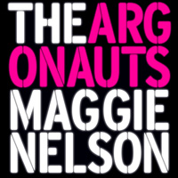
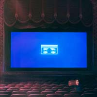
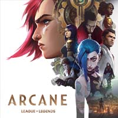
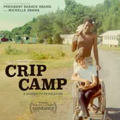
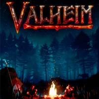
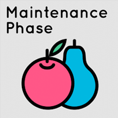
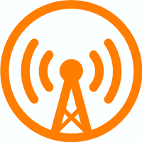

+++
date = "2022-01-16T15:04:02-05:00"
draft = false
title = "2021 Favorites"
categories = ["Yearly Favorites"]
tags = ["Movies", "TV", "Books", "Video Games"]
summary = "My favorite books, TV shows, movies, and more from 2021."
+++

Oh, wow, it’s been another YEAR, right? Certainly on the global scale. But, I was also busy this year personally—moving, [buying our first house](https://www.hannasthoughts.com/buying-a-house-in-2021/), [starting a new job](https://www.hannaliebl.com/blog/2021-year-in-review/), [maternity leave](https://www.hannasthoughts.com/thoughts-on-parenthood-so-far/), thinking COVID was over and then not…it’s been a lot. Honestly, I'm tired. I hope 2022 is less eventful and more restful.

But anyway, for the past few years I've been cataloging my favorite things I read/watched/listened to/played, and so here are my 2021 favorites. As always, sometimes these are favorites that actually came out this year, but I don’t limit myself to that.

## Book

  

This was one of my lowest book counts in recent years ([here are the 12 books I read](https://www.goodreads.com/user_challenges/25875243)). I think parenthood definitely influenced that. I’m still adjusting to different constraints on my time. I also spent nearly half the year reading the entirety of the Stormlight Archives, which is amazing, but each book is very long.

Anyways, my favorite book wasn't published this year but I finally read it: [The Argonauts](https://www.indiebound.org/book/9781555977351) by Maggie Nelson. I wept like a baby during the last scenes where she writes about childbirth and the death of her mother. A close second was [In the Dream House](https://www.indiebound.org/book/9781644450031) by Carmen Maria Machado. Both that and the Argonauts are really cool takes on memoir/lit theory.

## Music

  

I spent a lot of this year, frankly, not listening to music or not seeking out new music, which is unusual for me, but it’s been an unusual year. Anyways, I did catch up on a bunch of music in November and December and found a lot to love. My favorite album goes to [Home Video](https://lucydacus.bandcamp.com/album/home-video) by Lucy Dacus. The songwriting is incredible and I loved it from start to finish. It captures so much about adolescence and high school while being relevant to my current age.

I also really loved [Little Oblivions](https://julienbaker.bandcamp.com/album/little-oblivions) by Julien Baker (look, I had a bit of a [boygenius](https://xboygeniusx.bandcamp.com/album/boygenius) revival moment this year, can you blame me?) I also enjoyed listening to [girl in red](https://girlinred.bandcamp.com/). If I were in high school today, I would be obsessed with her music, I am sure of it. Where was all this gay music in 2004ish, huh? I’m so excited that so much indie music is being made by women and queer women, at that. It’s a marked difference from 15 years ago.

I also went to a concert! What a novelty! I saw [Big Thief](https://bigthief.bandcamp.com/), and they were awesome.

## TV

  

The best show of 2021 was an animated show based on a video game I don't play. What? Really? Yes. It's [Arcane](https://www.netflix.com/title/81435684).

First, the animation is incredible. I am not normally into animated shows, but the animation and art direction blew me away. Second, the story and characters are incredible. You think you know what is happening after two episodes, but the third and fourth episodes completely change everything. Every character is nuanced and sympathetic, even the villains. It's a heart-wrenching, emotional ride, in a world that is so well-done. I can't write enough to praise it. Just watch it. It might actually be my favorite show of all time. I watched it once and then immediately watched it again and started reading Arcane fan fiction (this is a first for me.)

I also loved [Dickinson](https://tv.apple.com/us/show/dickinson/umc.cmc.1ogyy5s2agasxa5qztabrlykn). We were spoiled with two seasons this year. Season 3 was incredible and timely.

## Movie

  

Once again, I didn't watch that many movies. But still, my favorite one was the documentary [Crip Camp](https://www.netflix.com/title/81001496). It came out in 2020 and was totally snubbed at the Oscars. It's about a camp in upstate New York in the 60s and 70s for kids with disabilities and about the disability rights movement in America in general. It's a beautiful film about a civil rights movement that is still mostly hidden in American culture and consciousness, and it's well worth a watch.

## Video game

  

My favorite game of 2021 was [Valheim](https://www.valheimgame.com/). I didn't even play it for that long, but for the few weeks that my friends and I started a server together, and I crafted and hunted and built an elaborate Viking longhouse while fending off troll attacks, I was completely obsessed. It reminded me of how I used to play and think about video games as a teenager when I had so much more time. If my life were different, I would play it all day, but as it is, I look back on my weeks with it fondly.

I also had an amazing time with [Hades](https://www.supergiantgames.com/games/hades/). It was the perfect game to play on the Switch during my maternity leave. I got many runs in during my kid's naps. I've never enjoyed or been good at roguelikes, but Hades makes the genre work narratively in the best way.

Finally, I continued my years-long playthrough of the Witcher 3. I finished the base game and the Hearts of Stone DLC and am working on the Blood and Wine DLC. It's still my favorite video game ever, I think.

## Podcast

  

I'm retiring the food and beer categories this year (RIP going to restaurants), but I am going to add a podcast category because I listened to a fair amount this year (holding a sleeping, teething baby and listening to podcasts: a classic combo, I've found.)

My favorite podcast of 2021 was easily [Maintenance Phase](https://www.maintenancephase.com/). It's the best take on diet culture and health I've ever listened to. I also finally found a good video game podcast: [Triple Click](https://maximumfun.org/podcasts/triple-click/). I usually find video game podcasts annoying because of endless banter, poor hosts, and general lack of focus, but Triple Click gets that all right.

## App/Website

  

To go along with all the podcasts I listened to, I really loved the [Overcast](https://overcast.fm/) app this year. I mean, anything is better than the default Apple Podcasts app, but I found that having a good podcast app helped me listen to podcasts more consistently.

