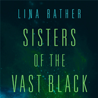
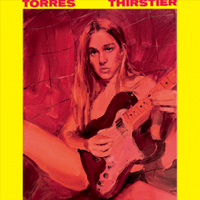
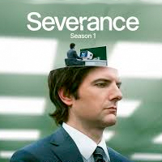
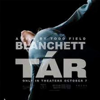
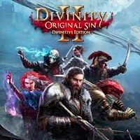
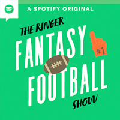

+++
date = "2023-01-21T08:04:02-05:00"
draft = false
title = "2022 Favorites"
categories = ["Yearly Favorites"]
tags = ["Movies", "TV", "Books", "Video Games"]
summary = "My favorite books, TV shows, movies, and more from 2022."
+++

Another year has slipped by! I spent a fair amount of energy and time on [house](https://www.hannasthoughts.com/categories/house/)/[garden](https://www.hannasthoughts.com/categories/garden/) projects. I got a new job. My favorite job is still being the parent of a tiny, wonderful human. Here are my 2022 favorites. As usual, not all of these things were released/published in 2022, some of them were just my favorite thing in a given category that I watched/read/listened to/used this year.

## Book

  

This was one of my [worst reading years](https://www.goodreads.com/user/year_in_books/2022/1932853) in recent memory. I'm not sure why? Life is just busy, and reading took a backseat. I started and didn't finish a fair number of books, too. I'd like to change that in 2023, but we will see. I started by deleting Twitter off of my phone, which is a small way to get more time for reading back.

My favorite of the nine books I read is a novella called [Sisters of the Vast Black](https://www.goodreads.com/book/show/44581558-sisters-of-the-vast-black). The campy premise is "nuns in space" (including a lesbian nun, of course), which is great in and of itself, but it's a wonderful, tight story in a gorgeously realized sci-fi world.

I struggled through the [Baru Cormorant](https://www.goodreads.com/book/show/23444482-the-traitor-baru-cormorant) books and the second of the Locked Tomb series, [Harrow the Ninth](https://www.goodreads.com/book/show/39325105-harrow-the-ninth). They were challenging and ultimately I'm glad I stuck with them (Harrow in particular), but maybe I need to read some books that don't feel like such a slog in 2023, and that will help. I am still really enjoying this renaissance of sci-fi/fantasy books with lesbians and queer people as main characters, and I'm sure that will continue in 2023. Stay tuned.

## Music

  

I discovered [Torres](https://torrestorrestorres.bandcamp.com/) this year! What an amazing musician. I found out about her through her partner's instagram, the artist [Jenna Gribbon](https://www.instagram.com/jennagribbon/?hl=en), which is a first. I will list her most recent album, [Thirstier](https://torrestorrestorres.bandcamp.com/album/thirstier), as my favorite, but her entire catalog is great.

As for music that came out this year, I also discovered the band [Momma](https://mommaband.bandcamp.com/) (they opened for Snail Mail, one of my favorite bands), and I really enjoyed their music as well.

## TV

  

I watched a lot of TV this year...probably too much, but there was also a lot of good TV! My favorite show is [Severance](https://tv.apple.com/us/show/severance/umc.cmc.1srk2goyh2q2zdxcx605w8vtx). It's a bit of a slow burn, but every episode the stakes get higher, the puzzle and questions about this odd setup (basically, an agreement where your you sever yourself into two pieces that don't remember each other: your work self, and the self that exists outside of work) It's a black comedy, workplace drama, and a bit of a thriller.

Coming in a close second was [Andor](https://disneyplusoriginals.disney.com/show/andor). Andor is a Star Wars show, but you wouldn't really know it while watching. There's no force, no mysticism, no grand hero. Just a grim, realistic take on the fight against fascism, and the huge bureaucratic machine of the Empire. It's a spy thriller/heist show, and it's better than any Star Wars movie or show I've seen in decades, and among the best TV of this year in general.

I also enjoyed [Bad Sisters](https://tv.apple.com/us/show/bad-sisters/umc.cmc.14kr4vv65unannh7doqgvlh20) (dark comedy), [Motherland: Fort Salem](https://www.hulu.com/series/motherland-fort-salem-f4589e2a-215e-431f-a2f6-66000a06a05c) (matriarchy, alternative history, witches, lesbians...really wish more shows like this existed...the final seasons were not that great, but I binged it regardless), and [House of the Dragon](https://www.hbo.com/house-of-the-dragon) (Game of Thrones, but with women as the stars of the show, intrigue and politics galore.) Even [The Rings of Power](https://www.amazon.com/Lord-Rings-Power-Season/dp/B09QH98YG1) (Amazon's billion dollar Lord of the Rings show), for all its flaws, is worth a mention. It was a big year for fantasy/sci-fi TV in general.

## Movie

  

I am trying to watch more movies. I feel like I've lost an ability to appreciate or critique movies after years of not watching more than a handful each year. They demand a different attention than TV shows, and some movies place an emphasis on different things than TV shows do (metaphor, symbolism, mood, etc. rather than straight story/spectacle.)

My favorite of the 2022 releases that I watched was [Tár](https://www.imdb.com/title/tt14444726/). Cate Blanchett is amazing in it. It's a movie about power and abuse of power, focusing on a fictional composer-conductors named Lydia Tár. I also enjoyed [Triangle of Sadness](https://www.imdb.com/title/tt7322224/), a black comedy (and in many ways a physical comedy) about ultra-wealthy people on a doomed yacht cruise.

A new-to-me movie I watched for the first time was [The Favourite](https://www.imdb.com/title/tt5083738/). It's another black comedy, this time set in 18th century England featuring a love/power triangle between Queen Anne and two women in her court.

## Video Game

  

I'm years behind on video games, because I made a pact with myself to actually play through (some) of my backlog before buying new games. This will likely change in 2023 as I am too excited about Starfield and the next Zelda game, but I actually stuck to it in 2022. Therefore, my favorite game in 2022 was [Divinity: Original Sin 2](https://store.steampowered.com/app/435150/Divinity_Original_Sin_2__Definitive_Edition/). I love its difficulty and the story. It was so nice to really sink my teeth into a relatively old-school computer RPG.

Honorable mention also goes to [Gloomhaven](https://store.steampowered.com/app/780290/Gloomhaven/), which I played with some friends on and off for a few months. It's a decently casual coop game as far as computer games go, but complex enough to keep our interest.

Shoutout to [Hades](https://store.steampowered.com/app/1145360/Hades/) for capturing my attention again as I use this [wonderful build guide](https://www.leereamsnyder.com/blog/hades-build-guide) to actually get good at the game. I am going to actually beat it for real here soon using those amazing builds.

And am I still playing the Witcher 3? The same playthrough I started in 2019? Yes. Yes I am.

## Podcast

  

I didn't listen to a lot of new podcasts this year. I came back to [The Daily](https://www.nytimes.com/column/the-daily) again and again, but I've listened to The Daily for years now. So maybe I will say [The Ringer Fantasy Football podcast](https://fantasyfootball.theringer.com/podcast). I like to listen to some fantasy football content to pass the time during the NFL season, and this one is good because it doesn't take itself too seriously. It was great easy listening during gardening and household chores in 2022.

### App/Website

  

A big part of me watching more movies this year is [Letterboxd](https://letterboxd.com/). It's a website and app for storing movie reviews and watchlists (here is [my diary of movies watched](https://letterboxd.com/hannaliebl/films/diary/), if you care.) It's such a simple but well-executed idea. It's been great for discovering movies to watch. I find myself immediately looking at Letterboxd reviews for films I want to check out, because there are a lot of smart (and funny) film buffs on the site.
