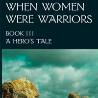
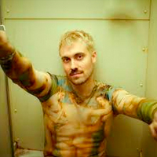
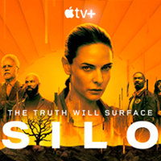
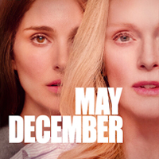
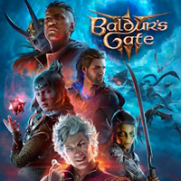
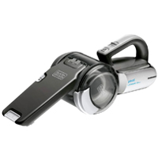

+++
date = "2024-01-29T08:04:02-05:00"
draft = false
title = "2023 Favorites"
categories = ["Yearly Favorites"]
tags = ["Movies", "TV", "Books", "Video Games"]
summary = "My favorite books, TV shows, movies, and more from 2023."
+++

It's January, so it's time for my 2023 favorites post, which I've had a few weeks to ruminate on. Not a lot changed in my life in terms of career, location, etc...but we did have another kid! So that definitely influenced the amount of time I had to devote to some of these categories. Without further ado, my favorites from the year (and as always, a given book, movie, etc. doesn't necessarily have to have been released in 2023 in order to count.)

## Book

  

I made a modest goal of reading 15 books, and I met that goal ([here are all the books I read](https://www.goodreads.com/user_challenges/40752966))! I unabashedly read almost entirely sci-fi/fantasy books because they bring me joy. My favorite book was the third book of the When Women Were Warriors trilogy, [A Hero's Tale](https://www.goodreads.com/book/show/6081011-a-hero-s-tale), by Catherine M. Wilson. The entire series is an amazing, criminally-underrated story that is unlike anything I've read before. It's written almost in an oral tradition about an unspecified Bronze-Age group of people, but the actual context doesn't really matter (if there even is one; it's not historical fiction or fantasy, exactly.) Unlike many other fantasy books, there's not a lot of conflict, or even action (though there is some), but it doesn't matter, because it imparts these beautiful lessons to you slowly: it's about community, and love, and finding your place in the world. You can read the first book [online for free at the author's website](http://www.catherinemwilson.com/free-ebook.html) if you're interested in giving it a try.

I also re-read the entire Red Rising Sage by Pierce Brown in anticipation of the sixth book, [Light Bringer](https://www.goodreads.com/book/show/61755286-light-bringer), being released in July, and that was another favorite from this year. I still maintain there is no other series of books I've read that feels like watching an action movie, and I sped through all six books this summer, enjoying my time back in that dark, intense world.

## Music

  

I usually pick an album for this, but I'm going to go with a new DJ I started listening to this year, [Marlon Hoffstadt](https://soundcloud.com/marlonhoffstadt). He's a part of a new resurgence of 90s-style eurodance music coming out of Berlin, and it's just infectiously upbeat and great ([this Spotify playlist](https://open.spotify.com/playlist/47jvz4DKtwa07Op3oCkvjM?si=c41a7d1847004b1a) curated by him is a good place to get a feel for the general sound.) I found out about him from [Hör Berlin](https://hoer.live/), a weekly livestream of DJs from Berlin, and it's been a great source for new music in general.

I also spent a lot of time listening to Ellen Allien mixes. I've been an Ellen Allien fan for years, but for whatever reason I found a bunch of her mixes on Youtube and have really been enjoying them. To call out two in particular, her [lockdown livestream from August, 2020](https://www.youtube.com/watch?v=DTSYJL2jZEU) is amazing, as is [this vinyl mix she did for Boiler Room/Technics](https://www.youtube.com/watch?v=sJsBd8U73YE).

## TV

  

My favorite show was [Silo](https://www.imdb.com/title/tt14688458/), a sci-fi thriller on Apple TV. The basic premise is that for some reason 10,000 people are living in a giant silo underground, presumably because something outside the silo made the planet uninhabitable. Predictably, the society in the silo is stratified, and there are plenty of secrets and intrigue to stretch out over the entire season, which ends on a big cliffhanger.

I also really enjoyed [Deadloch](https://www.imdb.com/title/tt14671678/) on Amazon Prime, an Australian comedy/crime show about two mismatched detectives in a small town in Tasmania trying to solve a murder. If you watch it, give it a few episodes, one character in particular starts of very unlikeable, but she grew on me.

Other shows I enjoyed: [The Boys](https://www.imdb.com/title/tt1190634/) (I watched all three seasons in 2023, it's an ultra-violent, darkly satirical and cynical superhero show), [Yellowjackets](https://www.imdb.com/title/tt11041332/) (season 2, a continuation of the intense, dark, and compelling first season), and [The Last of Us](https://www.imdb.com/title/tt3581920/) (prestige TV comes for video games, a very faithful adaption of the PlayStation game, also very grim.)

## Movie

  

In a continuation from last year, I've been trying to watch more movies, with mixed success. I still don't really find a lot of movies I love. One that I enjoyed from this year was [May December](https://www.imdb.com/title/tt13651794/) (a Netflix release), an unsettling drama about an actress doing research for a controversial role in an upcoming film...but everything is definitely not as it seems. Other than that, I also enjoyed [Nimona](https://www.imdb.com/title/tt19500164/), a relatively lighthearted animated adventure/fantasy film, also on Netflix, and rewatched [Trainspotting](https://www.imdb.com/title/tt0117951/) again for the first time in many years and still enjoyed it as much as I remember.

## Video Game

  

This was a great year for video games, and I ended up playing a lot of new releases this year. But first, I finally finished the Witcher 3 and DLCs! After starting the game again in 2019, I finally finished it. It's one of my favorite games of all time, mostly because of the world and atmosphere. And ending in beautiful, southern France-inspired Toussaint was the perfect end to my many hours spent in the world.

Anyways, on to my favorite game: it's undoubtably [Baldur's Gate 3](https://baldursgate3.game/). I watched a good friend of mine play Baldur's Gate 2 years and years ago, and I spent a lot of 2022 playing another Larian game, Divinity Original Sin 2, so I was set up to like BG3, sure, but I _loved_ it. The accolades it's getting are not overhyped: it sets a new bar for decision making and storytelling in video games, not to mention the voice acting. I just started the final act of the game on my first playthrough, and I'm already 70+ hours in and will definitely be playing it again and again with different characters.

I also had good fun with Diablo IV for a few weeks with friends, but I burnt out on it pretty quickly.

## Podcast

  

My favorite podcast goes to the [Late-Round Podcast](https://lateround.com/#podcast), by JJ Zachariason. I love when podcasts just get to the point, and he does, providing excellent fantasy football analysis, usually in less than 15 minutes. I'm a general fan of his statistical and data-driven analysis, and his preseason rookie rankings are an excellent guide.

I also really enjoyed catching up on [My Perfect Console](https://shows.acast.com/my-perfect-console/episodes) episodes. The premise is that the host brings someone from the games industry (largely and broadly defined) and has them build their own "perfect console," with five games from any period of time/system, and then explain their choices. It's great for when I'm in the mood for a longer podcast about video games that isn't news and reviews.

## App/Website

  

Like many people, I really enjoyed playing in [Music League](https://app.musicleague.com/) this year. Using the Spotify API, they built a neat app that lets you create private or public competitions where you submit songs against a prompt and then everyone who participates in a given round can vote for their favorites.

## Purchase

  

A new category for this year! I have no idea if this will continue, but there are some things that I buy that improve my life so much I feel like I need to tell the world about it. This [Black and Decker hand vacuum](https://www.amazon.com/gp/product/B00IOEFBKS?ie=UTF8&th=1&linkCode=ll1&tag=d01a3488-20&linkId=134ed7b769da317a5801ca27f2c0d246&language=en_US&ref_=as_li_ss_tl) is one of them.

I got this originally to quickly clean up errant cat litter, but I use it constantly to clean up after both my cats and my toddler. It's perfect for quickly cleaning crumbs off the couch, or vacuuming little corners when I'm too lazy to bring out the big vacuum, and it's particularly useful for the car. The whole thing comes apart easily and the filter is easily washable. It charges quickly and folds up small.
