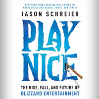
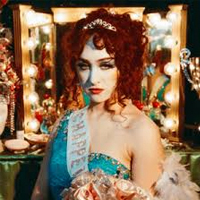
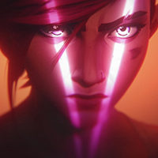
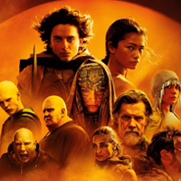
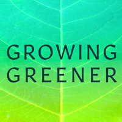

+++
date = "2025-02-15T08:04:02-05:00"
draft = false
title = "2024 Favorites"
categories = ["Yearly Favorites"]
tags = ["Movies", "TV", "Books", "Video Games"]
summary = "My favorite books, TV shows, movies, and more from 2023."
+++

Better late than never! I feel like my media consumption is way down, somehow. I am busier than ever between two kids, work, and lots of things going on. I still enjoy this exercise, though, so here it is: my favorites from the year (and as always, a given book, movie, etc. doesn't necessarily have to have been released in 2024 in order to count.)

## Book

  

I didn't read much this year. This happened in [2021](https://www.hannasthoughts.com/2021-favorites/) as well, when my first kid is as old as my second kid is now, so maybe there's something just uniquely taxing about having a baby/young toddler that makes it hard to find the time to read? In any case, [here is what I read in 2024](https://www.goodreads.com/user/year_in_books/2024/1932853).

My favorite of those was [Play Nice](https://bookshop.org/p/books/play-nice-the-rise-fall-and-future-of-blizzard-entertainment-jason-schreier/21042587) by Jason Schreier. This is a nonfiction book about Blizzard Entertainment, the computer game company behind World of Warcraft, Overwatch, Starcraft, and other big titles that I played and loved when I was younger. Play Nice is really a book about business and how the pursuit of continual profit can ruin (or at least...complicate) a company's creative genius and, ultimately, what it makes. I read this book really quickly because I found it so interesting. I think because I grew up playing Blizzard games, I was primed to really enjoy it.

I also really enjoyed the Teixcalaan series ([A Memory Called Empire](https://bookshop.org/p/books/a-memory-called-empire-arkady-martine/6986710) and [A Desolation Called Peace](https://bookshop.org/p/books/a-desolation-called-peace-arkady-martine/9858127?ean=9781250186478)), two science fiction books by Arkady Martine. The story is a space opera dealing with questions around empire and colonialism, featuring excellent world building and writing.

## Music

  

This was the year I got (more) into pop. I loved some very big, popular releases: [Brat](https://hobbsrecords.bandcamp.com/album/brat) by Charli XCX (she had some [great DJ sets](https://soundcloud.com/user-214380210/charli-xcx-boiler-room-ibiza) this year as well) and [HIT ME HARD AND SOFT](https://store.billieeilish.com/products/hit-me-hard-and-soft-digital-album) by Billie Eilish.

But my favorite was actually a 2023 release that found massive popularity in 2024: Chappell Roan's [The Rise and Fall of a Midwest Princess](https://chappellroan.lnk.to/TheRiseandFallofaMidwestPrincess). Queer women came for indie music over the past few years, and now it's pop's turn. I love the big pop ballads and the quieter, angstier songs equally.

## TV

  

This has to go to [Arcane season 2](https://www.netflix.com/title/81435684), which came out at the end of November on Netflix. Arcane is my favorite TV show of all time. I wrote about it in my [2021 Favorites post](https://www.hannasthoughts.com/2021-favorites/), where I chose it as my favorite TV show that year. Season 1 is better than season 2–I do think season 2 tried to shove in too much plot and expanded the world/story out too far, and it lost some of the tightness that made season 1 incredible, but season 2 is still great TV. Plus, CaitVi is canon now, so what more could I ask for?

I also caught up on all the seasons of For All Mankind, a cool alternative history take that starts in the 1960s with the question "What if the Soviet Union had won the race to the moon?" and then continues down that timeline with every season in a new decade. I watched critical darling Shogun, but didn't love it as much as everyone else. I did really enjoy True Detective: Night Country (season 4 of the True Detective series), while I think the popular reception of that show was not so great.

## Movie

  

I had a good attempt at watching more movies in 2022 and 2023, but that fell off this year. I did see Dune 2 in theaters, and that was a great experience, a movie really built for watching on the big screen, so I'll say that was my favorite movie, though I think I, truly, only watched a handful of movies total this year.

## Video Game

I really didn't play many video games this year at all. I just didn't find the time. This is a first for me in recent years. I played Helldivers 2 once or twice with my friends, and that was fun, but I just couldn't commit the time to it.

So, for the first time, I can't really put anything in this category!

## Podcast

  

My main hobby these days is gardening, and as it takes up more of my time and mental energy, I've also been trying to find podcasts about it. I love this semi-local podcast by Tom Christopher called [Growing Greener](https://www.thomaschristophergardens.com/podcast), which features interviews with people interested in ecological horticulture and related topics. Basically, gardening, but considering insect life, bird life, supporting native plants, and thinking more broadly about the ecological consequences of what and how we plant.

## App/Website

  

I've had TikTok for a few years, but I really learned to love it in 2024. I made some TikTok videos about native plants and gardening, but, really, I spent more time watching videos and letting the algorithm lead me down rabbit holes. There is no better algorithmic content on the internet, and if you influence it a little bit with intentionality (searching, commenting, liking/saving posts), it will lead you to some great content. I'm not that interested in the discourse around how bad TikTok is for attention span (it probably is, but I also don't moralize how I spend my free time), or that it's a tool for state-sponsored propaganda (it certainly is, like any social media platform in this age.)

But I learned a lot on that app in 2024, and it kept me company during many nights/afternoons I spent nap-trapped under a baby/toddler, and for that I will always be grateful.

## Purchase

  

I got [these little motion-activated night lights](https://amzn.to/41JvQWO) and put them up on my stairs. No more holding a phone to light my way up or down them at night. This is a great example of a small tweak that makes a big difference. You have to recharge them, but that's easily done every few weeks.
