+++
date = "2025-12-30T07:15:00-04:00"
draft = false
title = "2025 Garden Reflections"
categories = ["Garden"]
tags = ["Gardening", "Native Plants", "Garden Design", "Lasagna Gardening", "Winter Sowing", "Vegetables", "Blueberries", "Peaches", "Patio Bed", "Birch Bed", "Front Yard", "Trees"]
description="Reflections and a recap of my biggest gardening year ever."
summary = "Reflections and a recap of my biggest gardening year ever."
+++

2025 was, so far, the biggest gardening year I've had--I started gardening at this house in 2022, and it took me three years to ramp up to this point. I completed many projects, started many new garden beds, and planted hundreds of plants in my yard, almost all of them native to Massachusetts or to the east coast in general. I grew a lot of plants from seed, both annuals and perennials. Overall, I'm very proud of what I did and how well it's worked out so far, so let me reflect on the season as a whole.

## Big Projects I Tackled

I'll cover this in rough chronological order...

### Growing More from Seed

I started native perennials from seed for the first time ever. I used the milk jug method of cold stratifying species that require a period of cold, moist conditions to trigger germination, and that worked pretty well. Not everything germinated, but I got a lot of tiny seedlings that I transferred into my garden throughout the year. I also started some species that don't require stratification directly in flats like purple coneflower and mountain mints, and had success with that, too.

  </img>
  

    
Some of the native perennials I started from seed in milk jugs.

  

I continued starting a lot of vegetables from seed, and also did a lot more annual flowers: cosmos, zinnias, snapdragons, sunflowers, and marigolds. I interspersed these annuals into new garden beds and other random areas and loved the bursts of color they provided.

  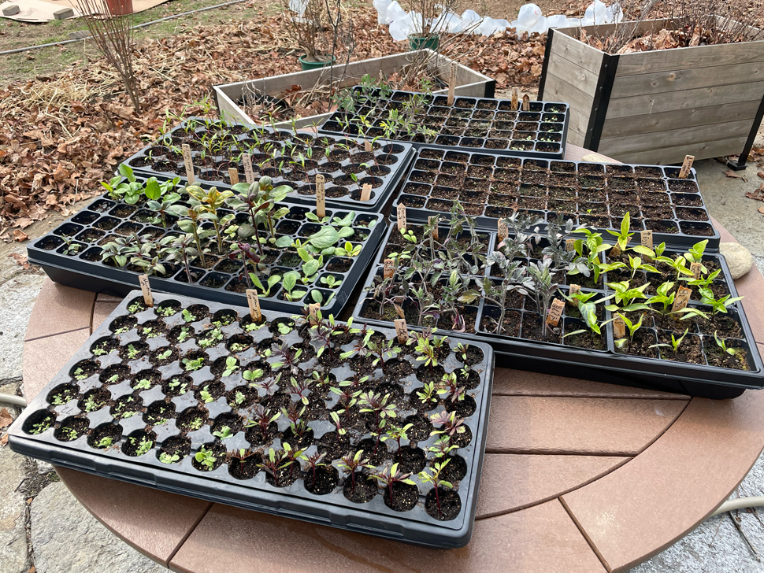</img>
  

    
Some of the vegetables and flowers I grew from seed before translanting in the spring.

  

As always, growing from seed indoors is fun and a nice way to extend the garden season in the long New England winter.

### Garden Infrastructure and New Trees

In March, I installed a [cedar arbor](https://www.wayfair.com/outdoor/pdp/all-things-cedar-pagoda-arbor-atcd1216.html). I zip-tied it to 6' rebar that I drove into the ground below the frost line and weatherproofed it with an exterior stain, so I'm hoping it will last for many years. I also installed three cattle panel trellises between my four raised beds. All of these structures give me way more vertical space to garden with. I installed a glider under the arbor, too, and it's been a wonderful spot to sit and enjoy the [patio garden](https://www.hannasthoughts.com/the-patio-garden-project/) from (more on that later.)

  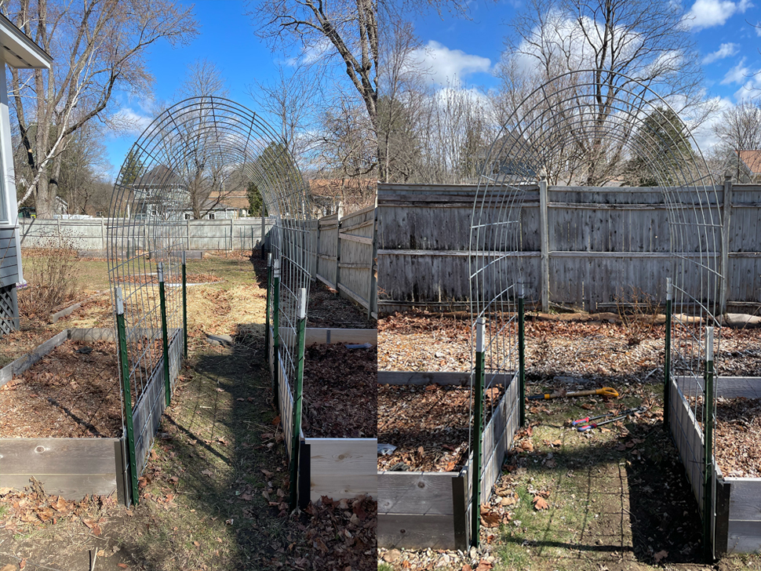</img>
  

    
New cattle panel trellises along my raised beds, March 2025.

  

  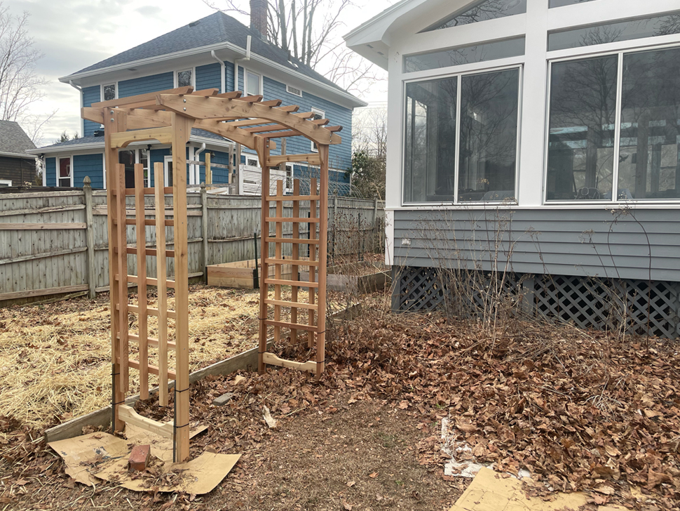</img>
  

    
Newly-installed cedar arbor before staining, March 2025.

  

In April, we took down the two remaining Norway maple trees in our yard. It's a somewhat futile gesture to take down two invasive trees in a neighborhood that is full of them, and I am always thoughtful about taking down any mature tree (except for you, Tree of Heaven!), but it opened up way more space to fill with other, more beneficial plants. On one side, where one of the maples once was, I added an "Autumn Brilliance" serviceberry, and on the other side, I planted a red oak. The serviceberry is closer to the house and will provide an anchor for that side of the yard without getting too tall. I'm excited to sample some of the fruit (if the birds let me), and it should provide multiple seasons of interest, from spring blooms to fall color.

The red oak was a choice driven entirely by ecological benefits. I've been interested in planting an oak for a while since I learned that in the Northeast they are one of the most broadly beneficial plants to vast amounts of insect and bird life. I like that red oaks grow relatively quickly and also give some fall color. I planted it far enough away from the house that it shouldn't be an issue, hopefully forever, but even if it does need to come down in 50 or 100 or more years, it will have provided decades of ecosystem services.

  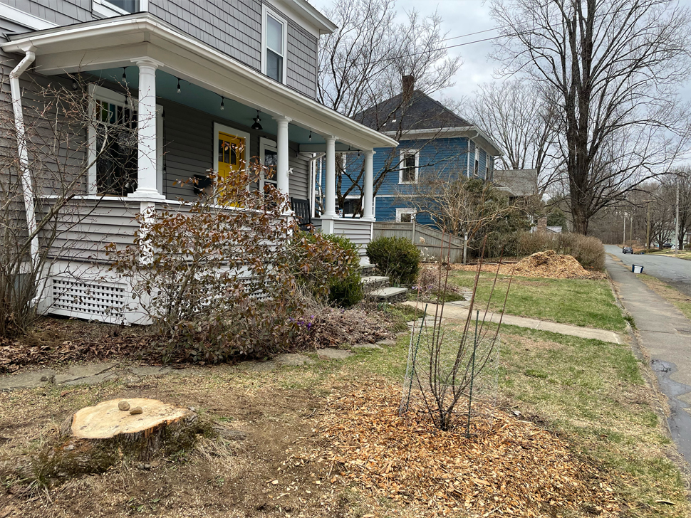</img>
  

    
"Autumn Brilliance" Serviceberry close to the stump of a Norway Maple we took down, April 2025.

  

  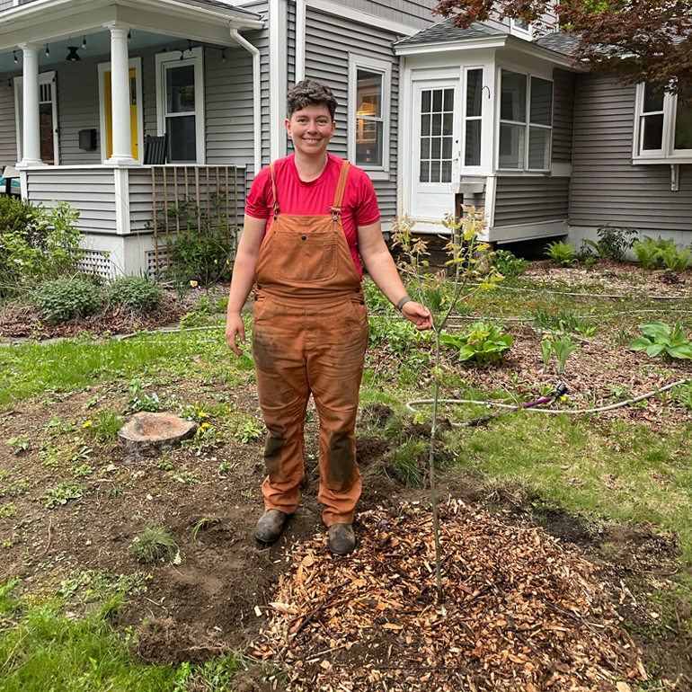</img>
  

    
Newly-planted northern red oak sapling and yours truly, May 2025.

  

### Creating and Expanding Garden Beds

The biggest project I completed was creating my patio garden bed. I wrote an [entire post](https://www.hannasthoughts.com/the-patio-garden-project/) about it, but in brief, I created a new bed to wrap my patio, featuring multiple seasons of interest and fragrant shrubs. I designed it last year as the final project for a designing with native plants course I took with the [Native Plant Trust](https://www.nativeplanttrust.org/), and this year was all about realizing that design. It's only in its first year, but I was very happy with how it turned out.

  </img>
  

    
The progression of the patio garden in 2025: late April, late June, early August, and early November.

  

I made a bunch of other new beds and expanded existing beds in both the front and backyards:

#### Backyard

I expanded an existing bed on the other side of my patio along my garage that was mostly full of annuals and biennials from a seed mix I'd sown there in 2023. It's under the shade of the large sugar maple in the backyard, so I made it a shade garden with rhododendrons, mock orange, clethra alnifolia, Jacob's ladder, bluebells, asters, goldenrods, ferns, and a pagoda dogwood to anchor one end of it.

  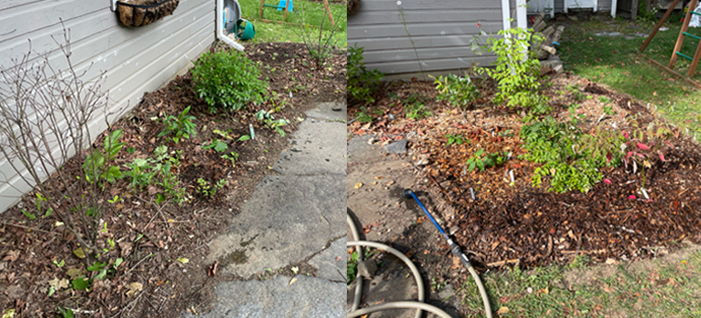</img>
  

    
On the left, part of the garage bed in May with new transplanted forbs and shrubs. On the right, an expansion to the garage bed in the fall, featuring a small, newly-planted pagoda dogwood.

  

  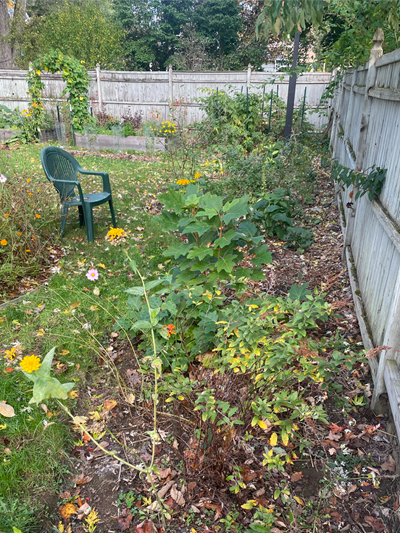</img>
  

    
I don't have many photos of the long side border I made, but here it is in October 2025.

  

I used leaves last fall to smother the lawn along a fence on the southern side of my yard, so I planted up that bed with blocks of taller, shade-tolerant native perennials. I had two sour cherry shrubs there that I incorporated into the bed. I still haven't had fruit from these shrubs yet, but hopefully some year they will give me some type of yield.

I moved my blueberries (and got some new varieties - I have 12 shrubs in total now!) from behind my raised beds on the back side of my yard to in front of the raised beds (if you're curious about how my blueberry plans have evolved, check out this post from 2022 about [establishing my blueberries](https://www.hannasthoughts.com/the-garden-year-1-establishing-blueberries/)), and filled the empty space behind the beds with a shrub and perennial border. I used fothergilla, ninebark, a flame azalea, and aronia arbutifolia as the shrub layer, and while they are all still small, I filled in the rest of the space with more prairie-style, sun-loving perennials, as the back bed gets a lot of sun, and the plants should be ok there until the shrubs get much bigger.

  </img>
  

    
The blueberries transplanted in front of my raised beds, and a new shrub border in an expanded bed behind the raised beds, April 2025

  

I expanded my circular peach tree bed into a longer shape. It's the home of a permaculture guild using native plants as well as cosmos that reseed themselves in one spot, and I intend to fill in the rest of the bed in 2026 with apple trees. I read the amazing book [Grow a Little Fruit Tree](https://bookshop.org/p/books/grow-a-little-fruit-tree-simple-pruning-techniques-for-small-space-easy-harvest-fruit-trees-ann-ralph/d15ffd35e29d8321) by Ann Ralph, and hope to incorporate her pruning techniques to keep my peach tree and future apple trees small, in order to fit them into the space I have. I fit a few blueberries around the edges of this new bed expansion, too.

  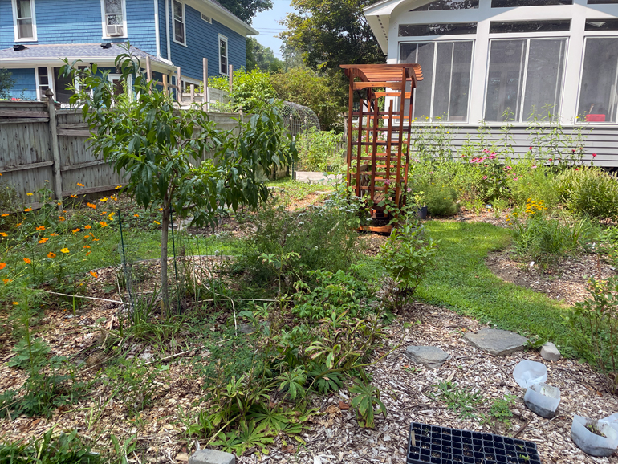</img>
  

    
My mostly native peach tree guild in July 2025 (year 2 of most of these planting, year 3 of the peach tree). I have lupines and yellow false indigo to fix nitrogen, garlic and alliums to repell pets, and cosmos and mountain mint to attract pollinators (and parasitic wasps to combat pests.) Still a work in progress in many ways.

  

  </img>
  

    
The expanded peach tree bed, ready for more fruit trees next year, and the patio bed in August.

  

In the fall, I expanded an existing shade garden around a birch tree with more shade plants: lots of ferns, wild ginger, wild geranium, turtlehead, some small irises, and sedges.

  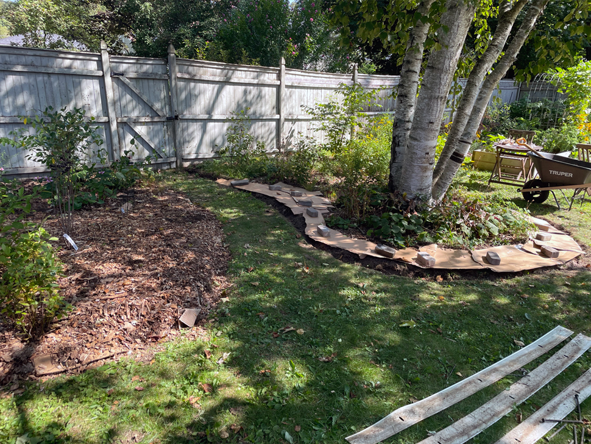</img>
  

    
Expanding and re-edging my birch tree garden, September 2025. I still think putting down cardboard and then wood chips or leaf litter - a quick lasagna garden - is the easiest way to kill grass. Then I just cut through the cardboard and plant into the soil beneath. On the left of this image is my newly-created/expanded edible native forest garden.

  

I also significantly expanded a small shrub border north of the birch tree, and decided to theme this bed as an edible native (or near-native to Massachusetts) forest garden. I planted American hazelnuts, paw paws, ramps, wild strawberry, lowbush blueberry, and aronia melancarpa.

#### Front Yard

I used the arborist chips from the Norway maple removal to finish converting the side of my front yard into a garden bed. I had started this in 2023, and slowly worked my way all the way up from the back of this yard to the sidewalk. The arborist chips should hopefully finally smother the ivy, bittersweet, hostas, and barberry that were in that bed, but I have continued pulling by hand throughout this year there as well.

  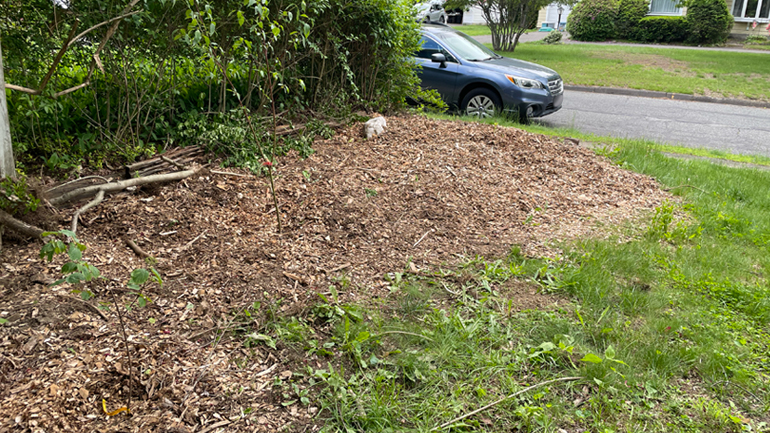</img>
  

    
May 2025, the front portion of the bed. Freshly-laid aborist chips have replaced what was once barberry, bittersweet, and ivy. Two newly-planted bare roots shrubs are in this shot as well, maple leaf viburnum and a red osier dogwood.

  

I planted shrubs in this space, with a vague winter and fall interest theme. There's a witch hazel from 2023 here, but I added maple leaf viburnum, red osier dogwood, aronia arbutifolia 'brilliantissima', and transplanted a hydrangea.

  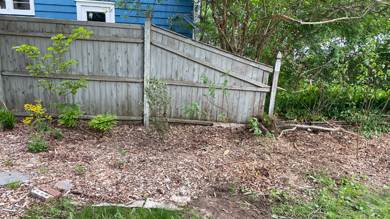</img>
  

    
Taken on the same day as the image above, looking at another section of the border. The more established witch hazel is on the left of the image, followed by the aronia (in bloom in white), a red osier dogwood, a maple leaf viburnum, and then another red osier dogwood. The yellow bloom is Packera obovata.

  

Near the front of this bed there's another mostly full sun spot, so I planted a mix of zinnias and cosmos for immediate interest along with some more prairie-style meadow plants: purple and pale purple coneflower, anise hyssop, Culver's root, little bluestem, butterfly milkweed, sweet Joe Pye weed, switchgrass, and rattlesnake master.

  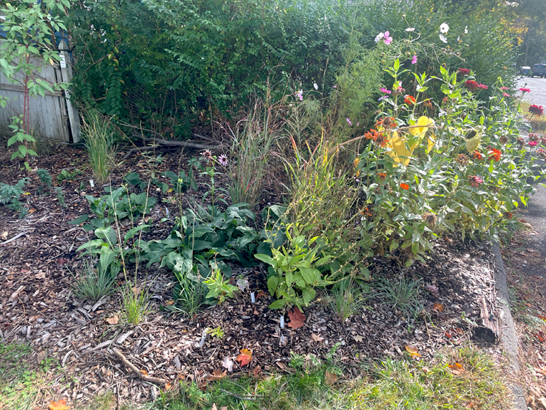</img>
  

    
The front of the side border, closest to the sidewalk in October 2025. What was once all arborist chips has been planted up with perennials and annuals. The cosmos and zinnias are just finishing blooming, anchoring a space that will look very different in a few years as the perennials grasses and flowers mature and fill in.

  

I also filled in more gaps in this entire side border and around the Japanese maple in my front yard with a variety of plants: asters, wild ginger, meadow rue, foxglove beardtongue, Indian pink, coral bells, and more sedges. Finally, in the fall, I defined the borders of this entire bed and planted crocuses along the edge, in an attempt to create something like Brooklyn Botanical Garden's [crocus lawn](https://www.instagram.com/reel/C33KXVBOznv/?hl=en) (on a smaller scale).

  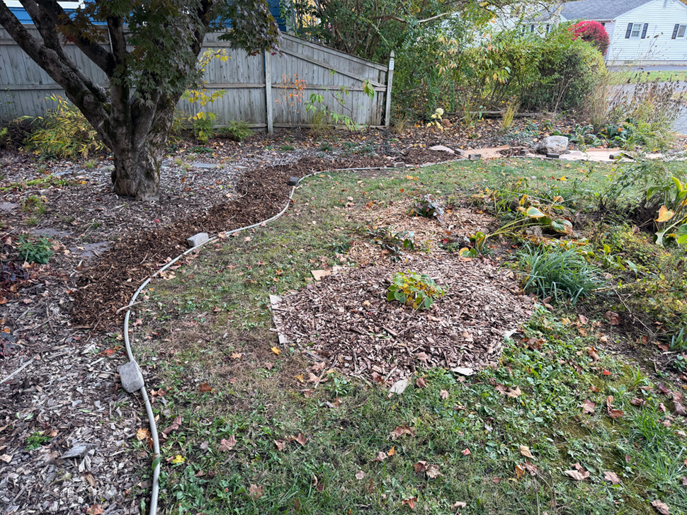</img>
  

    
Creating a more defined border for the side/front garden, fall 2025.

  

Finally, at the end of the garden season, I asked a tree crew who were taking down a big, rotting silver maple in my neighbor's yard if they could give me the the entire truckload of arborist chips they had from that project. I moved chips around my yard for a few weeks, and got the pile off of my driveway the day before the first snow in late November. I used the chips to create two new beds in my front yard (around the oak and serviceberry), created what will become a native hedgerow along my driveway, and got rid of most of the lawn along the south side of my house around existing raised beds and expanding future planting areas. So, lots of room for more plants in 2026 and beyond!

  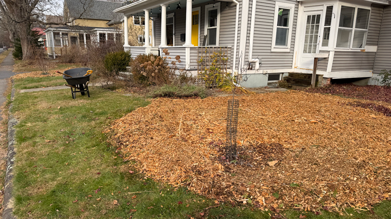</img>
  

    
Nobember 2025: new wood chips around the oak tree and further back, around the serviceberry. These will be new gardens in 2026!

  

That about wraps up all the beds I created and expanded!

## Other Projects and Tidbits

I planted grapes on the wooden arbor. This is a new type of crop for me, and I'm curious to see how they do. I decided to try rwo table grape varieties, [Vanessa](https://raintreenursery.com/products/vanessa-seedless-grape) and [Somerset](https://fedcoseeds.com/trees/somerset-seedless-grape-7502).

I added two bird baths to my garden after reading about the benefits of water sources for birds and insects. One is in my new patio garden in full sun, so I added a solar bubbler to it, and the other is a carved stone bath from [Dances with Stone](https://danceswithstone.com/) that sits on the ground in my birch tree bed. I made sure to clean them and refill them frequently, and once the birds found them, a day didn't go by when I didn't see a bird using them. I made sure to include stones in both bird baths so that insects could easily perch next to the water and safely drink from these water sources as well.

  </img>
  

    
Bird bath with bubbler in the patio bed.

  

I saw a lot more monarchs this year than in years past, which was great. I'm sure it's reflective of larger trends in monarch populations, but there are more milkweeds than ever in my yard, as well as nectar sources, so maybe my plant choices had a small impact on seeing more of them. I did spot my first monarch caterpillar in my yard this year, which was also very exciting!

  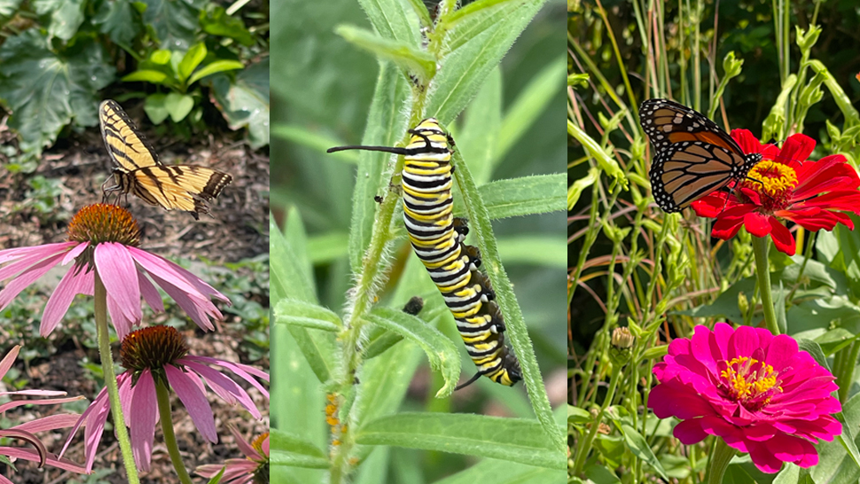</img>
  

    
Eastern tiger swallowtail butterfly, monarch caterpillar, and monarch butterfly, all taken in my yard this year.

  

I loved seeing other little creatures in the yard, too, like toads and snakes (as well as the ubiquitous chipmunks and squirrels) as it tends to mean that there is habitat there for them, and both of these animals take care of pests (slugs) and animals I'd like to keep away from my house (mice.)

I'm still trying to get good at gardening with mostly native plants in containers, and added a few more large cedar planters to my deck to try to bring color and foliage up closer to the house. Results TBD on that.

  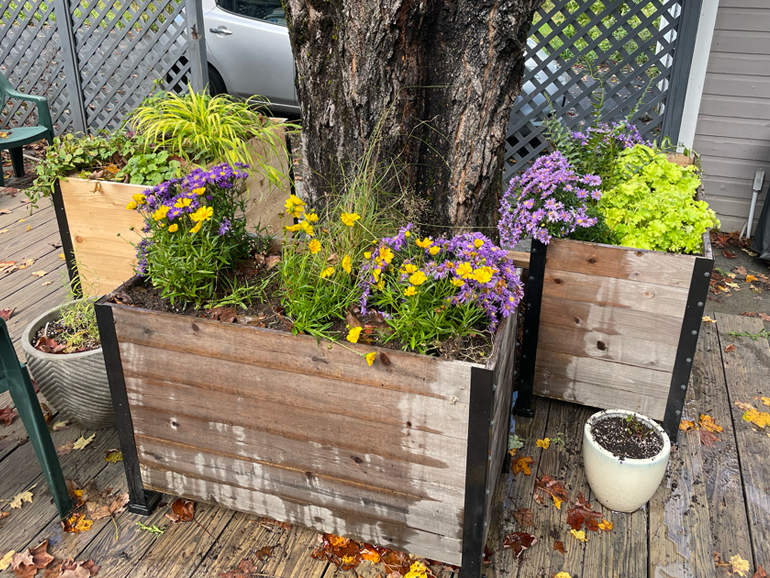</img>
  

    
New planters on my deck in September 2025. I tried a formula of picking a central focal point that provides height and texture all season long, then adding interest via blooms and contrasting foliage that provides. On the left it's Japenese forest grass, Jacob's ladder, and coral bells. In the middle, tufted hairgrass, asters (some type of New England aster cultivar), and coreopsis, and on the right, Christmas fern, coral bells, and asters.

  

I re-edged all my beds this year, too. I've used aluminum edging at times, but for now, in the majority of my garden beds I think I've settled on a simple edge cut with a shovel. I bought a little string trimmer which should help keep the lawn tidy on these cut edges, but I like the clean lines and simplicity of this edging style.

Finally, I planted a lot more bulbs this fall. I read that crocuses help support native mason bees, even though they aren't native, and these bees are especially helpful pollinators for the early blooms of fruit trees, so I planted a lot of crocuses close to my existing fruit trees and close to where I intend to add more apple trees. And then I planted a lot of daffodils. I had a lot in the front yard already, but I distributed new bulbs throughout my entire garden. The reason is simple: daffodils make me happy, and they will always herald the beginning of spring for me. So I want to look out at my garden and see more of them.

## Dos and Don'ts

**Do** plan and write things down! I've used Google Sheets for a few years now for plant lists, but this year I got serious about tracking what I grew from seed and using Google Sheets for planning purposes. It was invaluable for all the seeds I started, and the notes I kept this year will make next year easier.

  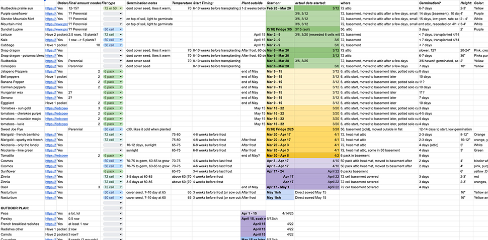</img>
  

    
A spreadsheet of all the seeds I started indoors this year.

  

I also got more serious about drawing out designs for my new garden beds, starting with the plan I'd made for the patio garden in 2024. For some beds, I really sat down and plotted the details with graph paper, and for others I kind of improvised, but having some record of what goes where is helpful.

  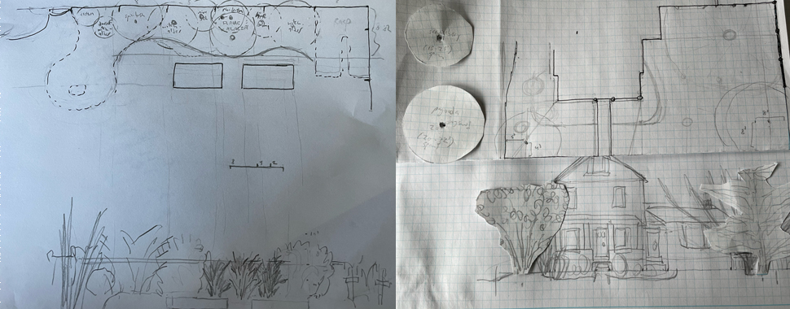</img>
  

    
A few of the hand drawn plans I made this year. On the left, plans for the shrub border behind the raised beds, and on the right, working through some ideas for trees and shrub placement in the front yard.

  

**Do** mark bare root plants with flags. I should have done this last fall when I planted some bare root plants in the side yard. I amended this for the ramps and wild strawberry I planted this fall, to ensure that I don't accidentally dig them up next spring before they emerge.

  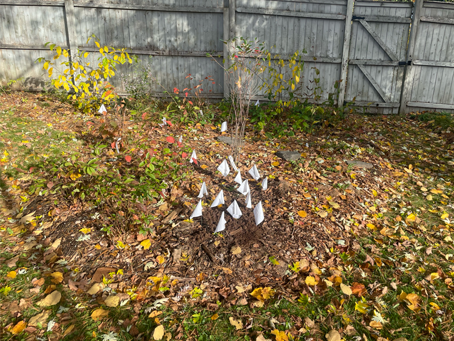</img>
  

    
Marking where I planted bare root ramps and wild strawberries, fall 2025.

  

**Don't** sow milk jugs too densely. I had a lot of success with milk jugs, but in some cases, I really sowed too densely and wasn't diligent about thinning, and that meant by the fall when I needed to plant what I'd sown, I was left with a lot of tiny seedlings that could have been more established had I thinned them earlier.

**Do** create a bloom calendar. I got the idea from [this blog post](https://meristemhorticulture.com/planted/bloom-calendar), and it was pretty easy to implement in Google Sheets. This will make future garden planning easier as I can really see exactly what blooms when and chart combinations. Plus, it's fun to see just how many flowering plants I grow in my yard.

  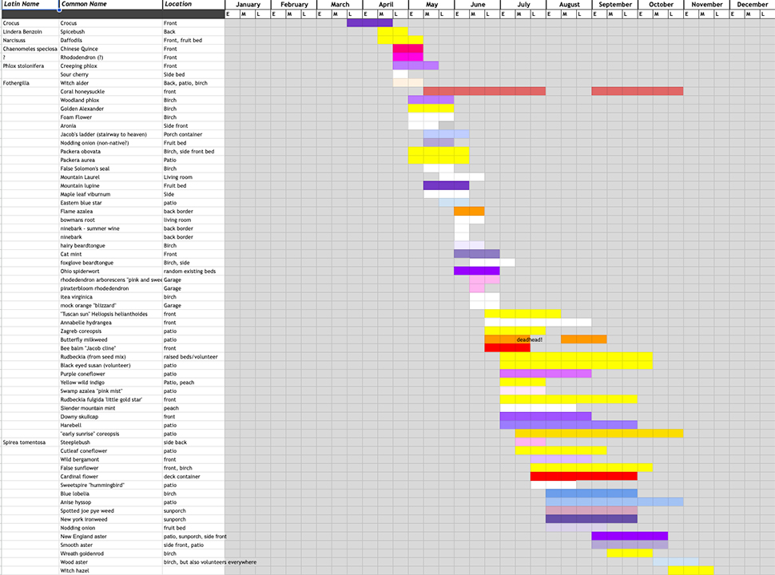</img>
  

    
A chart of almost all the flowers in my garden in 2025. Easy to make in Google Sheets if you get into the habit of recording blooms when you see them and noting roughly how long they last. Each cell represents about 10 days.

  

**Do** collect seeds! As I grow more perennials from seed, I'm trying to collect seeds from my own plants rather than buying them again. This is fun, cost-effective, and also helps promote genetics of plants that I know do well in my garden.

## Notable Harvests:

I harvested my first peaches from my redhaven peach tree this year! Nine peaches ended up turning into just four harvestable ones due to the squirrels taking bites out of them, even through the mesh bags I wrapped them in, so I'm going to need to find some better squirrel-proof solutions next year, but I was still grateful for every bit of those four sublime fruits this summer.

Vegetable gardening took a bit of a backseat this year with all the perennial gardening, but I still planted up my four raised beds. A new vegetable for me that I definitely intend to plant again was [rattlesnake pole beans](https://fedcoseeds.com/seeds/rattlesnake-pole-bean-292). They were prolific, tasty, and added amazing foliage to one of my cattle panel trellises for months.

  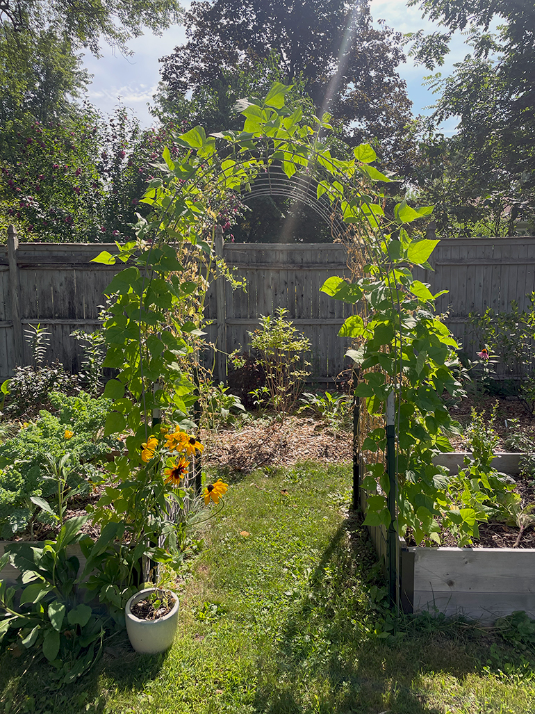</img>
  

    
The cattle panel trellis filled in nicely with rattlesnake pole beans in late summer.

  

Some other favorites were the old reliable Sungold tomaotoes and [Forellenschluss Ritzy Romaine Lettuce](https://fedcoseeds.com/seeds/forellenschluss-ritzy-organic-romaine-lettuce-2858). [Strawberries](https://www.hannasthoughts.com/a-lasagna-garden-strawberry-patch/) and my Anne yellow raspberries also had good years. Because I moved the blueberries this year, I didn't really have a substantial harvest this summer, but I'm looking forward to more blueberries in the coming years.

## Last Words and Photos

So much of perennial gardening, especially if you start with plugs and small shrubs, is waiting years for what you envision to be fully realized. I'm also still really trying to get better at garden design with native plants, and this is probably going to take me years to understand and refine, and what I tried two years ago might, with the wisdom of time since then, not be at all what I would do now. Thankfully, gardening is forgiving, and plants can be moved and divided and grown again when things inevitably need to change.

Still, I think there are little vignettes that capture some of what I'm trying to do, and so here are some photos from the past year that capture some of the beauty I'm trying to create in my garden, even if it's not fully realized yet:

  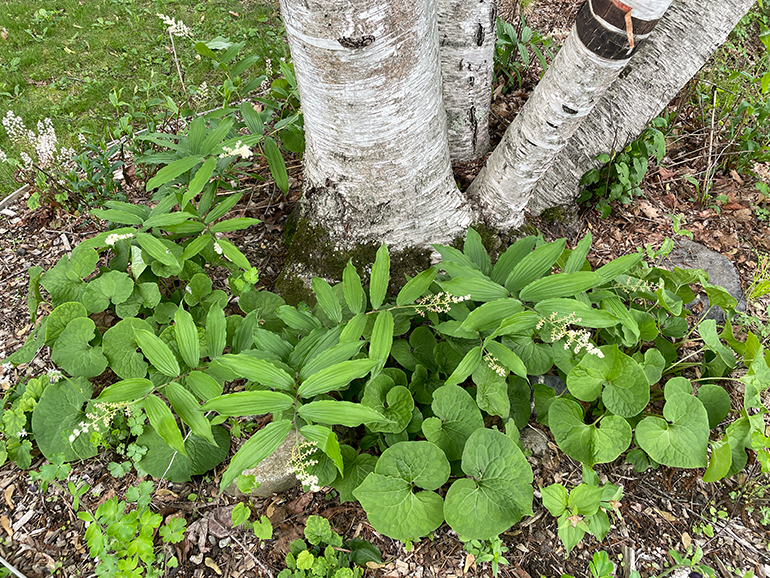</img>
  

    
False Solomon's seal and wild ginger under my birch tree in spring. I planted these in 2023, and this is the first year they are really filling in. Foam flower is also blooming in the background.

  

  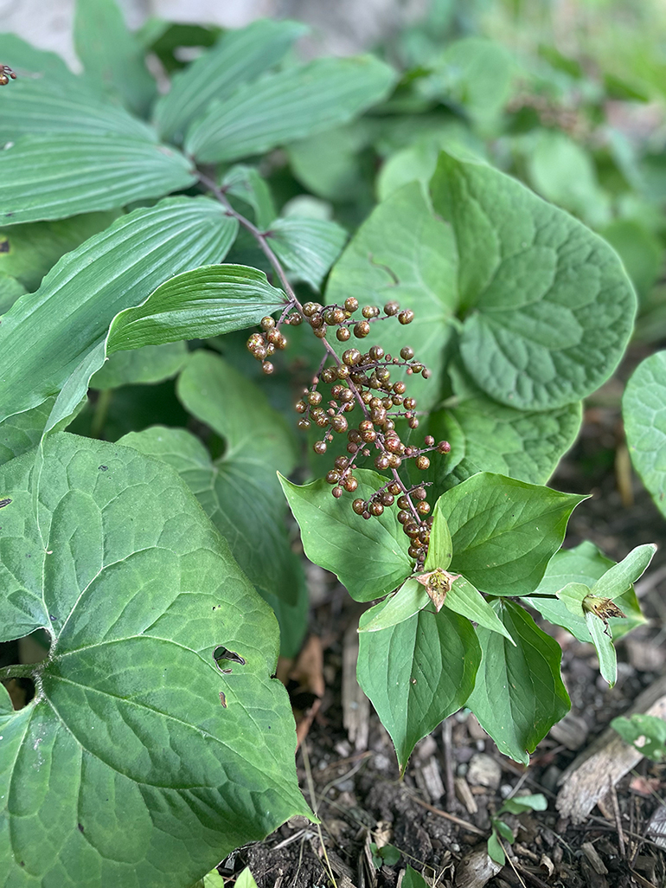</img>
  

    
Speaking of False Solomon's seal, here's a closeup of it in July. The berries eventually turn red, but they have this amazing gold effect beforehand.

  

  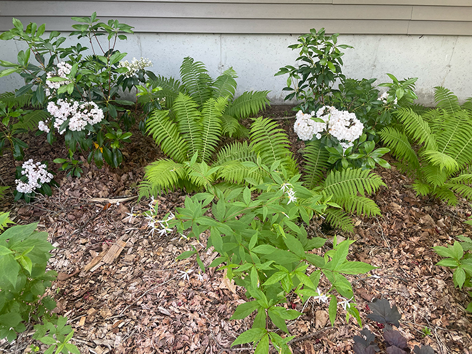</img>
  

    
2025 was year two of this foundation planting of mountain laurels and ferns I transplanted from an existing bed (I am not sure what type of fern--maybe ostrich?). This planting still needs to come into its own, but I love the contrast of the dark leaves of the mountain laurel with the light green of the ferns. The mountain laurels also bloom at the same time as Bowman's root in the foreground.

  

  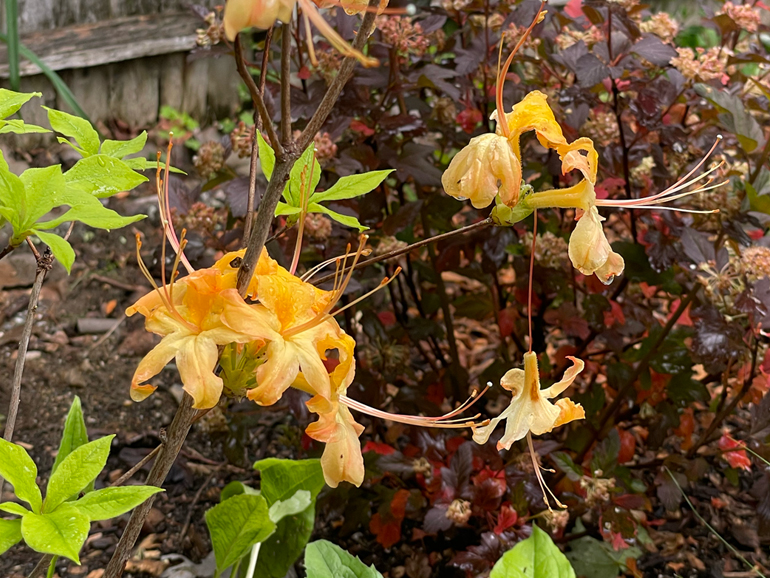</img>
  

    
This is a little detail from the new shrub border behind my raised beds, ninebark "summer wine" behind a flame azalea. I wanted the maroon leaves of this ninebark cultivar to serve as a dramatic backdrop to the beautiful orange azalea blooms.

  

  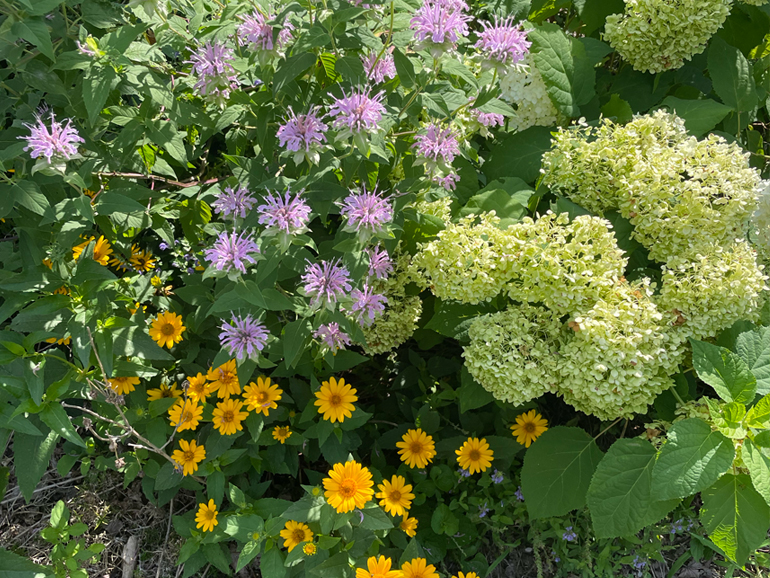</img>
  

    
A bloom combo I like from the front yard, which I originally planted in 2022, but have added to over the years. Annabelle hydrangea, wild bergament, and "Tuscan Sun" false sunflower.

  

  </img>
  

    
Witch alder is becoming one of my favorite shrubs. Its native range is to the south of Massachusetts, more in the mid-Atlantic, but I can't resist the fall color. It also has beautiful blue/green summer foliage and early, fragrant spring blooms. Here's one of the witch alders I planted in the patio bed at the peak of its fall color. I'm trying to get better about considering fall colors and the fall and winter shapes of seedheads in my designs.

  

