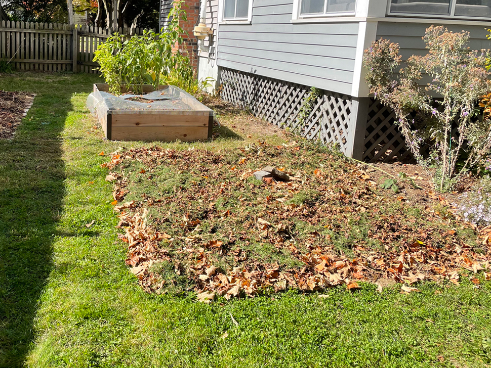
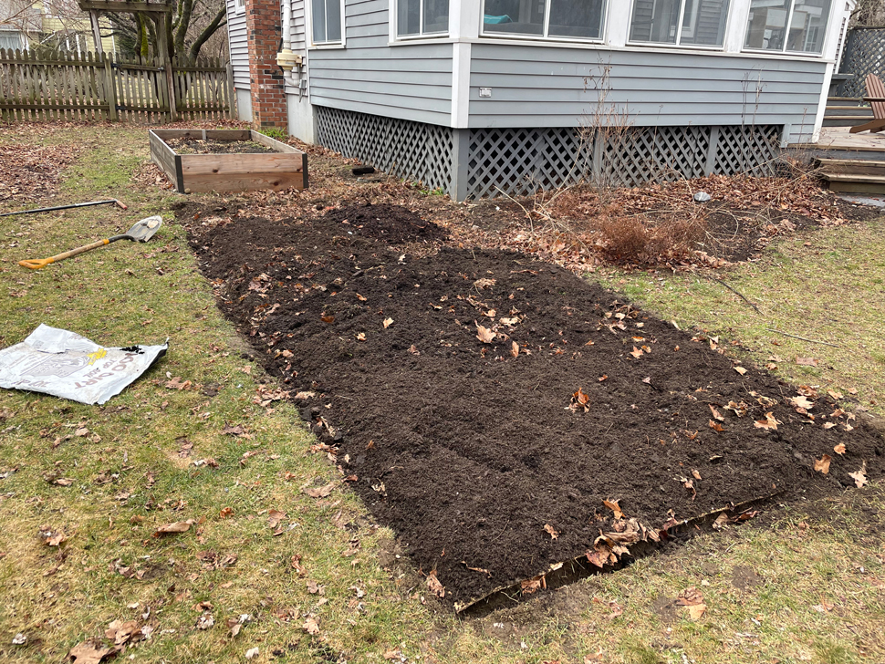
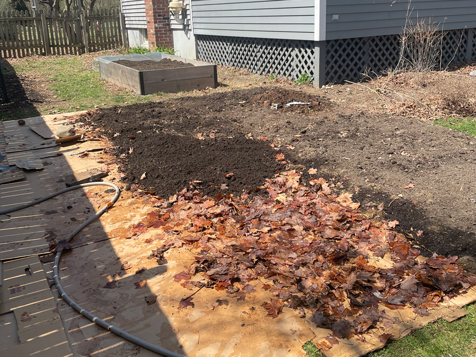
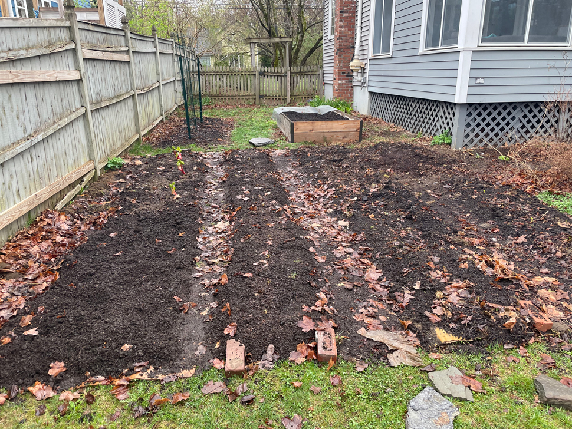
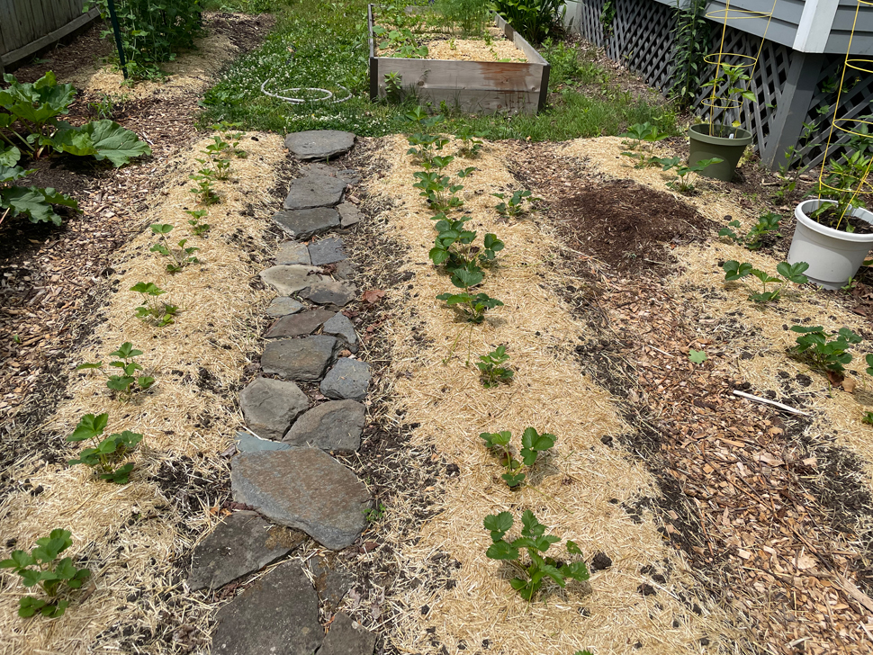
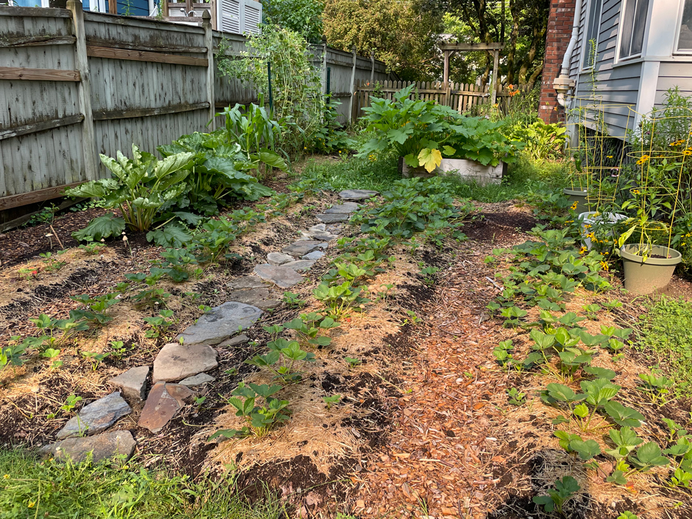
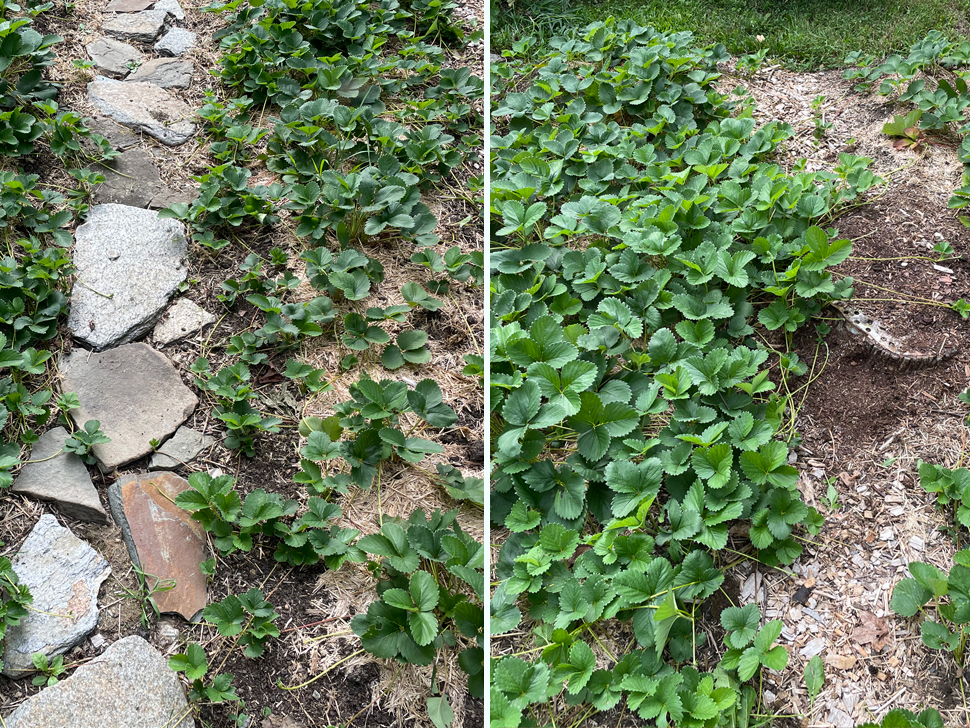
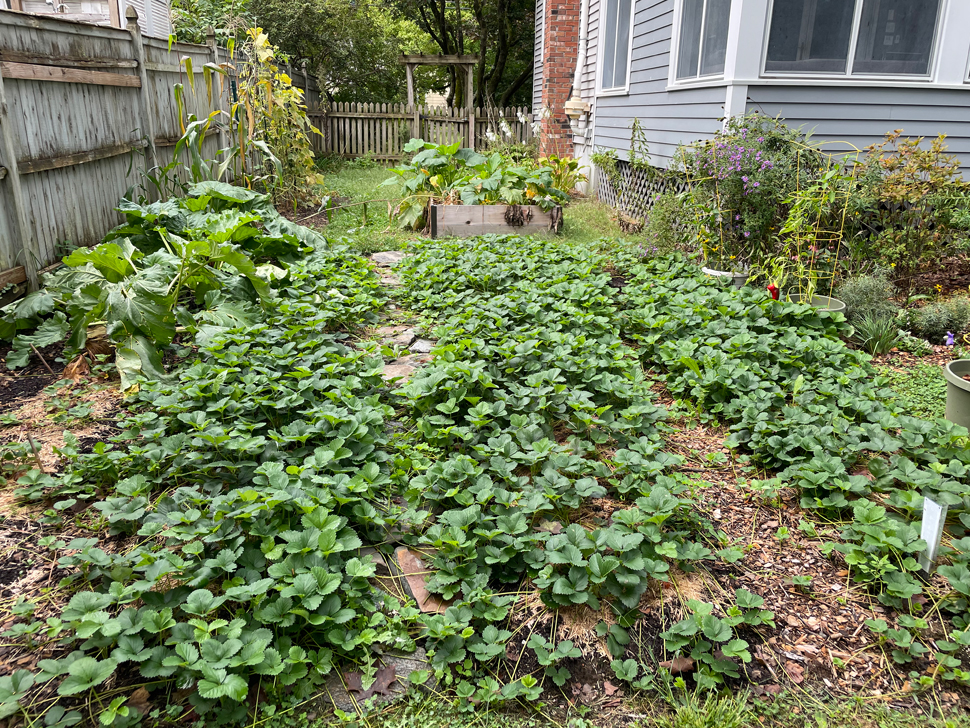

+++
date = "2023-11-06T07:15:00-04:00"
draft = false
title = "A Lasagna Garden Strawberry Patch"
categories = ["Garden"]
tags = ["Gardening", "Lasagna Gardening", "Strawberries"]
description="I'm seeing how far I can push the concept of lasagna gardening for my backyard strawberry patch."
summary = "I'm seeing how far I can push the concept of lasagna gardening for my backyard strawberry patch."
+++

This is the story, so far, of my strawberry patch, which I started in the fall of 2022. It documents a bit of an experiment into lasagna gardening on different timescales.

## Fall 2022: The Beginning

  </img>
  

    
Starting my lasagna garden in October 2022 with cardboard, leaves, and grass clippings.

  

I love strawberries, so along with my blueberries and raspberries, I knew I wanted to try to grow them myself. I chose one of the sunniest spots in our yard, the southern exposure, east of an existing raised bed. We took down a tree there that was very close to the house here, and that opened up more of the area to full sun.

I started with a small lasagna garden bed. Lasagna gardening, for a brief recap, is basically layering cardboard with green and brown materials/compost to slowly smother weeds/turf and build up a layer of fertile soil to plant in. It is my preferred "lazy", no-till method of creating new garden beds as it uses materials readily available to me (cardboard, leaves, and grass clippings) and preserves the underlying soil structure.

The fall is the perfect time to start a lasagna garden because I have a surplus of leaves. So I layered clean cardboard (no colored inks, no tape, etc.) with leaves and grass clippings. I also cut away the turf around the edges of the garden and put that turf upside down in spots. I did this in October and left it alone until the following spring.

My key mistake was not really considering just how much land I would need to plant the amount of strawberries I ended up buying. The classic advice "measure twice, cut once" sort of applies here, but, happily, gardening is forgiving, and you can always make the bed bigger (or move plants, or try again, etc: gardening is forgiving of experimentation if you have patience.)

## Spring 2023: Expanding the Plot

  </img>
  

    
Expanding the lasagna garden in March 2023 with cardboard, leaves, and finished compost.

  

I ordered my plants in December. I used [Fedco](https://fedcoseeds.com/), which is my preferred source for plants by mail. I chose the [Sparkle variety](https://fedcoseeds.com/trees/sparkle-june-bearing-strawberry-385) (it was their description of the variety that convinced me: "We’ve yet to taste a strawberry that comes even remotely close to Sparkle. They possess a flavor that can only be described as the essence of strawberry. The best in an early year, the best in a late year, the best this year, last year, every year." Fedco ships bare roots in 50-plant increments, and so I ordered 50 plants.

In March, I decided that I would probably need more space, so I extended the bed to the east. I put down a layer of cardboard, and some old leaf litter I had on hand, and then bought some finished compost and topsoil and layered that on top.

## Let's Get Even Bigger!

  </img>
  

    
A last-minute expansion in April 2023.

  

A few days before my plants were set to arrive in April, I did some research on optimal spacing guides for strawberry plants and settled on doing a matted row. A matted row is where you space plants 12-24" apart in rows 3' apart. You then let the plants fill in the rows with their runners and cut back paths in between the rows.

I brought my measuring tape out to the bed and realized I would need to expand it again. I committed to extending it all the way to the fence to make room for all 50 plants.

Once again, I put a layer of cardboard down. Next, I put a thin layer of wet leaves down (from last fall) and then covered it with finished compost. This was even more of an experiment in pushing the lasagna gardening concept: plants don't really like 100% compost, and as leaves break down they draw nitrogen away that plants need. So I wasn't really sure how it would turn out!

## Planting Strawberries

  </img>
  

    
Planting strawberries and rhubarb in April 2023.

  

I planted the strawberries in mid-April. I used my trusty [garden knife](https://www.fiskars.com/en-us/gardening-and-yard-care/products/food-gardening/hori-hori-garden-tool-340130-1001) and cut through the cardboard to ensure that the roots of the plant had access to the native soil. Next, I carefully arranged the roots in the hole I'd dug so they had space, and made sure the crown of the plant was at the middle of the soil level.

I ended up planting 42 Sparkle plants (June-bearing -- I gave the other eight to my neighbors!) in three rows, and then in the last row, along the fence, I planted three rhubarb plants and the ever-bearing strawberry variety Ozark Beauty. I made sure to keep everything watered, pruned the blossoms off of the Sparkles (so they could focus on establishing themselves this year in preparation for a first harvest in 2024), and put down a layer of straw mulch in the heat of the summer to help with water retention.

  </img>
  

    
The strawberry patch in June 2023, after applying straw mulch.

  

I chose the middle path through the patch as the main path and used some extra pavers I had to make it a stone path to emphasize that it was the main way through from my backyard into my side yard. Eventually, I might dig the rocks into the ground more to make this more permanent, but it worked fine for this year. I filled in the other paths between the rows with wood chips. The old stump from the tree we took down straddles one of the rows and the path, but I like that the strawberries will eventually just grow over the stump and help cover it up for now.

## Results...So Far

What I ended up with is a lasagna garden in three parts: one that was allowed to sit from fall to spring, one that was allowed to sit for a month or so, and the newest section that was only there for a few days before I planted.

  </img>
  

    
The strawberry patch in July 2023. If you look closely, you can see that the plants at the back of the bed, in the oldest lasagna section, are growing more densely than the plants near the front.

  

Early on, I thought it was cool that you could see the difference in soil quality based on the density of plants in these three lasagna bed sections. The oldest section of the bed was where the plants grew most densely, and they grew more sparsely in the newer sections. This makes sense to me intuitively because the older sections were allowed to develop and the raw materials had longer to break down into fertile soil.

  </img>
  

    
A closeup of the density of the strawberry plants in August 2023. The plants on the left were planted on the newest lasagna garden section and are still noticably less dense than the plants on the right, which were planted on the oldest lasagna garden section.

  

Now, at the end of the season, the plants have mostly entirely filled in their rows, and I can't see much of a difference at all. I will have my first harvest next summer, and I'm curious to see if there will be a difference in fruiting between the three sections.

  </img>
  

    
The strawberry patch at the end of its first season in September 2023. Even the newest lasagna section is growing very well by now.

  

I hope this post will encourage you to start a lasagna bed, even if it's shortly before you need to plant. The compost I added as a top dressing really seems to have allowed everything to get established by the end of the growing season.
