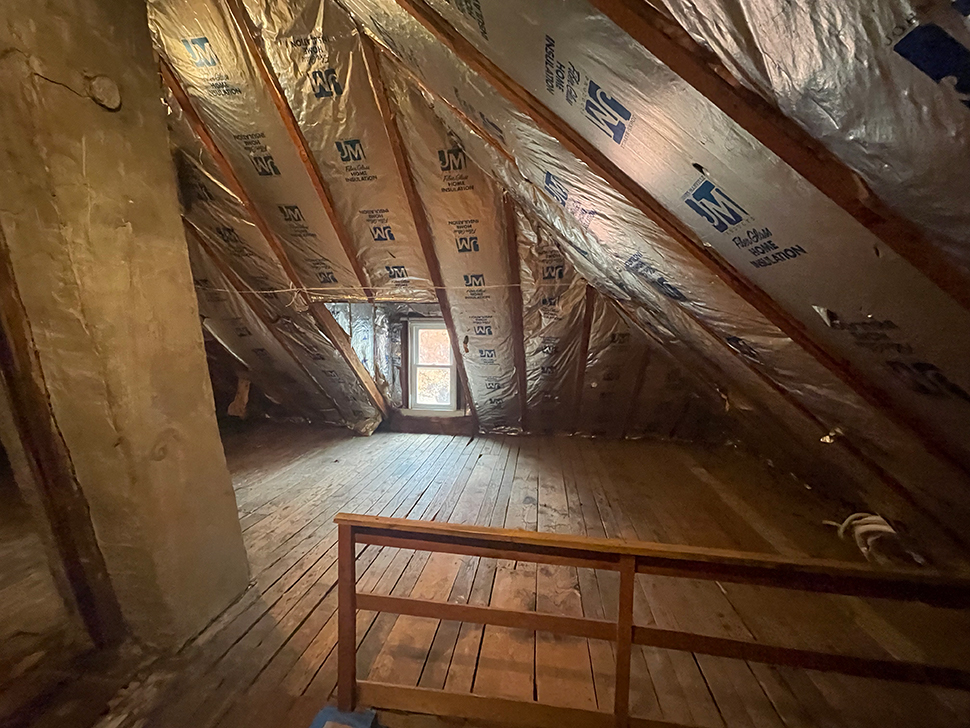
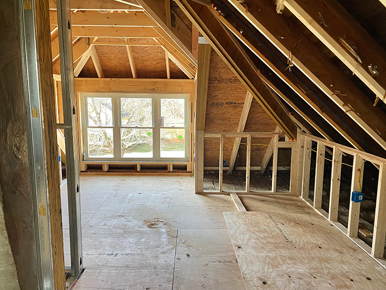
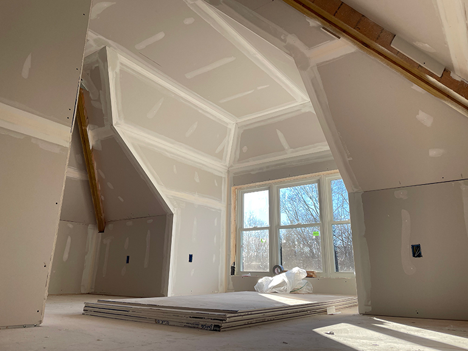
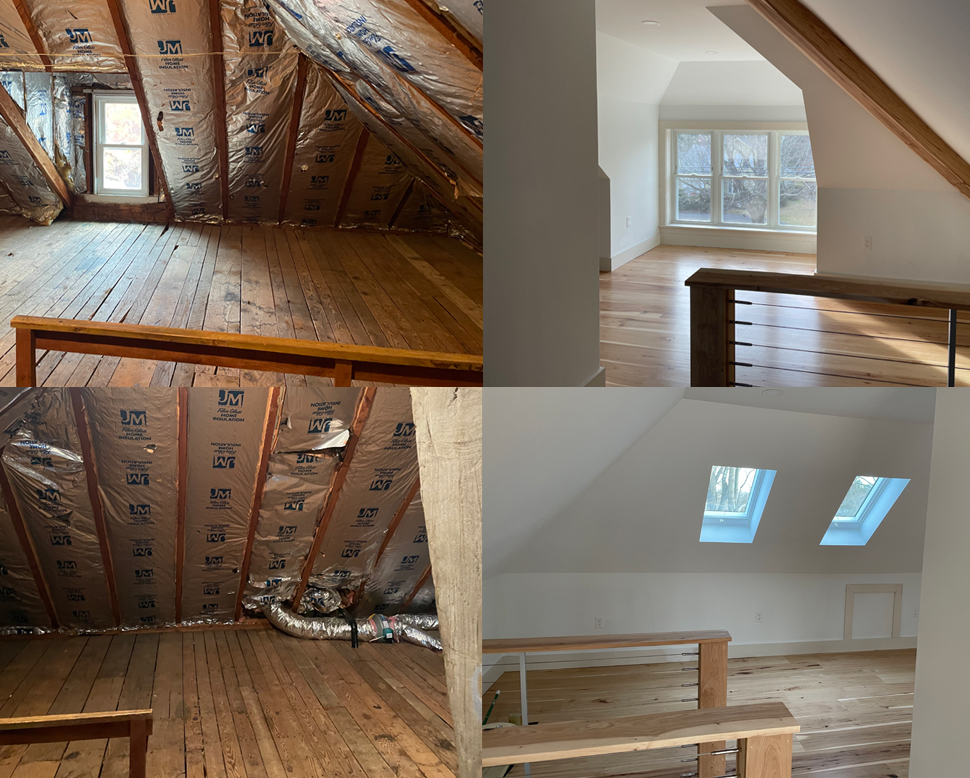
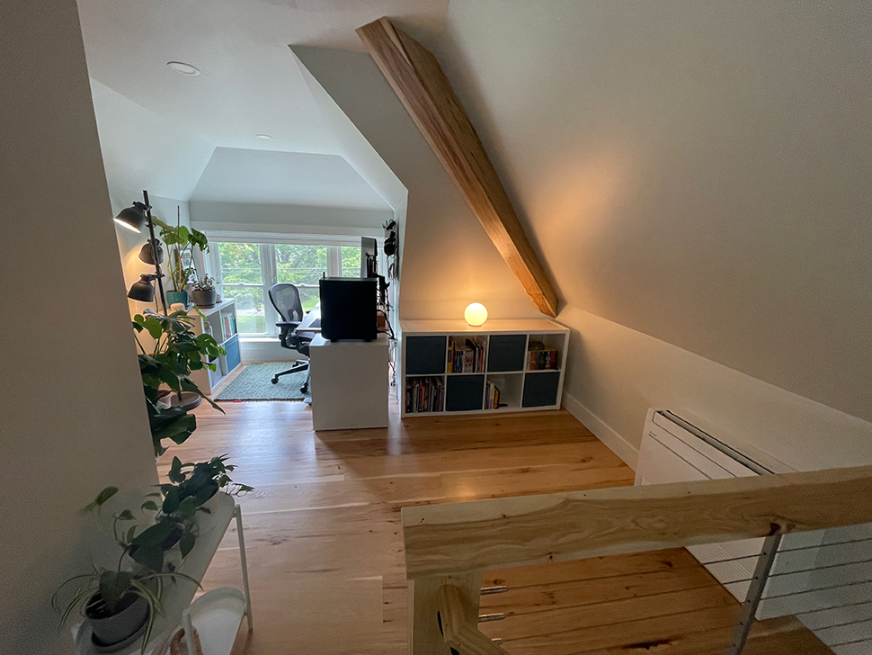
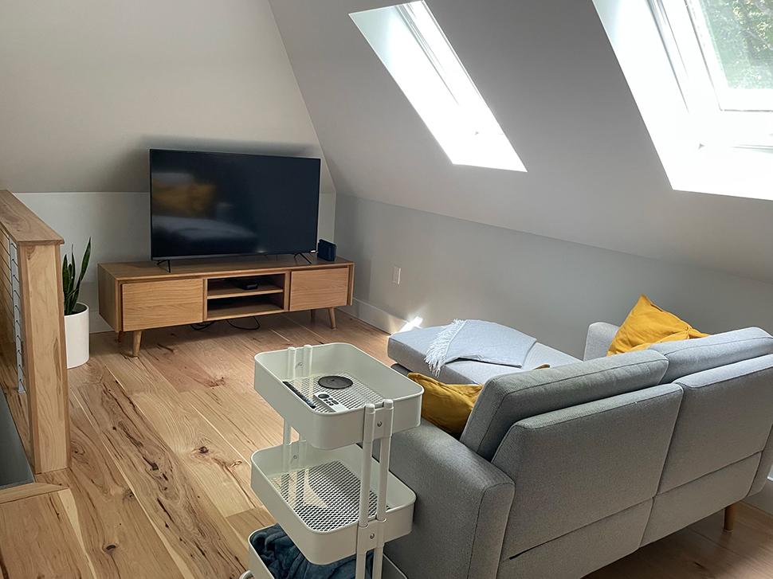
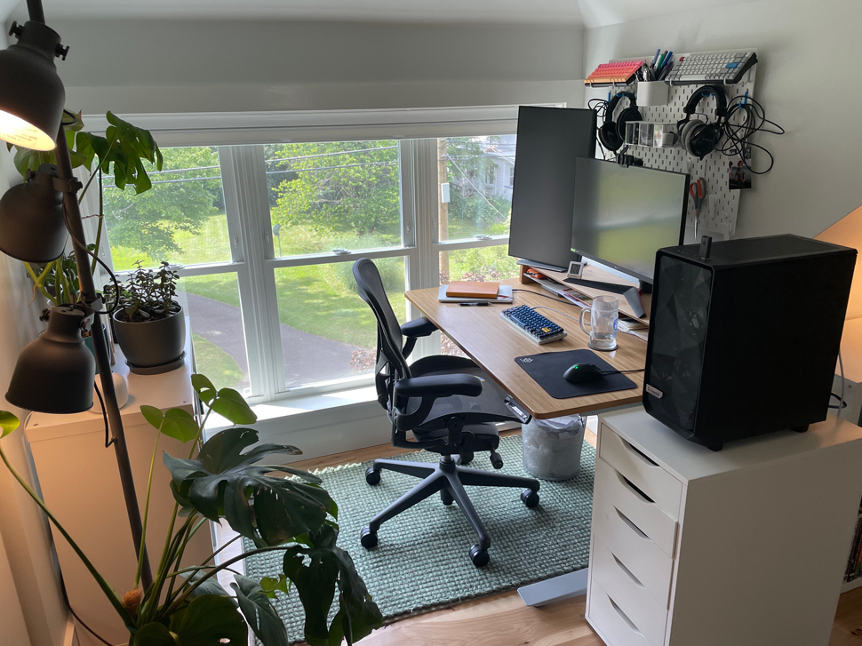

+++
date = "2023-09-24T07:15:00-04:00"
draft = false
title = "Finishing the Attic"
categories = ["House"]
tags = ["Home Renovation", "Attic", "Smart Home", "Home Office"]
description="Photos and thoughts behind our first major home renovation, finishing our attic into an office and living room space."
summary = "Photos and thoughts behind our first major home renovation, finishing our attic into an office and living room space."
+++

This was the first major home renovation we took on. I want to be clear: we paid a general contractor to do this work because it was way, _way_ too much for us for us to DIY, but I thought it would be fun to see our thought process and share progress photos.

## Why the Attic?

This house has an interesting feature: a walk-up attic, with access from the main bedroom. The attic isn't the most obvious space to finish, partially because the only access is through a bedroom, and partially because there's also a big chimney running through the middle of the space (the chimney is used by our oil boiler, which heats most of the house along with our water–a very typical New England setup), and partially because we have a classic foursquare house with a hip roof, which means all four sides of the roof come down at an angle in the attic, cutting viable room height down.

We really wanted to expand our livable space, though, because we both work from home in a three-bedroom house. With kids, office space in the bedrooms is tight, and there aren't many other obvious places in the house to take calls from and be isolated enough to do deep work.

We considered a few other options, like finishing the basement, but neither of us loved the idea of working there long-term as our basement is old and full of noise from the boiler and pipes running to all the baseboards in the house. We briefly considered finishing part of our garage, but then we would lose garage space, plus we would need to deal with getting reliable internet and heating/cooling out there.

The more we thought about it, the more the attic really did seem like the best spot, mostly because we decided it would always just be a space for us: not primarily for our kids, not for visitors, but a place to work and also relax away from the rest of the house. So access only through our bedroom didn't matter as much, and we thought there was enough space, even with the chimney and hip roof, to create the room we wanted.

## Design

We wanted a clean, modern feel. We knew the space wouldn't be big, so we wanted to keep it light, with natural wood floors, light paint colors, and natural light. We settled on wide plank hickory with a satin finish for the floor, railing, and support beams: we loved the aged character of the wood, and it really is the centerpiece of the whole feel of the space. We added two skylights on the east side to improve the natural light. A big part of this project was also bumping up the size of the existing dormer, which also gave us good light from the west and provided a space with vertical walls to house my computers and desk.

We chose a simple, modern trim and a modern rail design. We ended up choosing the same very light gray, almost white, paint for the walls and white for the trim to match the rest of the house.

## Progress Photos

Here is how the space looked before construction started: the bare chimney, fiberglass insulation, and a small dormer window.

  </img>
  

    
A wide-angle shot of the attic before any work began.

  

One huge improvement that also benefitted the rest of the house was adding closed-cell spray foam insulation. This not only makes it way more efficient to heat and cool the attic but also improves the energy efficiency for the rest of the house. The spray foam they added is R-49, so a massive improvement over the old, single layer of fiberglass batts. We added a single floor-mounted Mitsubishi mini split to heat and cool the space, and it has worked extremely well to keep it comfortable year-round.

What stood out to me the most after they put the drywall in and the new dormer was defined was just how much space there actually was up there. I was expecting the space to feel cavern-like, and even a bit cramped, but it really doesn't feel that way to me at all, even with the walled-off chimney. If anything, the hip roof adds a cozy feel to the attic that I love.

  </img>
  

    
Framing done, including bumping up the size of the dormer window.

  

  </img>
  

    
Drywall mostly done, and the space feeling larger than I thought.

  

  </img>
  

    
A couple of before and after comparison images (before final painting was completed).

  

## Furnishing the Space

The attic is now my office (and a plant haven.) It's also a great storage space. I love old houses, but they are tight on closet space, so we have, at present, three [Ikea Kallax storage cube shelves](https://www.ikea.com/us/en/p/kallax-shelf-unit-white-80275887/). There's plenty of space to add more storage in the future, like an armoire or something similar.

  </img>
  

    
Another wide angle shot of the same dormer view. You can see the mini split, one of the storage shelves, plants, and the dormer office setup.

  

One interesting wrinkle is that because the stairs going up to the attic are very tight, we had to be careful not to order furniture that was too big. In fact, the only way to get furniture all the way up to the third floor was to carefully order items that come packed flat. We ended up with a [Burrow loveseat](https://burrow.com/nomad-fabric/loveseat-chaise?sku=NSC-CG-2-HI-DW), which works great. Burrow's claim to fame is modular furniture designed to be shipped in boxes that can make it up, say, a tight walkup apartment in a big city, so that worked perfectly for us. I've had good luck with Article furniture in the past, and so we also picked up a [TV stand](https://www.article.com/product/15093/seno-oak-63-media-unit) that packed flat.

  </img>
  

    
The TV/relaxation side of the attic.

  

I had to disassemble my [Jarvis standing desk](https://store.hermanmiller.com/standing-desks/jarvis-bamboo-standing-desk/2542428.html?lang=en_US) to get it upstairs, but, thankfully, it also fit up the stairs one taken apart. The rest of my office is all Ikea: an Alex set of drawers and another small Kallax bookshelf, and so they all made it upstairs easily. I added a [small wool carpet from Floyd](https://floydhome.com/products/the-rug?variant=37788114452642), and we left the rest of the room bare to show off the floor.

Otherwise, there's an Ikea plant stand, an Ikea rolling cart, and a variety of planters and pots. The attic gets perfect indirect light for many houseplants and is also a safe haven from my monstrous cats, who love to chew on plants if they can find them, so I've been propagating a lot of my houseplants in the attic.

  </img>
  

    
My attic office, and plants. So many plants.

  

  </img>
  

    
With a Hue LED strip behind my monitor, I can do extremely nerdy things like match the lights to my video games.

  

Finally, I added some lighting. I'm trying to embrace smart lighting in the house, and this was a great place to do that. The dimmable lights in the ceiling are attached to a [Caseta smart switch](https://www.casetawireless.com/us/en/products/dimmers-switches). I also installed [Hue bulbs](https://www.philips-hue.com/en-us) in an Ikea fixture and in a globe light I found on Amazon, and installed a Hue LED strip behind my monitor. These lights can be used in different combinations to set different scenes. I have one for daytime, one for night, one for watching TV, and various combinations to use when playing computer games.

There are still some things left to do: I still need to hang artwork and photos on the few vertical surfaces available, and I am planning on installing some wooden floating shelves by my desk and transferring some of my plants there. There's also more space in one corner for my partner's desk. Once our third bedroom becomes a full-time kid room, she will be able to work there. We're extremely happy with the space, and it's been a joy to use for the past six months.
