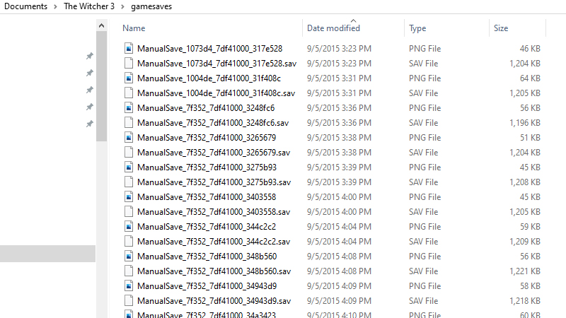

+++
date = "2020-08-26T10:31:38-04:00"
draft = false
title = "Fixing Witcher 3 Cloud Saves"
categories = ["Guides"]
tags = ["Video Games", "Tech"]
summary = "Steam cloud saves are fairly unintuitive when you run out of space because there is no warning that they aren't working. Here's how I fixed my Witcher 3 cloud saves so I could cross-save on my Nintendo Switch."
+++

The Witcher 3 is one of my favorite video games. I got it in 2015 a few months after it was released and played it for 80+ hours, which is a lot for me in recent years. I loved it so much I would get up at 6 AM and play it before I had to go to work. This year I got back into the game and am re-playing it. I'm taking my time, doing quests I never did the first time around, and hopefully will actually finish the game and play the expansions. We're also about to have a baby, so I am intrigued by the possibility of playing The Witcher 3 on my Switch and taking advantage of the portability and ability to instantly close out a game by putting the console to sleep, which seems useful when a baby demands immediate attention at the drop of a hat.

## Problems with Downloading Cloud Saves

I have no interest in playing a long story-driven game like the Witcher 3 on multiple platforms unless cross-saving is possible, and, thankfully, it is supported between the Switch and Steam using Steam Cloud saves. So, I bought a copy of the game on my Switch and loaded it up. There's an item on the main menu called "Cloud Saves." You log into GOG or Steam via the Switch in-game, and then can download or upload cloud saves. I logged in successfully, but much to my dismay, I didn't see any available saves to load.

I had done a fair amount of research before buying the game about potential issues with cross-saves. One frequent issue is uploading saves from the Switch to Steam, which some people say is a network issue, but I didn't really see any issues about downloading.

## Looking at Your Steam Cloud Saves

First, I double-checked that cloud saves were actually on for the Witcher 3. You do this by right-clicking on the game's title in your Steam library, selecting "Properties," and then under the "Update" tab, ensuring that the Cloud Synchronization checkbox is checked. For me, the box was checked, but it said it was only using a few kilobytes of data.

  

The other odd thing was that every time I played the game on my PC and exited, the cloud save UI would light up on the game's play icon. This seemed to me like some type of async cloud save service was running, but, clearly, there were no save files actually being successfully uploaded.

I read the cloud saves can run into network issues and did a bit of a deep dive into various forum posts and Steams docs. I looked at the cloud save logs, but to me, everything looked fine.

Finally, in the Steam docs, I found that you can [look at the files in Steam Cloud per-game](https://store.steampowered.com/account/remotestorageapp). The Witcher 3 was only saving one file: my settings, which was a few kilobytes. I figured something else was going on.

## The Witcher 3 Saves are...Huge

In the course of my digging, I decided to look at the actual saves on my computer. For me, they were in `Documents/The Witcher 3/gamesaves`.

  </img>
  

    
This is just one hour of saves from 2015...

  

I noticed one thing right away: there were a TON of saves in that folder. I play RPGs by saving a lot, maybe too much, but I hate losing progress, and in a game like the Witcher 3 where a lot of quests have variable endings, I like to give myself lots of options to go back to older saves to see different endings.

All these saves were taking up a ton of data, it turns out (like...2 GB!). This is because I had played the game back in 2015, so I had 80+ hours of saves from 2015 - 2016, and then when I started replaying the game this year, even more saves from then.

## Silent Cloud Save Failures

I figured maybe because I had so many saves locally, Steam wasn't able to save anything to its cloud, and for some reason wasn't telling me this was a problem.

My first solution was to simply delete saves from my PC (but as you will see later, I didn't delete nearly enough of these files initially). I did this directly by deleting the save files from the `gamesaves/` folder. This appeared to work! I turned cloud sync off, loaded the game, closed it, then turned cloud sync on and opened the game in Steam. When I quit, the cloud sync icon spun for a long time. I loaded the game on my Switch, and, lo and behold, my saves were there! I tested out loading a save, saving on the Switch, and uploading to Steam, and that all worked really well.

I ran into problems when I began saving game progress on my PC again. Old habits die hard, and I started saving a lot again! I started to see new saves not show up on my Switch anymore. I tried my old trick of deleting the save files by going to the `gamesaves/` folder again, but I realized that Steam would constantly re-sync that data from the cloud, leaving me in a weird situation where I was running out of space to save my most recent progress. The only way to truly delete the saves from the cloud was to do it in-game, which was very tedious, because you have to delete one save at a time and for through a confirmation UI every time.

As a sidenote, all of this was hard to confirm because the [remote storage app](https://store.steampowered.com/account/remotestorageapp) that lets you look at cloud save data doesn't have any sorting options, so it was impossible to confirm that my most recent saves were actually showing up in the cloud and it was some other problem with my Switch, maybe.

## A Trick to Force Steam to Delete Cloud Saves

Really what I wanted was to clear out a bunch of my Witcher 3 cloud saves to be certain that it wouldn't try to re-download them and create this sluggish, error-prone experience with not seeing my recent saves on my Switch.

It turns out deleting cloud saves isn't very easy to do. I finally found a tip on Reddit: open the Witcher, alt-tab out, delete the saves from the folder, go back to the game, and then quit. This tricks Steam into syncing the cloud with your local files, likely because Steam takes the game as the source of truth: if you delete save files via the in-game UI or tab out and delete files yourself (which is way easier to do), at the end when you quit and the cloud sync runs, Steam has no way to know how you deleted those saves, just that they are now deleted, and it can safely not re-download those deleted saves.

## The End?

I wish this whole process had been easier, because it was really close to being seamless. I was in a somewhat unique situation where I had three years of saves on my computer before I tried syncing to my Switch. Still, I wish Steam would put some type of warning out when you were running out of space syncing a game's saves to Steam Cloud. And I wish that deleting cloud saves were easier.

I still run into issues sometimes with not seeing my most recent saved games on my Switch, and I haven't nailed down why that is, because I see them in the remote storage app now that it is trimmed down to just a few pages of saves. Still, it's a lot closer to an optimal experience now that I am mindful of the number of times I save.

## Sidenote on Witcher 3 Performance on the Switch

I think the game runs very well in handheld mode. I haven't played it in docked mode, but I suspect it would appear less good there.

The main complaint I have is the audio quality is clearly more compressed, and there is a touch of lag when opening the map/inventory menu. This is the most annoying aspect for me as I constantly check the map when playing the Witcher 3, but, again, it's truly amazing I can play this game on the go, and for my life now, it's worth paying for the game twice.
