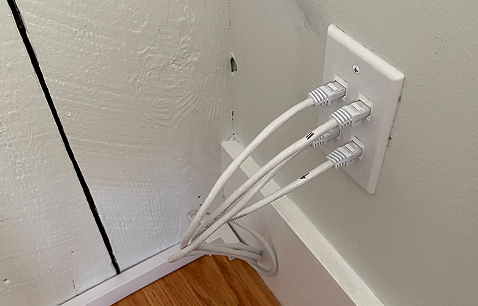

+++
date = "2024-11-10T07:15:00-04:00"
draft = false
title = "Home Network Install"
categories = ["House"]
tags = ["DIY", "Home Network", "Home Office", "Smart Home", "Tech"]
description="An in-depth description of how I wired my house with ethernet cable and set up my own basic home network."
summary = "An in-depth description of how I wired my house with ethernet cable and set up my own basic home network."
+++

I have always wanted a hardwired network in whatever home I ended up owning, and in the fall of 2022 I finally made that a reality! I work from home, stream a lot of media, and generally have hobbies that need a reliable internet connection, so it made sense to take this on as one of my first big DIY projects.

## Home Network Basics

I'm writing this partially as the guide I wish I'd had before doing this. So let's start with the basics!

Here's a rough diagram of how a basic wired home network works:

- The internet connection comes into the house. When we did this install, it was from the cable company, via a coax cable in the basement. (Now it's from a fiber line, but same idea!)
- The coax cable connects to the modem.
- The modem connects to a wireless router.
- The wireless router connects to a network switch, which distributes traffic via ethernet cables to ethernet jacks in the walls and any other devices that are plugged in directly to the switch.

I am by no means a network engineer, but the nice thing about modern routers and network switches (if you get an unmanaged switch) is that it should _just work_ to plug the cables into the switch, modem, and router: there's no configuration or software needed.

## Planning the Cable Runs

Part of a home network install is physically running ethernet cable from the switch to locations in the house. There are a few ways to do this: the most common is through the walls, which is what I did, but other options might work for you (running lines through ducts or even outside the house.)

For every ethernet jack you want that will be connected to your switch, you need a separate ethernet cable. So figure out where you need your connections, where your switch will be located, and then map out the best path. Often, it can be easiest to run the cable all the way up to an attic or crawl space and then come down into the walls rather than running the cable up through the floor to get to the second floor. It's almost always better to use interior walls to run cables as they don't generally have insulation and physically pulling the cable into the walls is easier without insulation. Finally, to prevent interference, it's best to leave space between electrical and ethernet lines (the recommendation is 12".) When I could, I tried to run my ethernet cables into a separate stud bay than existing electrical lines.

#### My Layout

Because the coax cable was coming in to the basement already, I decided to house the switch, modem, patch panel, and network rack there to keep everything organized in one spot. There's an addition on my house (likely completed about 25-30 years ago) that added a living room, and so that part of the basement is a bit more modern than the rest of my house (poured concrete walls, for example), so I decided to situate the rack here. My basement has also never flooded and I run a humidifier down there year-round, so it felt like a safe spot to house everything. Finally, choosing the basement addition as the hub of the network made it easy to run a cable directly up to the living room on the first floor, which houses the main wifi router.

Another common place to install a network rack is in a closet, but living in a 100-year old house, closets are at a premium, so the basement made the most sense.

I wanted ethernet connections on every level of my house:

- Four connections in the living room (first floor.) This is where the wireless router is, so I needed two ports: one to bring the connection up to the router and then one back down from the router to the basement into the switch. Then one for the TV and one extra/for a video game console.

  </img>
  

    
The four separate ethernet jacks I have in my living room.

  

- Two connections in the library (first floor.) This is auxiliary office space, and may one day house a networked printer.
- One in each bedroom (3x1) on the second floor. The one in the main room is a wired backhaul for our mesh network, and the connections in the other two rooms are there to future-proof potential uses.
- Six ports in the attic (3x2.) This is slightly overkill, but it's an office and entertainment space, and will be that way forever, so I wanted extra redundancy. I have multiple computers and a TV up here.

So that's 15 physical lines that need to go from the switch to their spot in the walls of the house. All told, I would need cable runs to every floor of the house from the basement. I ended up going up through the floors on the first floor and used a plumbing chase (and an electrician!) to get all the way up to the attic to run cable into the attic and then down into the second floor. More on that later!

#### Type of Cable

A brief note on the types of ethernet cable. I chose CAT6, which is a good balance of performance and ease of install. One level down from CAT6 is CAT5e and one level up is CAT6a - you can read about the differences [here](https://cablesys.com/updates/cat6-cat6e-cat6a-differences/). In general, I'd recommend anyone doing this themselves to use CAT6 to future-proof their home, but not worry about the additional complexities of installing CAT6a.

## Installing the Ethernet Cables

Let's get into how I installed the lines! I did the first floor runs myself, but had an electrician run the lines to the second floor and attic (using a plumbing chase.) I'd recommend getting the help of an electrician if you have a lot of cable to run or tricky situations with walls that don't have easy access.

I did do all the cable termination and wiring myself, though, because that's definitely something that you can DIY.

#### Running the Cables

As I wrote above, I ran the cables from my basement to the first floor. The first step was going to the first floor and cutting a square in the drywall for the ethernet jack face plate. The main consideration here was being in a stud bay, and ensuring the ethernet jack wasn't too close to existing electrical cables. Next, I went down to the basement and used my drill with a long flexible bit to drill a small pilot hole up into the floor, ensuring that I was drilling inside the wall cavity. This was a little harrowing. Luckily, in my house, it's pretty easy to tell where the walls are, so I didn't need to measure super exactly to ensure I was going up into the wall cavity, but your situation might warrant more precise measuring.

I did one run up into an interior wall, which was decently straightforward. The one thing I did that made this easier was put my little battery-powered handheld LED light into the wall cavity, shining down (through the hole I'd made in the drywall for the face plate.) That way, I could drill a pilot hole from the basement and immediately know if I was in the right spot if I could see the light coming through the hole I'd just made.

  </img>
  

    
The flexible bit was very useful for drilling up through the floor in tight spaces.

  

My main note from drilling up into the floor is that there is way more wood to get through than I initially thought! The flexible bit was immensely helpful, because for a lot of these holes, the angle is too tight to fit the drill into the space, so being able to aggressively angle where I was drilling up into to get into tight spaces was very important. Once I was sure I was in the right spot with my pilot hole, I switched to a larger drill bit -- in the living room, for reference, I used a 3/4" bit as I needed to fit four ethernet cables through the hole.

To actually run the cable, I used this method:

1. First, use electrical tape to secure string to the end of an electrician's snake. The snake is essentially a thin piece of metal that you can unroll. It has some flex but is also rigid enough to push all the way up into a wall cavity.
2. It's very helpful to have two people for this part: one person is on the first floor, looking down into the wall cavity with a light. The second person is in the basement with the snake, and pushes it (with the string attached) through the hole. The first floor person can then grab the snake when they see it being pushed up from the basement.
3. The person on the first floor removes the string from the snake, and pulls it all the way up and out of the wall.
4. Now you have a string that runs from the basement to the first floor, so you can use electrical tape again to tape an ethernet cable to the string (in the basement), and pull on the string from the first floor to fish the ethernet cable up from the basement.

  </img>
  

    
On the left, the electrician's snake is taped to string and the snake is able to push through the fiberglass insulation into the hole in the drywall. Then, the string can be used to fish the ethernet cable through the hole.

  

The run up into my living room had to go through an exterior wall, which was trickier than the interior wall run. Drilling the hole and ensuring I was drilling up into the wall cavity was easy there, because it's obvious when you're looking up near the rim joist that you will be inside a wall. But once you drill through, all you can see is insulation––fiberglass bats, in my case. So fishing the cable was much harder. The electrician's snake was very useful in this case, as it was rigid enough to push through the insulation, but I still had to flail around blindly through the insulation to actually find it.

  </img>
  

    
The electrician ran ethernet cables up to the attic via a plumbing chase.

  

All told, I was glad to be able to do the first floor runs myself, but I was also glad to get professional help for the second and third floors. We were [renovating the attic already](https://www.hannasthoughts.com/finishing-the-attic/), so I had my electrician for that project run the cables down from the attic to the second floor before the walls were drywalled, and then he also ran cables up into the attic itself after it had been framed, but before the drywall went up. He ended up using a plumbing chase to get all the way up to the attic from the basement, and I was glad to lean on his experience to do these more complex and long runs.

Once I (and the electrician) had the cables safely up into their spots, I could focus on installing the actual low voltage mounting plate and the face plate for the ethernet cables themselves, which was fairly straightforward.

  </img>
  

    
J-hooks and zip ties with a screw attachment were very useful for cable management.

  

Then, I focused on cable management in the basement: I used a combination of J-hooks and zip ties with a screw attachment to run the cables along the basement ceiling (mostly along floor joists) and then down to my network rack setup (which is eventually where these cables will plug into the network switch.) This was easy and soothing work, like cable management always is. The only thing to keep in mind here is to leave something called a service loop at the end of the cable: just leave yourself some extra loops of cable, in case you need to move the network rack (for example, if we or future owners ever finish the basement, or insulate the walls, having a little slack at the end of the cable runs to move them is nice) or re-terminate the cables for whatever reason.

Here is a list of all the tools and supplies I used to run the cables, mount the face plates in the drywall, and do everything aside from terminating/wiring them up into keystone jacks (which I cover below):

| Tools to install cables and faceplates:                                                                                                                                    | Use                                                                                                                                                                                                                                           |
| -------------------------------------------------------------------------------------------------------------------------------------------------------------------------- | --------------------------------------------------------------------------------------------------------------------------------------------------------------------------------------------------------------------------------------------- |
| drill with [flexible extension](https://www.homedepot.com/p/RYOBI-11-in-Flexible-Shaft-Bit-Holder-A10FB1G/205193137?source=shoppingads&locale=en-US&gStoreCode=8452&gQT=1) | For drilling holes at an angle through the floor                                                                                                                                                                                              |
| 3/4" drill bit                                                                                                                                                             | I needed a larger hole in the living room, as I ran four cables through a single hole                                                                                                                                                         |
| long drill bit                                                                                                                                                             | Another option from the flexible extension, which I used for drilling up into the floor from the basement for the library first floor run (I had more space to work with there, so I could fit my drill into the space with less of an angle) |
| [handheld light](https://www.lowes.com/pd/Kobalt-KOBALT-1000-LUMENS-LED-WORK-LIGHT/5015054845)                                                                             | This was super helpful to see what I was doing inside of walls!                                                                                                                                                                               |
| box cutter                                                                                                                                                                 | For scoring the drywall around the ethernet face plate                                                                                                                                                                                        |
| drywall knife/saw                                                                                                                                                          | For cutting the drywall                                                                                                                                                                                                                       |
| level                                                                                                                                                                      | For leveling the ethernet face plates                                                                                                                                                                                                         |
| [wall plate with keystone openings](https://www.monoprice.com/product?p_id=6731)                                                                                           | Make sure to get one with the correct amount of openings: in the living room I had one with four, and in the library I used one with two.                                                                                                     |
| [low voltage mounting plate](https://www.monoprice.com/product?p_id=7013)                                                                                                  | This is required to mount the wall plate onto                                                                                                                                                                                                 |
| string                                                                                                                                                                     | To fish the cable                                                                                                                                                                                                                             |
| electrical tape                                                                                                                                                            | To attach the string to the electrician's snake, and the cable to the string                                                                                                                                                                  |
| [electrician's snake](https://en.wikipedia.org/wiki/Fish_tape)                                                                                                             | This made pulling cable way easier, especially through an insulated exterior wall                                                                                                                                                             |
| [ethernet cable](https://www.monoprice.com/product?p_id=13674)                                                                                                             | The actual cable itself! I bought a 500 foot box and then my electrician bought another 500 foot box, and we used almost all of it.                                                                                                           |
| [J hooks](https://www.discount-low-voltage.com/ERICO-CAT12)                                                                                                                | I used this to hang the cable in the basement                                                                                                                                                                                                 |
| [zip ties with screw attachments](https://amzn.to/4kOnc1U)                                                                                                                 | Another way to bundle cables together to make cable management easier. I screwed these into the floor joists to run the finished ethernet lines along the basement ceiling.                                                                   |
| [velcro ties](https://amzn.to/4kOlSvY)                                                                                                                                     | To make cable management easy (and allows flexibility for future changes.)                                                                                                                                                                    |

#### Terminating the Cables

This is the fun part, actually taking the cables and terminating them into keystone jacks. A keystone jack looks like this:

  </img>
  

    
Two keystone jacks in a wall faceplate.

  

And then they accept an RJ45 connection, the standard connection you see on the end of ethernet cables you'd but to plug into your computer.

I also chose to terminate them in the basement into keystone jacks connected to something called a patch panel. Basically, instead of plugging the ethernet line that's running in the wall directly into the switch, you terminate it into a keystone jack that's put into a patch panel, and then you use small patch cables to actually connect the lines in the walls to the switch. This saves the wires that are running through the walls from being moved/jostled needlessly, adding an extra level of protection from a cable failing. Odds are, you're using solid copper wires in the walls, which aren't designed to be moved around as much as stranded patch cables.

  </img>
  

    
Patch panel with colored keystone jacks corresponding to floor..

  

A patch panel also adds another layer of organization to your network setup: you know exactly where a line is terminated, and can easily swap which port it connects to by simply moving a patch cable. Monoprice sells keystone punchdown jacks in multiple colors, too, so I could color code my patch panel by floor: all of the first floor connections, for example, are blue in my setup.

  </img>
  

    
Stripping a CAT6 ethernet cable and seeing the four wire pairs inside.

  

As for actually doing the wiring, the best way to learn is [Youtube](https://www.youtube.com/watch?v=0gxNZoPcnP4) (this video was one of the best I found.) But, basically, you strip the cable a bit and separate out the four wire pairs into eight individual wires. You push each wire down onto one of the eight connections on the keystone jack, and then use something called a punchdown tool to secure them safely.

The cables must be punched down in a specific order (each wire has a color, and those colors must be punched down in the correct order), and there are two standards for the color patterns you can use: ["Type A" or "Type B" (T568B and T568A)](https://www.cablematters.com/Blog/Networking/how-to-wire-a-keystone-jack). I chose type B as my standard, since this is commonly used in North America in residential settings. But, really, you can use whichever one you like, provided that a single cable uses the same standard at both ends.

Finally, just to ensure I did everything right, I tested the cable with a network cable tester. It tests each wire in the connection and ensures everything is working properly.

| Tools to terminate/wire up the cables:                                                                                 | Use                                                                                                                                             |
| ---------------------------------------------------------------------------------------------------------------------- | ----------------------------------------------------------------------------------------------------------------------------------------------- |
| [wire stripper tool](https://amzn.to/4iCzpW0)                                                                          | A tool to strip the plastic sheathing off of the end of the ethernet cable so I could separate the wires inside of it.                          |
| [punch-down tool](https://www.monoprice.com/product/index?c_id=303&cp_id=30308&cs_id=3030823&format=2&p_id=7043&seq=1) | This is the tool that actually properly connects each individual wire stand inside of the ethernet cable to the connection on the keystone jack |
| [keystone jacks](https://www.monoprice.com/product?p_id=5384)                                                          | I terminated the cables into keystone jacks in the patch panel.                                                                                 |
| [patch panel](https://www.monoprice.com/product?p_id=43544)                                                            | The patch panel organizes all the cables coming into the network rack and saves them from needing to be plugged/unplugged.                      |
| [network cable tester](https://amzn.to/4kUy9PC)                                                                        | To make sure I wired everything correctly!                                                                                                      |

## More Network Equipment

  </img>
  

    
My finished network rack in all its moderately unorganized glory.

  

Of course, there's more to a home network than just the ethernet cables themselves! In terms of equipment, I already wrote about the patch panel and switch above. You can store these however you want, but the standard way to organize this and other equipment is in a network rack.

I settled on a small, wall-mounted rack. I had to install another stud into my basement wall to attach the rack, so I used [tapcon screws](https://www.tapcon.com/) and a special concrete driver to drill a new stud into the concrete. This was tedious and time-consuming, but fine for the single 2x4 I added to the wall.

A note about network rack size: racks are measured in ["rack units"](https://en.wikipedia.org/wiki/Rack_unit) which correspond to how tall the rack is, and the equipment you mount inside is also measured in those units. The rack I chose is 8 units tall, for example. Some network equipment you buy will list something like "1U," which means it is one rack unit high. For example, the power distributor unit I purchased is 1U tall, so I could theoretically fit 8 of them into my rack.

That's the last thing to talk about: power. I bought a power distribution unit, basically a fancy power strip that mounts into the network rack. I also have everything plugged into an uninterruptible power supply (UPS), mostly to make sure I can shut down my NAS in the event of a power failure. I also have internet for a little bit if the power goes down.

So my final setup is as follows:

| My network setup:                                                    | Use                                                                                                                                                                                                              |
| -------------------------------------------------------------------- | ---------------------------------------------------------------------------------------------------------------------------------------------------------------------------------------------------------------- |
| [network rack](https://amzn.to/41WEZLL)                              | The rack that houses and organizes the setup                                                                                                                                                                     |
| [patch panel](https://www.monoprice.com/product?p_id=43544)          | See above: a way to organize the network cables coming into a setup                                                                                                                                              |
| [patch cables](https://amzn.to/4i0A9mN)                              | The ethernet cables used to connect the connections from the patch panel to the network switch                                                                                                                   |
| [network switch](https://amzn.to/4hHN24P )                        | Used to connect devices to the network (basically, this is what all the ethernet cables in the wall plug into)                                                                                                   |
| [rack-mounted shelf](https://amzn.to/4kY0m85)                        | A shelf that fits into my network rack. I put my NAS and some smart home bridges on it.                                                                                                                          |
| [power distribution unit](https://amzn.to/4hN5CZn)                   | A rack-mounted power strip, basically                                                                                                                                                                            |
| [UPS](https://amzn.to/4iCETA4)                                       | Gives my setup little bit of battery power backup if the power goes out. Also provides some surge protection.                                                                                                    |
| [wire shelf](https://amzn.to/4iEjXIU) (not part of the network rack) | For more storage below the rack. My modem is down here, and extra cables and cable management tools are stored in the shelf. In the future, maybe I'll add another wall-mounted rack to replace this, who knows! |

I also used a cheap [label maker](https://amzn.to/4iUTaIB) to label cables and ports, and also printed off a little guide. I try to think about someone else coming into the house, say, a decade from now if we ever sell and wanting to understand how I've set things up (not that I want to sell anytime soon, but it's a good thought exercise in terms of communicating your design to someone else.)

As for what's on my network that's specialized or exciting, now it's mostly my [Synology NAS](https://amzn.to/4iEQpee). I run a [Plex server](https://www.plex.tv/) off of here locally for steaming video and music. I also house smart home hubs in this basement area: my [Hue bridge](https://amzn.to/4l2CMXW) and a [Lutron Caseta bridge](https://amzn.to/4hNahdP).

I'd love to get more into home automation, so maybe in the future this little rack setup will serve as the center for a [Home Assistant](https://www.home-assistant.io/) setup or something similar, but I haven't had the time to commit to that yet. But, this little network setup is a great first step for more projects down the line, and the backbone is that now I have ethernet cables running out to all three levels of the house and coming down to one central, organized space, and this will make future projects easier and more performant.

I hope this long-winded post helps someone else out down the line!
