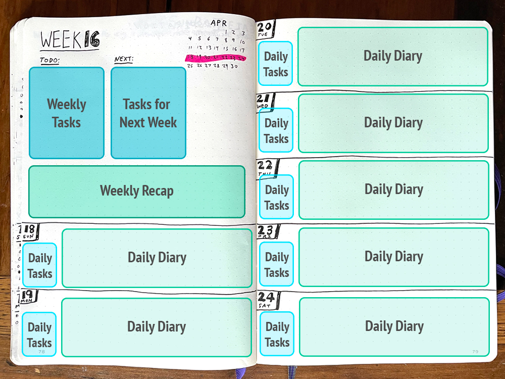
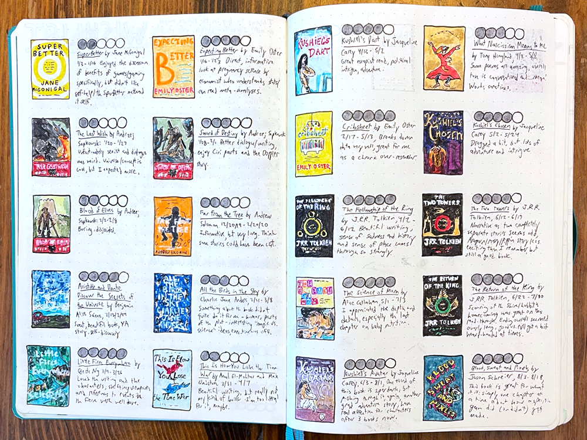
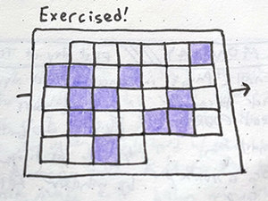
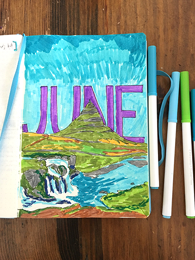
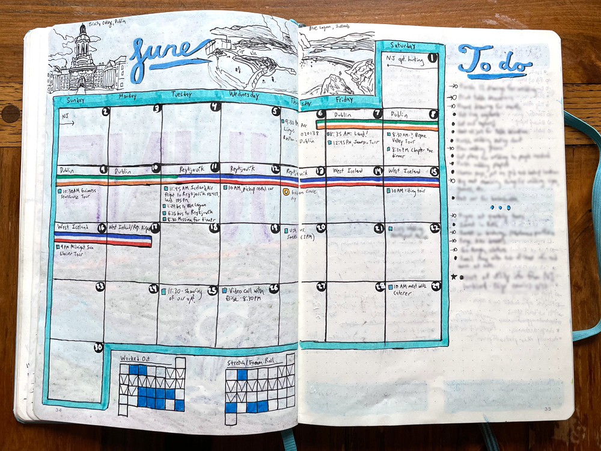

+++
date = "2021-04-12T10:31:38-05:00"
draft = false
title = "How I Use My Bullet Journal"
categories = ["Guides"]
tags = ["Bullet Journaling", "Organization"]
featured = ["true"]
images=["/how-i-use-my-bullet-journal/twitter-card.jpg"]
summary = "I walk you through how I use my bullet journal: the tools I use, how I organize my weekly layouts, and how I think a bullet journal can even be a form of art."
+++

In my [last post](../what-is-a-bullet-journal-and-why-i-love-it), I described what bullet journaling is and why I love it so much. Today, I'd like to walk you through how I bullet journal: the tools I use, how I organize my weekly layouts, and the different ways I choose to use my bullet journal.

## My Weekly Layout

I've settled on a weekly layout that I love after experimenting with a lot of different designs, and so I thought I'd share that here. This layout may not look as beautiful as others, but I find it very functional, and it gives me enough space to keep track of my tasks and also serves as a diary.

  </img>
  

    
The layout I've settled on for my weekly spreads.

  

### Key features:

- Weekly tasks and to-dos are pulled into focus, as well as things I need to remember for the following week.
- I save space to write a recap of the week in general. I like to do monthly reflections, and having a little recap of every week is helpful for that.
- Each day has space for tasks and to-dos, but also plenty of space for a little diary entry. I like to use my bullet journal as a mini-diary/place to jot memories down.
- I can see the context of the week in the current month

## Other Features of My Journal

Aside from being a place to track tasks and to-dos over time, a bullet journal can be whatever else you want it to be! Here is what I use my bullet journal for.

### Lists

I keep track of a variety of lists at the beginning of my bullet journal. A lot are purely for helping me remember things I enjoy (these make up the basis of my [yearly favorites](../categories/yearly-favorites/) posts here, by the way.) I find the act of setting aside space for them in my journal helps me remember them and also reflect on them more easily. Here is what I track:

- **Best food and beer** I like food and I like beer! It's fun to keep track of good meals and beers I have over the year.
- **Favorite memories** The act of making a list of favorite memories helps me actually remember good memories from the year.
- **Travel** I keep a little list of where I travel and notes from what I did. I sometimes include a longer travel journal, but this is a nice little overview of where I went in the year.
- **Books read** This is one I'm proud of. I make this a little art project, basically. I read almost everything on my Kindle, so I don't get to spend a lot of time looking at book covers. Drawing the covers helps me reconnect with what I've read, and I also give what I read a rating out of five.

  </img>
  

    
Some of the books I read in 2020.

  

- **What I watched list** I keep track of the shows and movies I watch during the year, and give them a rating out of five.
- **Books, movies, TV shows, music, games, and podcasts I want to check out** I like having one place for all the lists of media I want to consume. This way I never need to worry about what to read/watch/listen to next.
- **Bucket list** Self-explanatory! Just things I'd like to do in my life at some point.
- **Wishlist** I write down things I want to buy for myself here. I find that waiting to buy things I want makes me actually buy things I will use. I check this every few months and remove items that I find I don't actually want anymore.

### Tracking Projects and Goals

- **Yearly Goals** I start every year with goals/New Year's resolutions, and I find writing them down and setting up checkpoints 6 months into the year helps me keep better track of these goals and my progress on them.
- **Aspirational project list** I keep a list of aspirational projects that sound neat to do someday, but I don't necessarily have time for now. For example, I think it would be really cool to run a Plex media server. I don't have time for it now, but I'd like to do it someday, so I put it on this list.
- **Classes/Tutorial progress** I go through a fair number of tutorials and classes because being a software developer means learning new things all the time. I keep track of my progress on one page in my journal.
- **Finances** I generally keep track of my retirement account balances and savings every month and record them on one page. This helps me actually check my accounts on a regular basis and consider whether I need to increase or decrease my savings rate.
- **Blog post ideas** I also keep track of post ideas for this blog and my [dev blog](https://www.hannaliebl.com/blog/)!

### Habit Trackers

  </img>
  

    
A very simple habit tracker.

  

I also use my bullet journal as a habit tracker, with mixed success. I think it is easy to get over ambitious with tracking a lot of habits you want to build and then burning out. I find focusing on one or two a month is achievable.

I generally draw a mini calendar and fill in days that I completed the habit I want to build. Some people have luck with big grids of habits, but I prefer the simplicity of a mini-calendar. I generally put these on my monthly spread pages.

### Mood Tracker

This is another feature I've been testing recently. I like the idea of assigning each day a general rating, and then slowly building up a year. Often this is called "a year in pixels."

The problem I've run into is that a day may be a mix of good and bad, and so I end up with most days being the "average" rating. Which I suppose is how most days are, after all. But I'm also not sure I'm sold on this being useful for anything (can I see a pattern or track my moods to something else? So far, not really), but it is, at least, kind of interesting at a surface level.

### Monthly Reflections

One final piece of my journal that I find extremely useful is monthly reflections. At the end of every month, I take stock of what happened, what I achieved, if I met my goals, and what dominated my thinking/anxiety. I've found these [four questions from the Shine app blog](https://advice.theshineapp.com/articles/use-these-4-questions-for-your-end-of-month-reflection/) to be helpful to frame my reflections.

This built-in time for reflection is something I've really come to look forward to. It's a small act of self-care, and I do think this built-in reflection has made a difference in my ability to achieve and set goals, and also to examine my mindset.

I used to take a more "stats-based" approach to this reflection, which can also be helpful. For example, in my 2020 bullet journal, I used the monthly reflection page to track the hours I spent working on contract software development projects, the number of days I exercised, and whatever else I happened to have data for. I've found the more writing-heavy, reflection approach based on the four questions linked above to be more useful for me in 2021, though.

## Equipment I Use

You can buy all types of fancy bullet journal equipment, including [official bullet journals](https://bulletjournal.com/pages/shop) that have pages labeled for the future log. But, really, you can use any notebook you have laying around and any writing utensil. I get into this type of stuff, though, so here is my opinion on equipment:

### Notebook

I use a [Leuchtturm 1917 dot grid notebook](https://www.amazon.com/Leuchtturm1917-Medium-Ruled-Hardcover-Notebook/dp/B00SBDN12W?&linkCode=ll1&tag=d01a3488-20&linkId=70cd5f8c5124382d9ecae2ed4cfd2ba4&language=en_US&ref_=as_li_ss_tl), which is one of the pieces of equipment I saw being used in the bullet journal social media sphere. The pages are a bit thin, and so markers and pens can bleed through a bit, but I don't mind, because of its slim profile and nice-feeling cover. I kind of like the feeling of the marker/pen ghosting through from one page to the next, it makes me feel accomplished, I guess, to have that feeling of fullness, of actually using a journal up and my efforts ghosting through from one page to the next. I also love dot-grid notebooks: they work super well for laying out information, but don't take over the page like lines do, in my opinion.

### Pens

I'm also very particular about pens. My go-to for daily writing is a [Uni-Ball Signo Ultra Micro 207 retractable gel pen](https://www.amazon.com/gp/product/B005HNZ5ZU?ie=UTF8&th=1&linkCode=ll1&tag=d01a3488-20&linkId=0d39c89a261e7376e662a4afcc064c61&language=en_US&ref_=as_li_ss_tl) (quite a mouthful...). They have very fine tips and write smoothly. I go through multiple a year.

For layouts and titles, I use [Sakura Pigma Micron pens](https://www.amazon.com/Sakura-Pigma-30062-Micron-Blister/dp/B0008G8G8Y?dchild=1&keywords=micron+pens&qid=1618234025&sr=8-3&linkCode=ll1&tag=d01a3488-20&linkId=a6a88293dd0f502749d2e9d91f23b865&language=en_US&ref_=as_li_ss_tl), which are artist's pens. They come in different widths. I use 08, 05, and 02 for my layout needs.

### Color

I sometimes add color to my bullet journal. I used Crayola Washable markers for a while, which work fine, but I splurged on some [Tombow dual brush pen art markers](https://www.amazon.com/gp/product/B07581CXYK?ie=UTF8&psc=1&linkCode=ll1&tag=d01a3488-20&linkId=6d7d4e5b6e45acc9b3220b719fa5e1bc&language=en_US&ref_=as_li_ss_tl), and they are great. They can be used for calligraphy, and the brush tips are great for evenly filling in space with color.

## The Bullet Journal As An Art Form

Browse through the [#bujo tag](https://www.instagram.com/explore/tags/bujo/) on Instagram, and you will see millions of beautiful photos of people's journals, and the lettering and art they intersperse with mundane chores and habit trackers. On the one hand, I love looking at these beautiful images and am astounded at how talented many people who keep bullet journals are. On the other hand, I think this social media presence makes it intimidating for people to start bullet journaling. A bullet journal doesn't need to be a piece of art: it can be simply a functional, utilitarian way to organize your life.

  </img>
  

    
My illustrated cover page for June 2019.

  

But, I like that it can be used as a creative outlet. In recent years I've gone more towards the utilitarian side, but I do sometimes create artistic cover pages for months, or create a monthly spread with drawings and typography that could, maybe, find a home on an Instagram page.

My bullet journal is sometimes the only time in a day or week that I put pen to paper. As someone who grew up doodling and drawing, I like that connection to pen and paper, and when I give myself license to be a little creative and not worry so much about "messing up" my journal, that is when I find it most useful, and it can become a spot for creativity as well as function.

  </img>
  

    
The monthly spread for June 2019. I went to Ireland and Iceland and drew inspiration from those trips for this design.

  

My main lesson for bullet journaling, and my main piece of advice to anyone wanting to try, is just to do it! Don't worry about making it perfect. Don't compare it to other people who post on social media. Do it for yourself. Use the underlying system of organization however it helps you, and leave the rest. I've tried and abandoned spreads, projects, and layouts until I found what worked for me, and I'm still experimenting with different ways to use my bullet journal.

I love to hear about other people using bullet journals, or other systems of organization. Feel free to [send me a Tweet](https://twitter.com/lieblhan) or email me (first name dot last name at gmail dot com!) if you want to share how you use your bullet journal.
