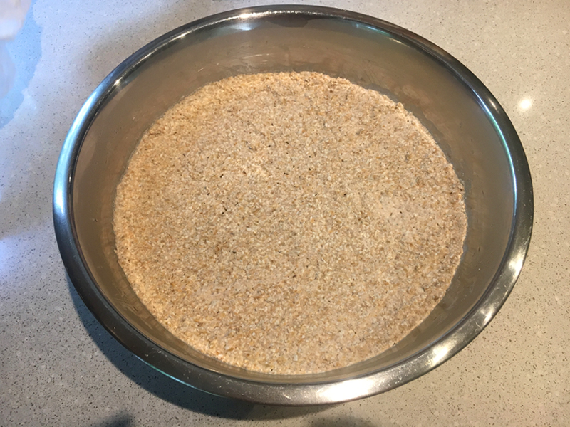
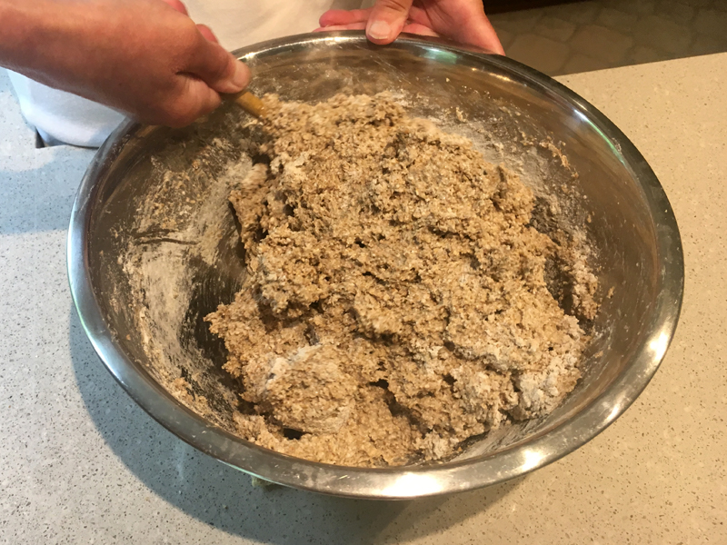
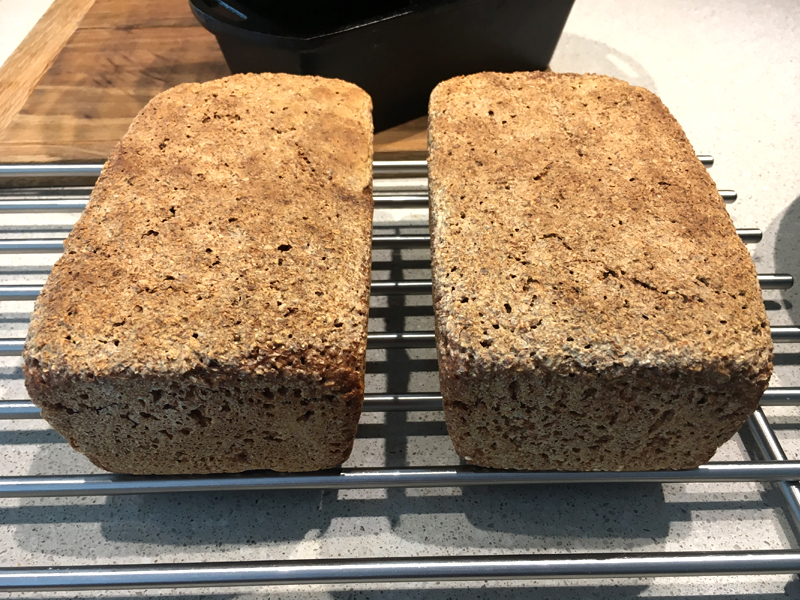

+++
date = "2020-07-03T11:35:38-05:00"
draft = false
title = "Mama's Sourdough Rye Bread Recipe"
categories = ["Food"]
tags = ["Recipes", "Bread"]
description="My mom's German sourdough rye bread recipe, featuring home-milled rye, for your internet viewing pleasure."
summary = "My mom's German sourdough rye bread recipe, featuring home-milled rye, for your internet viewing pleasure."
+++

Growing up, my mom would source frozen rye bread from a German bakery in a city a few hours away. That dark, dense rye bread was a staple in our house. In recent years, my mom has gotten into bread baking. First with a bread machine, but then with sourdough. The most recent iteration of this includes milling whole rye and recreating that amazing whole grain sourdough rye bread. This recipe is no-knead, and creates a dense, strong sourdough with a crispy crust.

To make this, you need a few tools/ingredients:

- A source of whole rye grains. She found Great River Organic Milling Company, an organic mill in Wisconsin, and they sell and ship on [Amazon](https://www.amazon.com/gp/product/B0049YM8XU?ie=UTF8&psc=1&linkCode=ll1&tag=d01a3488-20&linkId=163f568a6942f2950b992f051646ce8a&language=en_US&ref_=as_li_ss_tl). There may very well be mills/sources of grain local to you, though.
- A way to mill the flour. I use the [mill attachment](https://www.kitchenaid.com/countertop-appliances/stand-mixers/attachments/p.all-metal-grain-mill.kgm.html) for my KitchenAid mixer. You can make this without milling the flour yourself, just buy whole grain rye flour.
- Sourdough starter, fed with rye. See [King Arthur for instructions](https://www.kingarthurbaking.com/learn/guides/sourdough/create) on how to create your own starter.
- A bread pan. I like [cast iron loaf pans](https://www.lodgecastiron.com/product/seasoned-cast-iron-loaf-pan?sku=BW8LP), but any bread pan will do.
- A kitchen scale. This recipe uses weight, and it's easier to split the loaves equally in two if you can weigh them.
- Some type of large plastic bag to let the dough proof in.

#### Yield

This recipe makes two loaves, roughly 12 x 4 x 3 inches (same as the Lodge pan linked to above.) It takes two days, so begin your bread the day before you want to bake it.

#### Ingredients

Rye sourdough starter 
3 cups water
1000 grams of rye flour or rye to be milled into flour 
Spices (optional) cumin, oriander, fennel, caraway 
Salt 
Sesame seeds (optional)

#### Day 1:

1. On the morning of day one, activate the starter. My mom does this by feel: she takes her starter, puts it into a shallow glass container, adds some water and some milled rye flour to make a sponge. Leave it out at room temperature. You want to make enough to have 1 cup of activated starter.
2. In preparation for the next step, mill 650 grams of rye flour, or measure out 650 grams of flour if you aren't milling it yourself.
3. On the afternoon of day one (or earlier if it's warm out: the starter can be ready in as soon as 4 hours in the summer), take 1 cup of the activated starter and combine it in a bowl with 3 cups of water and the 650 grams of flour. Let this mixture sit covered on the counter overnight.

#### Day 2:

  </img>
  

    
The dough after the overnight rise. It should smell quite sour at this point.

  

4. The sponge in the bowl should now be dryer and smell sour. Mill or measure out another 350 grams of rye flour. An optional step here is to add some spices to the 350 grams of flour: cumin, coriander, fennel, and caraway are all options to add to the rye bread, according to your tastes. The natural flavor of the dough is quite sour already, so there might not be a need for you to add any other flavors.
5. Add some of the flour to the sponge, and add salt to taste (my mom uses 2 - 3 teaspoons.) Gently mix.
6. Add the rest of the flour and continue mixing. You don't need to knead, and the dough will be stickier, denser, and way less springy than sourdough recipes you may have used in the past.
7. You should now have 2000 grams total of dough. The dough should be sticky, but not too wet and not too dry, either. Feel free to add more flour or water here to achieve the desired consistency.

  </img>
  

    
This is roughly how the dough should look as you mix the final flour in and it is ready for proofing.

  

8. Prep your bread pans: oil them (canola oil works well for this), and, optionally, add a layer of sesame seeds to the bottom of the pan to keep the bread from sticking (sesame seeds also taste good in combination with the bread!)
9. Weigh out half of the dough (this should be around 1000 grams) and with wet hands form the dough into a rectangle that fits into your bread pan. Put the dough into the pan, and gently press it into the edges.
10. Proof the dough (the final rise): put the pans into your proofing bag, blow air into it so that the bag isn't touching the dough, seal the bag, and let them rise for at least two hours.
11. Finally, bake at 350° for 1.5 - 2 hours. The bread should brown nicely. Take it out of the pans and let it cool. One way to make sure it's done is to knock on the bread with your hand: it should sound hollow.

  </img>
  

    
The finished loaves!

  

