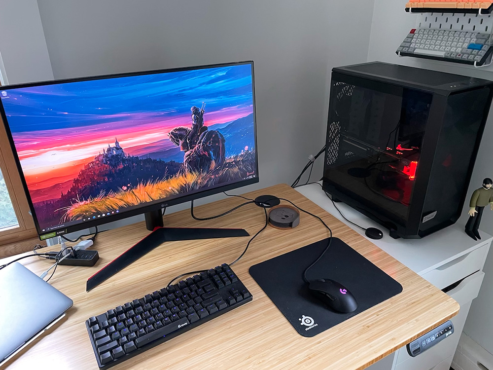
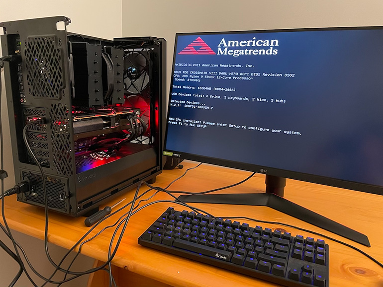
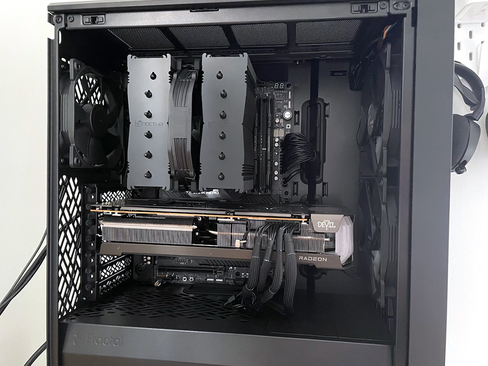

+++
date = "2021-09-24T18:35:38-05:00"
draft = false
title = "Notes from Building a PC for the First Time in a Decade"
categories = ["Tech"]
tags = ["Hardware", "PC"]
description="Some long-form notes on my experience building a PC for the first time since 2011: resources I used, how I decided on components, and my night-by-night build log."
summary = "Some long-form notes on my experience building a PC for the first time since 2011: resources I used, how I decided on components, and my night-by-night build log."
+++

_If you'd just like to see my completed build and the list of parts, [check it out on PC Part Picker](https://pcpartpicker.com/b/xVk6Mp)! If you want more info about how the build went and resources I used along the way, keep reading._

  </img>
  

    
My finished PC build! I love that it fits next to my desk so easily.

  

I've been a PC gamer since 1999 when my uncle and cousins introduced me to Starcraft and Total Annihilation. I've had ebbs and flows in the time and attention I give to PC gaming, but it's a hobby that has been a part of my life for decades. A key part of PC gaming is the computer itself. I don't build a new computer that often because I find that with some decent upgrades along the way, a good computer will last a long time.

This was the case with the PC I built in 2011. I had just gotten my first real job after college, and I spent a good chunk of my first paychecks on parts. I put it together on the kitchen table of the house I was renting with friends, and it has lasted me nearly a decade of playing games.

Now in 2021, though, it's starting to feel its age, and beginning to struggle to run games I would like to play at an acceptable frame rate. So, I decided it was time to build a new computer, hopefully, one that will serve me just as well as my old one for the next decade.

## Research

I had to do a lot of catching up on current PC hardware. I tend to start with [Logical Increments](https://www.logicalincrements.com/) for an overview of the various tiers of current PC hardware. Their guides are a great starting point for hardware recommendations at various performance and price levels.

I also like to prioritize what I want from a build. I wanted great performance at 1440p (with as close to 144hz refresh rate in most modern titles as I could get.) My old PC was running a 1080p monitor, but I had been using a 1440p display for work and wanted to run at the same size for play as well. I wanted a CPU and GPU powerful enough to work for the next few years without worrying about an upgrade. I wanted to prioritize hard drive space and speed (my goal is to use my PC both for gaming but also make it my main hub for Lightroom photo management.) Finally, I wanted a smaller form factor than my old 2011 mid-tower case.

I then spent time browsing [PC Part Picker](https://pcpartpicker.com/). This website is indispensable for building a PC. It allows you to select parts for a build and then tells you if they are compatible. It aggregates user reviews for parts, and, crucially, user builds, and allows you to search for builds that contain certain parts. This is great for getting inspiration and reading the description of people's builds also helps identify trickier aspects of combining certain hardware, or evaluating performance.

I also began reading [r/buildapc](https://www.reddit.com/r/buildapc) regularly to keep up with hardware news, and looking at the computers people were posting on [r/battlestations](https://www.reddit.com/r/battlestations/) to see general trends in what components people were choosing.

I couldn't really begin any in-depth planning without the most important and difficult component to source, though: the GPU. Once I had a GPU, I could find a case that fits, and work from there.

## The Hunt for a GPU

There's a huge GPU shortage that started in 2020 and has continued since then. There are a lot of causes people cite: the COVID-19 pandemic messing with supply and demand, a global microchip shortage, and surging demand for GPUs from cryptocurrency mining. Regardless of the reason, the result is that in the summer of 2021, it's very difficult to get any GPU, let alone a new Nvidia or AMD card for anywhere near MSRP (Manufacturer's Suggested Retail Price).

I wasn't picky about Nvidia vs AMD. I've had both brands in the past, and both have served me well for years. I was unconvinced that any specific set of features from one card or the other would matter that much. I think the truth is that for most people, any of the newest generation of video cards will run modern games extremely well, and this will be the case for years into the future. Arguably, I could have even gone a generation or two back and been just fine, but there is something fun about trying to get the latest and greatest, so I set my sights on the most recent generation.

I was looking for anything like an Nvidia RTX 3700/AMD Radeon 6700 XT or above in terms of quality to let me easily run games at 1440p (I used [Tom's Hardware GPU Hierarchy list](https://www.tomshardware.com/reviews/gpu-hierarchy,4388.html) as an easy reference.) I joined a lot of stock alert Discords dedicated to helping people get GPUs. I learned a lot about how and when different stores release inventory and try to manage demand either via a queue or other methods.

I got very deep into the weeds of this GPU hunt and tried my hand at various "drops"-- Best Buy, Zotac, and AMD. I joined EVGA queues. I never once succeeded in getting a card. I installed Tampermonkey scripts that helped automate the shopping cart process on various sites. I read a lot of guides pinned in various Discord groups. I signed up for every Newegg shuffle.

Finally, I got a stock alert for a Red Devil 6800 XT at Newegg. It was marked up a lot, but at this point, after weeks of trying, I figured that just buying from a reputable vendor was better than the frustration and time spent trying to get a card at MSRP or turning to the scalper's market. I am old enough now and far enough along in my career that paying a few hundred dollars premium to get a guaranteed card with the backing of a trusted seller was ultimately worth it to me, so I did! I left the stock alert Discords and moved on with my build.

## The Case

Once I had that coveted GPU, I decided on a case. I love that because hard drives are standardizing on much smaller form factors than physical disks of old and there isn't a huge demand for CD drives, cases can be a lot smaller than they were a decade ago because they don't need a huge drive bay. My old PC was a behemoth that sat on the floor, but I wanted something that could easily sit on my desk. Plus, a lot of cases these days feature glass windows to show off the components inside, so having something that could go on my desk was important for that as well. I think PCs look cool and I wanted to be able to see mine easily!

I briefly considered diving into the world of small form-factor PCs, but I was a bit scared of how hard it can be to actually build them and then cool them, so I settled on a small ATX case that I loved the look of and boasted good thermals: the [Meshify 2 Compact](https://www.fractal-design.com/products/cases/meshify/meshify-2-compact/).

## CPU, Motherboard, and CPU Cooler

I picked a very high-end AMD CPU and motherboard (that could handle my new AMD CPU without a BIOS flashback, which I did not want to deal with.)

Another difference from now vs. 10 years ago is that a lot of CPUs don't come with stock coolers, and so I needed to find a CPU cooler. I loved the look (in the all-black Chromax version) and the highly-reviewed specs of Noctua coolers, so I opted for one of those.

I did have to go a bit in the weeds trying to figure out if the cooler would fit in my case and clear my RAM. This was a bit complex. There is, thankfully, a very [clear diagram](https://noctua.at/pub/media/wysiwyg/faqs/nh_d15_clearance_2016.png) from Noctua that shows the clearance and exact height in mm, but it was hard to find true RAM height for the modules I had purchased. I used PC Part Picker user builds a lot in this process, and ended up choosing a cooler with only one fan mounted on the heatsink just in case I had clearance issues.

## Letting Sales Guide Me

For the rest of the components, I let sales guide me. I picked up hard drives (one m2 drive and one SSD for storage), RAM, a power supply, and a new monitor using sales. [r/buildapcsales](https://www.reddit.com/r/buildapcsales/) is a great subreddit for finding deals, and I used it heavily while sourcing components.

## Resources

For some components, like hard drives and power supplies, there are so many models and manufacturers that even with letting sales guide me, it was hard to find ways to compare two products. I leaned on a variety of user-created guides: [CPU cooler performance tier list](https://linustechtips.com/topic/891730-cpu-cooler-performance-tier-list/) and [power supply tier list](https://linustechtips.com/topic/1116640-psu-tier-list/) from Linus Tech Tips forums, and then an [SSD buying guide](https://www.reddit.com/user/NewMaxx/comments/9yv0c6/ssd_buying_guide_wip/) and [monitor buying guide](https://www.reddit.com/r/buildapcmonitors/comments/m5d3n0/reddit_monitor_recommendations/) from Reddit.

I also watched a lot of build videos, some specific to the component I was installing, and some general "how to build a PC" videos, because it had been 10 years since I'd built a PC. TechSource has a [detailed, informative video](https://www.youtube.com/watch?v=PXaLc9AYIcg) on building a modern gaming PC that served as a good general guide. Christopher Flannigan has a lot of very detailed videos that go over how to completely build a PC, and he happened to have [one that used my exact same case](https://www.youtube.com/watch?v=w0gXjqd5fRY), which was very useful.

Finally, after my computer was built, I had to update settings and tweak performance a bit, and I found [this video](https://www.youtube.com/watch?v=RYYoCXh2gtw) from JayzTwoCents a good general guide on what to do after you finish building your PC.

## Build Notes

I built the PC over four nights once the rest of the family had gone to bed. It was kind of fun to do it a bit-by-bit. Here are my build notes:

### Night 1

- I unpacked the case and got used to it. I practiced taking the side, top, and front panel off. I removed the dust filters from all the sides because I wanted maximum airflow.
- I read the motherboard and case manuals. This is an often-overlooked step because people are so eager to get going, but since this was my first build in 10 years, I wanted to be methodical.
- I installed the RAM, the M.2 hard drive, and the CPU. I did this before putting the motherboard in the case, as it is much easier to get access to the board before it is screwed into the case. I made sure to use the correct slots for the RAM (if you are installing 2 sticks, there is a certain configuration that works for two vs four-channel. Generally, you install the RAM first in the slot closest to the CPU and then the third-closet slot to the CPU, but check your manual to be sure.)

### Night 2

- I tackled installing the Noctua cooler tonight. I watched [this video](https://www.youtube.com/watch?v=_I-fk7HPSZ0) to see exactly how to do it and read the manual. I spent way too long researching thermal paste patterns, and just settled on an X pattern.
- I realized the M.2 drive hadn't been screwed in properly the night before. The heatsink on it was slipping a bit and the screw wasn't grasping properly. This was a bit annoying and fiddly, but I got it to work eventually.
- I finally screwed the motherboard into the case! It was a little tricky to do with the giant cooler in the way, but with some patience and my handy screwdriver kit with this [very useful screw grabber tool](https://www.amazon.com/Felo-0715750078-Phillips-Screwdriver-Gripper/dp/B000E60ODS?th=1&linkCode=ll1&tag=d01a3488-20&linkId=15317c1e48a39876c28be0a86c0050f7&language=en_US&ref_=as_li_ss_tl), I managed it.
- I also tackled another famously-fiddly bit of PC building: the front i/o connections and the chassis fan connections. I referenced my motherboard manual to do this properly.

### Night 3

- I installed the power supply and plugged in all the power cables. The Meshify 2 has a really handy removable power supply bracket that made getting it into the case easy. I also really appreciated that I bought a fully modular power supply, and so I could install only the cables that I needed.
- The power cables all went fairly easily except for the CPU power. Because I had already mounted the massive Noctua cooler, getting access to the power for the CPU on the motherboard was very hard. I had to take the case's top panel off, but it was still one of the most annoying parts of this whole build.
- I installed the GPU tonight as well. It's always a bit nerve-wracking installing the most expensive and largest component, but it is also fairly easy. I made sure not to daisy-chain my GPU's power cables (see [this diagram](https://hardforum.com/data/attachment-files/2020/10/388573_daisy_chain.jpg)).
- I also tried to install my SSD storage drive...I realized it didn't come with a SATA cable, so I had to quickly order one online. I at least mounted it in the SSD bracket on the rear of the case, though.
- I did a bit of light cable management. I intend to replace the stock case fans later, so I didn't go overboard, but the case has really good built-in cable management (divets for cables and cable ties built in, along with well-placed holes to route them to the back) and so I could get a lot done.
- Finally, the moment of truth...setting up my new monitor, plugging in a keyboard and mouse, and turning it on...
- It worked! I got to BIOS successfully, it recognized the CPU and RAM, and all the lights and fans turned on.

  </img>
  

    
Successfully booting to BIOS!

  

## Night 4

- This was all about the software side of things
- I made a bootable Windows 10 thumb drive and installed Windows.
- I tweaked some Windows settings for better performance/my preferences
- I installed a bunch of software: Chrome, Brave, 1Password, Discord, Steam, and Creative Cloud
- I updated my drivers using the motherboard's Armoury Crate software
- I installed the AMD control software and got those drivers up to date
- I enabled DOCP RAM profiles in the BIOD to get my RAM to 3600mhz
- I enabled 144hz and freesync on my monitor to unlock refresh rates above 60hz
- Finally, I installed and played a new game I've been itching to play on PC: Horizon: Zero Dawn! It ran buttery smooth on ultra settings, around 115 FPS, and on high it easily go to 144 FPS. I'm looking forward to years of fun with this PC!

  </img>
  

    
Details of the interior of my new PC.

  

