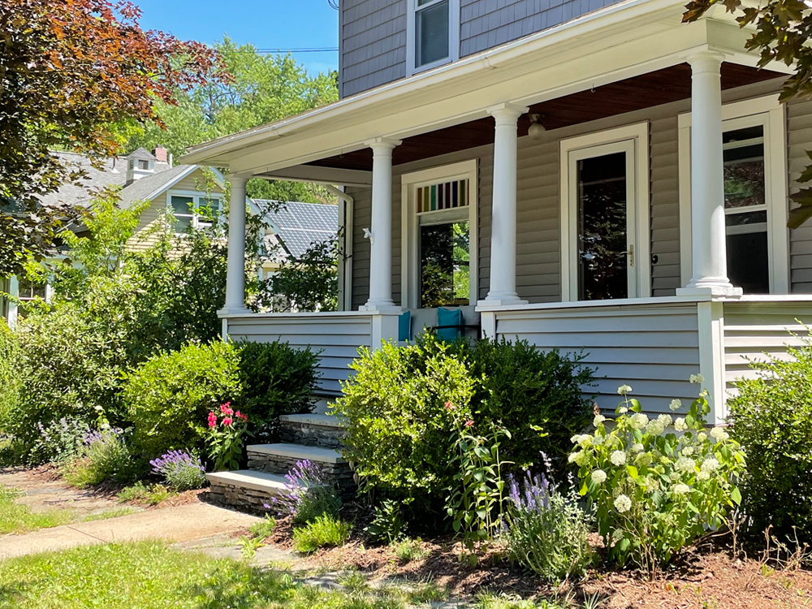
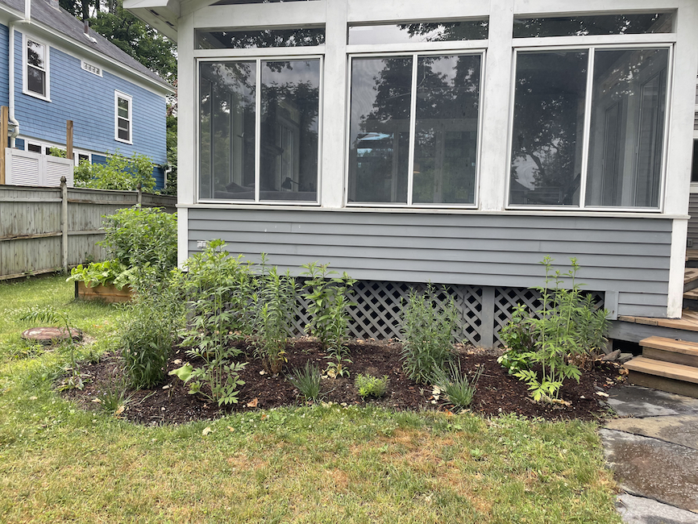
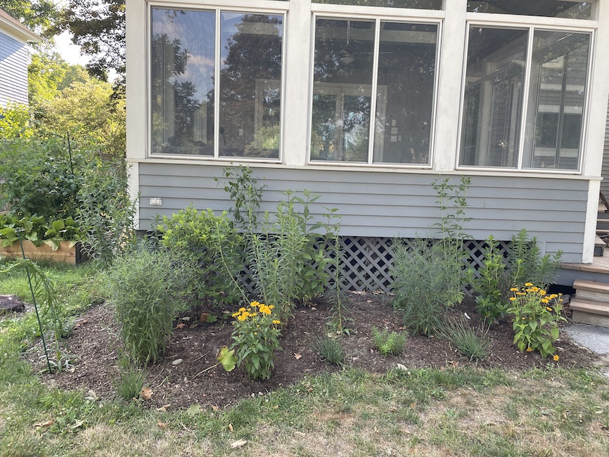
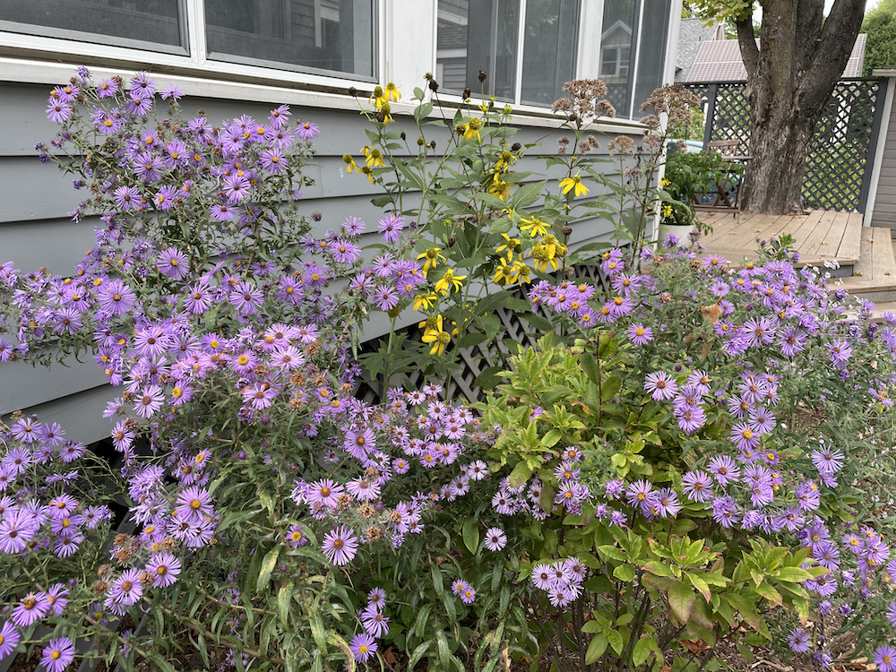
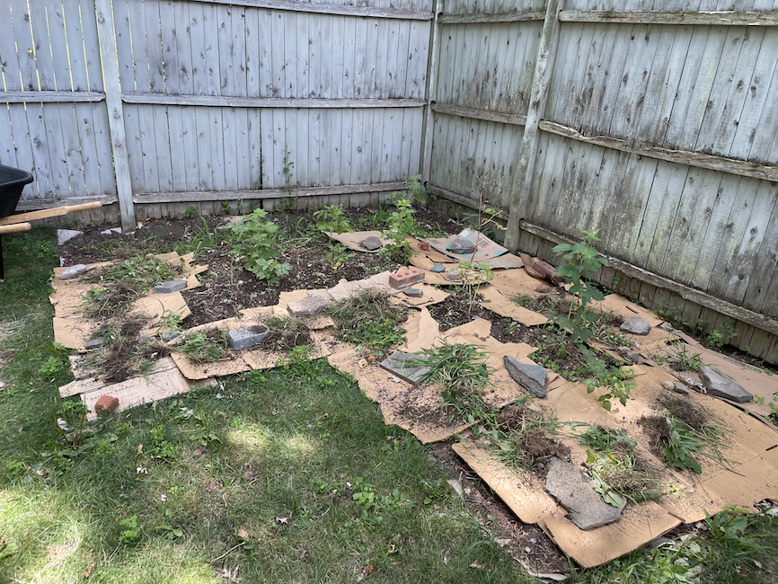
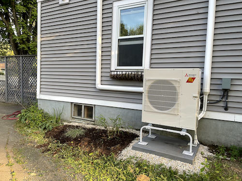
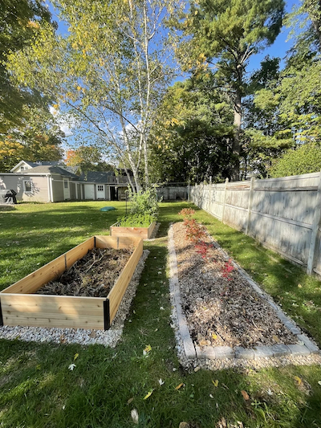

+++
date = "2023-08-26T07:15:00-04:00"
draft = false
title = "Other Garden Projects From the First Year"
categories = ["House", "Garden"]
tags = ["Gardening", "Bokashi", "Front Yard", "Sunporch Bed", "Native Plants", "Raspberries", "Lasagna Gardening"]
description="Catching up on all the other garden projects I did in the first full growing season, including my first foray into ornamental native planting."
summary = "Catching up on all the other garden projects I did in the first full growing season, including my first foray into ornamental native planting."
+++

_I'm catching up on some gardening posts! I wrote a chunk of this last year, but decided to finish it now, almost a full growing season later. This allowed me to reflect a bit on what I did in the first year, but also on what changed since I initially wrote it._

In addition to my larger projects of [establishing blueberries](https://www.hannasthoughts.com/the-garden-year-1-establishing-blueberries/) and [raised beds for veggies](https://www.hannasthoughts.com/the-garden-year-1-raised-beds-for-vegetables/), I also ended up taking on a few other garden projects in this first full year, which I will document here.

## Compost Bin

I built a compost bin from wooden pallets. I used a lot of the inherited leaf pile to fill raised beds and build a mounded bed for my blueberries, and so I decided to put a pallet compost system into the empty space in the corner of the yard where the leaves used to be. For now, I just have one section made of three pallets. I used metal brackets to screw them together.

The only thing to note about using pallets for DIY projects is that some pallets are treated with methyl bromide, an insecticide, and they should not be used for something like a compost bin, which makes soil that will come in contact with vegetables. There are specific markings on pallets used internationally that can tell you whether a pallet is treated with insecticides or heat treated (which is safe to use in projects). I used [this site](https://diyprojects.com/know-safe-use-pallet/) as a source to understand those markings.

## Front Yard Perennial Garden

As I detailed in [The Garden Year 0](https://www.hannasthoughts.com/the-garden-year-0/), the front yard had an existing bed, with boxwoods and Japanese barberry. I planted Annabelle hydrangeas in the fall of 2021 and filled in the rest of the bed with a mix of native and non-native perennials, going for a vague purple/white/yellow theme. Here's the initial plant list:

| Name                                 | Native? | Notes                                                         |
| ------------------------------------ | ------- | ------------------------------------------------------------- |
| Annabelle hydrangea                  | Yes     | White summer bloom, shrub                                     |
| Daffodils                            | No      | Early spring bloom, bulbs, planted fall 2021                  |
| Crocuses                             | No      | Early spring bloom, bulbs, planted fall 2021                  |
| Cat mint (Nepeta mussinii)           | No      | Purple summer bloom                                           |
| Skullcap (Scutellaria incana)        | Yes     | Purple summer bloom, these plants thrived!                    |
| Lavender                             | No      | Purple summer bloom, didn't get established                   |
| Bee balm (Monarda 'Jacob Cline')     | Yes     | Red summer bloom, suffered from powdery mildew                |
| Creeping phlox (Phlox stolonifera)   | Yes     | Spring bloom, purple and white                                |
| Columbine (Aquilegia canadensis)     | Yes     | Red spring bloom, didn't survive/reseed beyond the first year |
| Sage (Salvia nemorosa)               | No      | Purple summer bloom                                           |
| Rudbeckia fulgida 'little gold star' | Yes     | Yellow summer bloom                                           |

The bee balm suffered from powdery mildew, the columbine didn't make it past year one, and the lavender also suffered due to its placement, but some of the plants thrived. The creeping phlox, daffodils/crocuses, cat mint, skullcap, and rudbeckia create a really nice early spring to mid-summer show.

I didn't really know what I was doing, but it was a first foray into the joys of ornamental perennial plantings. A lot of the plants I planted later in the summer didn't survive the drought we had, and I've since changed the bed a bit, but it was a fun first experiment.

  </img>
  

    
The front bed in mid summer: hydrangea, bee balm, sage, and lavender blooming.

  

## Native Plant Sunporch Bed

I was initially only planning on getting some perennials for the front garden, but then I got really interested in more ornamental plantings. There was a small existing bed behind the sunporch in our backyard. I ripped out the only existing plantings (a small boxwood and some hostas) and decided to use the space as an experiment in working with native plants. We took down a tree that was very close to the house right next to the bed, which changed it from a shady spot into a spot with partial sun.

I happen to live within driving distance of [Nasami Farm](https://www.nativeplanttrust.org/for-your-garden/nasami-farm/), an excellent native plant nursery, and they have a [useful native plant finder](https://plantfinder.nativeplanttrust.org/Plant-Search) that allows you to filter plant lists by certain criteria. In the subsequent year, I've become way more invested and interested in native plants from an ecological perspective, but at first, I mostly decided to use them because Nasami is so close and it was a way to naturally limit my choice of plants. I'd like to think my motives to use native plants were better than that at the time, but, hey, we all start somewhere!

I chose two shrubs that sounded beautiful to anchor the bed and then filled in the rest with mostly flowers. A lot of them get quite tall as the summer progresses, which meant I could see them while sitting on our porch, which was lovely.

Here's my plant list for the sunporch bed in the first year (all natives–most are true Northeast natives, some are borderline–that is, native to the US, but not necessarily to New England):

| Name                                                       | Notes                                                                                                                                                                     |
| ---------------------------------------------------------- | ------------------------------------------------------------------------------------------------------------------------------------------------------------------------- |
| Pinxterbloom azalea (Rhododendron periclymenoides)         | Shrub, pink spring bloom                                                                                                                                                  |
| Coastal sweet pepperbush (Clethra alnifolia 'hummingbird') | Dwarf variety shrub, white summer bloom, chosen mostly because it's extremely fragrant                                                                                    |
| Blue-eyed grass (Sisyrinchium angustifolium 'lucerne')     | Front border, blue spring bloom                                                                                                                                           |
| New England blazing star (Liatris novae-angliae)           | Purple late summer bloom                                                                                                                                                  |
| Cut-leaf coneflower (Rudbeckia laciniata)                  | Pink summer bloom, tall plant, covered in bees all summer                                                                                                                 |
| Spotted Joe-Pye weed (Eutrochium maculatum)                | Yellow summer bloom, tall plant, covered in bees all summer                                                                                                               |
| New York aster (Symphyotrichum novi-belgii)                | Pale blue early fall bloom. Both plants didn't survive the winter, unfortunately: I think they got some sort of disease, despite apparently thriving in the first summer. |
| New England aster (Symphyotrichum novae-angliae)           | Purple early fall bloom                                                                                                                                                   |
| Butterfly milkweed (Asclepias tuberosa)                    | Orange summer bloom                                                                                                                                                       |
| Purple coneflower (Echinacea purpurea)                     | Purple summer bloom                                                                                                                                                       |
| False sunflower (Heliopsis helianthoides)                  | Yellow summer bloom                                                                                                                                                       |

I'm trying to keep in mind that perennials take a few years to become fully established and filled in, and I've found, writing this a year later, that my knowledge about design and spacing is even better now, but the nice thing about plants is that you can generally just move them around if you do it carefully once you learn. I like the experimentation that is inherent to gardening, and this bed was a great first foray into designing with native plants.

I'm always amazed at how much plants grow in a given season. Take a look at these progress photos:

  </img>
  

    
May 2022.

  

  </img>
  

    
June 2022.

  

  </img>
  

    
July 2022 (I've added some plants and moved some plants around: mostly, realizing the cut-leaf coneflower is way too tall to go in the front).

  

I am still searching for ideal plant and bloom combinations, and in this first year I was even less experienced in garden design, but I do think the late-summer/early fall blooms of the New England asters, the cut-leaf coneflowers, and Joe Pye weed looked great:

  </img>
  

    
A late-summer bloom combination: New England asters, cut-leaf coneflowers, and Joe Pye weed.

  

## Raspberries

It turns out a lot of people I know were trying to give away raspberry canes (because they spread so much!) and so I impromptu decided to start a raspberry patch in the back corner of the yard, next to the blueberries. It doesn't get a ton of sun since it's under the canopy of a neighbor's tree, but I figured berries would be fine to let go a little wild back there.

I used the same technique that I use for all my garden beds: lasagna-style gardening starting with cardboard, followed by whatever yard waste I had on hand (grass clippings, leaves), and then followed up with a layer of wood chips. A few canes didn't survive the transplanting/drought, but I definitely have some thriving plants in there now.

  </img>
  

    
Lasagna garden raspberry bed in-progress.

  

## Grasses on the North Side of House

  </img>
  

    
Gravel, grasses, and a new mini split.

  

I started a long-term project to simplify the plantings around the foundation of the house. This is partially for aesthetics, and partially for the health of the house, to prevent moisture buildup and potential root damage. I ripped out a huge boxwood (that was actually starting to damage the foundation a bit!) and some hostas that had been growing wild on the north side of the house.

As a side note, I've become an expert at removing shrubs, specifically boxwoods, at this point. I use loppers to trim all the branches down until it's just the main, woody center of the plant. I then dig around the roots, cutting any tenacious ones with loppers or pruners, and then work to pry the root ball out, using the existing woody stem as a handle. It takes a good amount of muscle, but it's very satisfying.

Removing these plants made space for a mini split we had installed to heat and cool the second floor of the house (my long-term goal is to get off of oil heat, and this is part of that plan), but I also made some space for planting some grasses (Hakonechloa Beni-kaze and
purple lovegrass.) I think grasses look good, are low maintenance, and don't spread as aggressively as hostas. Finally, I filled in the side of the house with some gravel. Again, for aesthetics, but also to keep a clear, plant-free barrier around the foundation. Someday I will do this to the entirety of the house, but this was a small step in that direction.

## A Third Raised Bed, and More Space for Vegetables

In the fall, I got another raised bed from Gardener's Supply to match the [other two I'd added](https://www.hannasthoughts.com/the-garden-year-1-raised-beds-for-vegetables/).

  </img>
  

    
My third raised bed, filled partially with woody material.

  

I started it in the fall to take advantage of fallen leaves to fill it. I did what I did with the other beds, except I had many more months for the material to break down: cardboard and sticks/branches on the bottom, then leaves, grass clippings, bokashi buried directly in the bed, and then a top layer of finished compost, soil, and straw.

This ended up working really well: in 2023, it was a tomato and eggplant bed, and these heavy nitrogen feeders did well here.

Finally, I started some lasagna beds in the ground, with the idea that by spring they would be ready to go. My intention was to create a space for trellised peas and cucumbers, and another bed for strawberries. Except more posts about the results of those beds soon!
