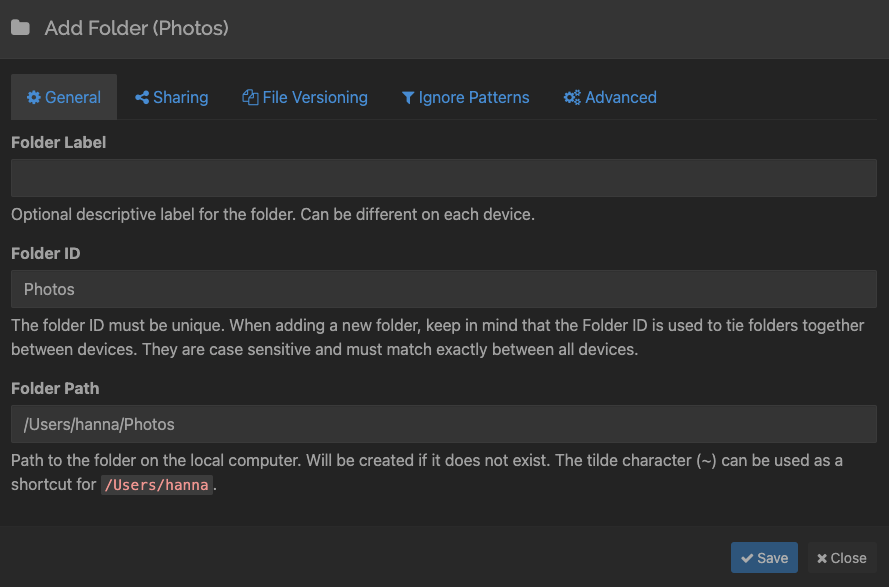
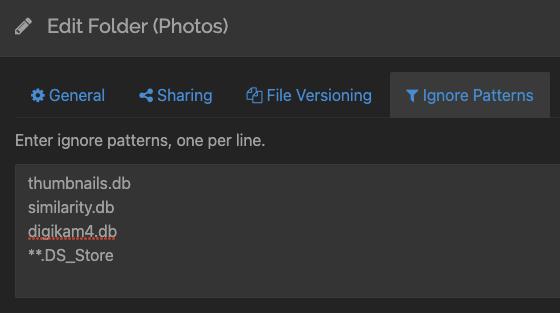
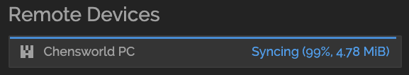
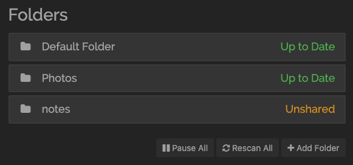
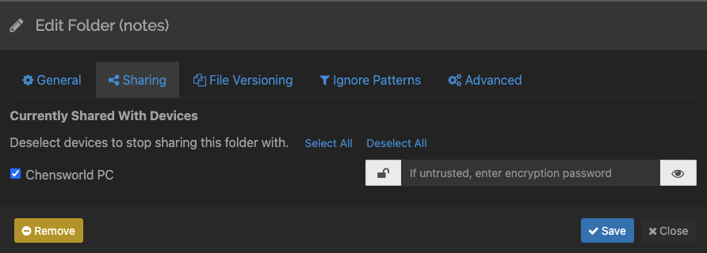

+++
date = "2021-11-07T13:39:45-05:00"
draft = false
title = "Sharing Photos and a Lightroom Catalog Between Two Computers with Syncthing"
categories = ["Guides"]
tags = ["Tech", "Organization", "Photography", "Lightroom"]
images=["/sharing-photos-and-a-lightroom-catalog-between-two-computers-with-syncthing/twitter-card.jpg"]
description="I solve a long-standing problem in my quest for an organized digital life: sharing and syncing a photo library between two computers."
summary = "I solve a long-standing problem in my quest for an organized digital life: sharing and syncing a photo library between two computers."
+++

I'm on a search for the holy grail of managing, organizing, sharing, and archiving my digital assets, and ever since buying a house this year, I feel like I can invest time and resources into doing this. It's a project I've been envisioning for a long time, and a first major step is getting a handle on my personal photo collection.

## Background

I've been a regular digital camera user since 2004, when I was still in high school. I love photos and the memories they help preserve. In 2020 I finally decided to embark on an organizational project that will hopefully help make my photo library more accessible. After all, it's only worth taking photos if there is a good way to look at them or find specific photos in the future.

I settled on using Adobe Lightroom as the main hub for my photo library. Lightroom certainly isn't perfect, but it solves a few problems for me. First, it allows me to use whatever underlying folder structure I want, unlike some other management solutions (I'm looking at you, Apple Photos!) Second, it allows me to easily create albums and collections without also disrupting this internal folder structure. I considered an open-source alternative like Digikam, but it only has support for tagging, and not albums/collections independent of folder structure (to be fair, it is apparently possible to use tags as albums in Digikam, but I found it awkward and had already invested a lot of time into Lightroom's system. I might revise this in the future once I get tired of paying Adobe a monthly license fee for Lightroom.) Third, Lightroom has robust editing features, and the plan I'm on includes Photoshop as well, which is occasionally useful for more editing.

The major downside of Lightroom is the monthly license cost. For now, though, I decided it was worth it to pay the fee and get my library under control with software I know how to use. The other downside of Lightroom is that it feels dated sometimes. It's not the most performant, either. I used to have issues with video playback as well, but I have found recent updates improved video support, and also increasing the size of the video cache has helped with playback.

In any case, my current setup is Lightroom is the home for my photo management. I originally only used Lightroom on my Mac laptop. However, I recently [built a new powerful PC](https://www.hannasthoughts.com/notes-from-building-a-pc-for-the-first-time-in-a-decade/), and wanted to also be able to edit and manage my photo library on that computer. I wanted to both sync my photos between two computers and also my entire Lightroom catalog that stored things like image thumbnails, edits, and collections.

## Syncthing Basic Setup on Mac and Windows

Enter [Syncthing](https://syncthing.net/)! It's open-source, free software that syncs files between two or more computers in real time. One way to think about it is like Dropbox, but free, without the cloud component, and with the freedom to share any directory of files between two computers. It works either across a local network or over the internet for remote devices.

### Install Syncthing on Mac

First, I installed Syncthing on my Mac with homebrew: `brew install --cask syncthing` You can also go ahead and download it from the [downloads page](https://syncthing.net/downloads/).

Once downloaded, I open the app, and it should open its GUI in a web browser at `localhost:8384`.

### Add Folder to Sync on Mac

The left side of the app shows a list of folders that you can choose to synchronize. By default, Syncthing creates a folder to share at `~/Sync`, but you can also click the "Add Folder" button below this default folder to add an existing folder.

I went ahead and tested this with a small subdirectory of photos for my first time doing this, and you might want to as well, but my actual setup is as follows:

I save all my photos to `~/Photos`. They are then divided into `Year/YYYY-MM-DD Description` subdirectories. I also store my Lightroom catalog in this Photos folder. So, I added the entire `~/Photos` directory to Syncthing:

  </img>
  

    
Adding my Photos folder to Syncthing.

  

While adding a folder, you can also add some ignore patterns, which will tell Syncthing to ignore certain file patterns (similar to a .gitignore, if you are familiar with that.) I had some remnants from using Digikam in my Photos folder, so I ignored those files along with all .DS_Store files (a Mac-specific file that contains info the Finder app uses, but isn't needed on Windows.) Here are my ignore patterns:

  </img>
  

    
My ignore patterns, which stop Digikam-specific files and Mac OS-specific files from being synced.

  

### Install Syncthing on Windows

I chose to use [SyncTrayzor](https://github.com/canton7/SyncTrayzor) as my wrapper for Syncthing on Windows - it wraps Syncthing and makes it behave more like a native Windows app.

At this point, you should have Syncthing on both devices you want to sync, and added a folder from your Mac that you want to sync with your PC. But you haven't actually started syncing yet! Keep reading to finish the process.

## Add Remote Device from Windows

From Syncthing on Windows, at the bottom left of the screen, click on Add Remote Device. Each device you add to Syncthing gets a unique ID. If your devices are on the same network, as mine are, then it will show you available local device IDs to add. So it was very easy to add my Mac's device ID to my Windows Syncthing setup.

You can also manually share device IDs - you find your ID by clicking on the Actions menu in the upper right corner and selecting "Show ID." You can also set up username/password authentication for adding a device to Syncthing.

## Add Remote Device from Mac

The next part is also adding the Windows device ID to the Mac Syncthing setup - the process is exactly the same as above. The end result is that on both Syncthing UIs on both computers, the other computer should show up as a remote device on the bottom right of the screen.

  </img>
  

    
My Windows PC as seen from Syncthing on Mac, currently syncing.

  

## Sharing a folder

The last step is sharing a folder. The original propagation of data went from my Mac (where I had a /Photos directory already) to my PC (where I did not yet have any photos), so I begin with sharing the folder from my Mac to my PC.

I'm going to demonstrate with screenshots of a different folder (my /notes folder, for [Obsidian notes](https://www.hannaliebl.com/blog/using-obsidian-for-software-development-notes/)), but the process is the same.

On the Mac, you will see the folder that you added in the previous step, and it will have an Unshared status:

  </img>
  

    
My ignore patterns, which stop Digikam-specific files and Mac OS-specific files from being synced.

  

Click on it, and click Edit, then go to the Sharing tab. You will see a list of remote devices, so go ahead and check the device you'd like to share the folder with, and hit save.

  </img>
  

    
My ignore patterns, which stop Digikam-specific files and Mac OS-specific files from being synced.

  

You should see back on the main Syncthing screen on Mac that the Windows remote device is syncing this new folder.

On Windows, you will see a message in Syncthing that a folder is being shared with you, and whether you would like to accept. Go ahead and do so and choose a location to store the synced file on your Windows computer, it will sync, and then you will be set up!

## Caveats?

I only ever open Lightroom on one computer at a time, because I don't want to get into a weird state with the copies of the Lightroom catalog getting out of sync. Syncthing [can handle conflicts](https://docs.syncthing.net/users/syncing.html#conflicting-changes), but I'd prefer not to deal with it.

There is also a risk of data loss in [renaming or moving a synced folder](https://docs.syncthing.net/users/faq.html#how-do-i-rename-move-a-synced-folder). I don't anticipate this being a problem for me as my /Photos directory on both computers shouldn't ever need to be renamed or move. Nonetheless, I also do backups of my photos to an external hard drive, mostly because having one more layer of data redundancy is good. In the future, I hope to automate these backups and save them to something like a NAS, but for now, I feel comfortable with my photo library living in three places (mac, PC, and external drive.)
