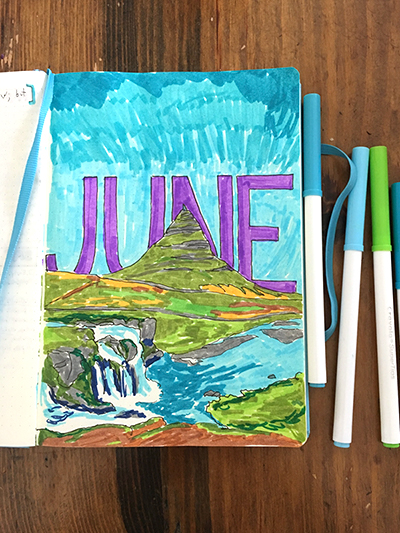
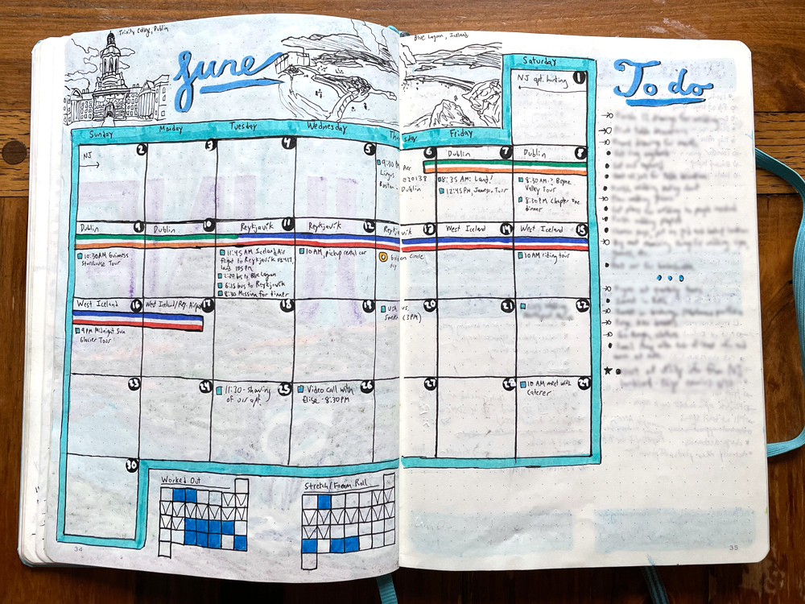

+++
date = "2021-04-14T11:35:38-05:00"
draft = false
title = "The Bullet Journal As An Art Form"
categories = ["Guides"]
tags = ["Bullet Journaling", "Organization"]
images=["/the-bullet-journal-as-an-art-form/twitter-card.jpg"]
description="Can a bullet journal be more than a utilitarian list of tasks? I think a bullet journal can be a form of art, but don't let that stop you from starting one!"
summary = "Can a bullet journal be more than a utilitarian list of tasks? I think a bullet journal can be a form of art, but don't let that stop you from starting one!"
+++

I've now written [three posts](../tags/bullet-journaling/) about bullet journaling! This final one (for now?) is more of a reflection on how a bullet journal can transcend from its humble origins as a system of organization into an art form.

Browse through the [#bujo tag](https://www.instagram.com/explore/tags/bujo/) on Instagram, and you will see millions of beautiful photos of people's journals, and the lettering and art they intersperse with mundane chores and habit trackers. On the one hand, I love looking at these beautiful images and am astounded at how talented many people who keep bullet journals are. On the other hand, I think this social media presence makes it intimidating for people to start bullet journaling. A bullet journal doesn't need to be a piece of art: it can simply be a functional, utilitarian way to organize your life.

  </img>
  

    
My illustrated cover page for June 2019.

  

But, I like that it can be used as a creative outlet. In recent years I've gone more towards the utilitarian side, but I do sometimes create artistic cover pages for months, or create a monthly spread with drawings and typography that could, maybe, find a home on an Instagram page.

I think a bullet journal's structure makes it easier to get a little creative: there are built-in opportunities every month to decorate and design a page or a spread with a purpose. A natural spot for creativity is creating a cover page for each month. Some people choose themes for the month and then decorate every weekly spread with those themes.

My bullet journal is sometimes the only time in a day or week that I put pen to paper. As someone who grew up doodling and drawing, I like that connection to pen and paper, and when I give myself license to be a little creative and not worry so much about "messing up" my journal, that is when I find it most useful, and it can become a spot for creativity as well as function.

  </img>
  

    
The monthly spread for June 2019. I went to Ireland and Iceland and drew inspiration from those trips for this design.

  

My main lesson for bullet journaling, and my main piece of advice to anyone wanting to try, is just to do it! Don't worry about making it perfect. Don't compare it to other people who post on social media. Do it for yourself. Use the underlying system of organization however it helps you, and leave the rest. I've tried and abandoned spreads, projects, and layouts until I found what worked for me, and I'm still experimenting with different ways to use my bullet journal.
