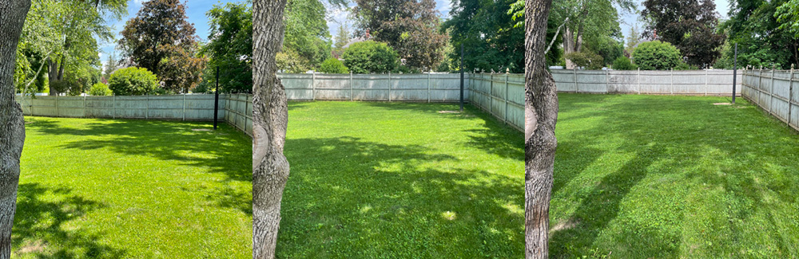
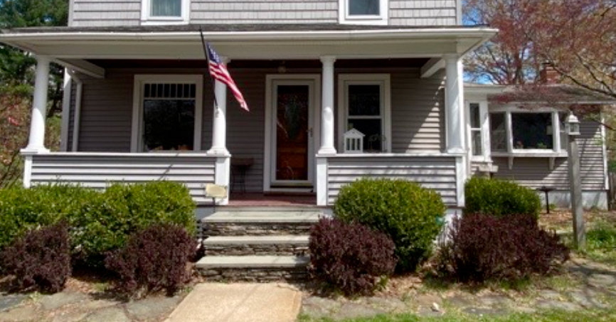

+++
date = "2022-04-24T07:15:00-04:00"
draft = false
title = "The Garden Year 0"
categories = ["House", "Garden"]
tags = ["Gardening", "Compost", "Bokashi", "Front Yard"]
description="The work I did in the first year of having a garden to prepare for future garden projects."
summary = "The work I did in the first year of having a garden to prepare for future garden projects."
+++

I come from a family of gardeners/farmers, so I was excited to start my own garden once we bought a house. I've done a little vegetable gardening in various rental properties and have some houseplants, but there is something satisfying (and intimidating) about looking at a yard and developing some long-term gardening plans.

We moved into our house last July with a baby, so I knew that in the first year I wasn't going to be able to do much. I called this year "Year 0," the first partial, foundational year in our house, and got the groundwork going for some garden projects.

## Sun Survey

First, based on [my friend Ian's advice](https://house.youngram.net/how-to-plan-a-garden-part-one.html), I did some sun surveys. I happened to be in the house before we were even fully moved in right during the summer solstice, and I took hourly photos of the backyard to see where the sunniest spots are to plan for a future vegetable garden. You can see that in the backyard there's really not a true full sun spot, but the back corner seems to be promising, with some good morning and afternoon sun. This is the potential downside of living in a neighborhood with big trees: great shade and the beauty of large trees, but not a lot of fully sunny spots to grow things that love the sun.

I wish I had taken pictures of the side yard as well, because the side yard is the southern exposure, and writing this in 2022, I do think there is also potential there for the most full sun.

  </img>
  

    
Tracking the sun in one corner of our yard.

  

## Compost

A key component of gardening for me is composting. It's such an easy way to create amazing soil for plants to grow in, and it is a great way to deal with food and yard waste.

### Yard Waste

The house already had a big leaf/yard waste pile in the back corner. Underneath the leaves there was already some nice rich soil from decayed leaves. My dad was kind enough to move the leaves off of the fence for me (to hopefully prolong the fence's life for a few more years) and I started to add my own leaves and grass clippings. I am still figuring out the best way to handle mowing and raking, but in general, I've settled on mostly leaving the grass clippings and cut leaves in the grass (because it's good for the grass/insects, and way less labor-intensive than bagging or raking them all) and then using the bag on my lawnmower to occasionally shred some leaves and add them to the pile. I also ended up doing a good chunk of manual raking/sweeping of the deck, driveway, etc, so there were plenty of leaves to add this fall. I'm always amazed at the huge volume leaves, especially unshredded leaves, take up, but they break down fairly quickly.

I also experimented with using shredded leaves as a mulch in the front yard. It's definitely another good way to put yard waste to use, and I think I will end up supplementing traditional mulch with leaf mulch in the future.

### Bokashi

Bokashi was invented in Japan, and it involves taking grains that have been inoculated with special bacteria and mixing them with food scraps in an anaerobic environment to create fermented compost. The fermentation process allows you to take basically any food waste (including meat) and, eventually, create compost with it. Once the waste has fermented, you either bury it directly in the garden in trenches or put it into a traditional compost pile to be further broken down.

I was interested in doing this because I have a toddler/baby who creates a lot of food waste (anyone who has fed a tiny human can probably relate) and I was tired of throwing so much food in the trash.

I first tried to build my own bokashi buckets by stacking two 5-gallon buckets inside each other and punching holes in the interior bucket so that liquid will drain while keeping the rest of the organic material inside the inner bucket. My main mistake was getting buckets that didn't have a quality seal. Unfortunately, I got flies in the bucket and ended up having a rather gnarly maggot situation (this isn't a huge deal in terms of outcome: I just sealed the bucket and it basically added some extra protein to that compost batch...but it was pretty gross.)

After that experience, I ended up buying an [overpriced bokashi bucket kit online](https://amzn.to/3IrYznb), but it worked really well, and I've been using it ever since. I start with an [indoor compost pail](https://www.gardeners.com/buy/brushed-stainless-steel-compost-pail/38-560.html) where we collect food waste. I put all my espresso grounds and basically all food waste into that pail. Then I transfer it to my active bokashi bucket, mixing it with the bokashi grains, pressing it down to get rid of air pockets, and then tightly sealing the bucket. I drain the liquid from the bucket every few weeks (you can take this and dilute it and water houseplants with it, but I found the smell to be pretty intense, so I just dump it...maybe in the future I will water outdoors with it.) After the bucket fills, I seal it and let it sit for four weeks (and then the second bucket becomes my active bucket.) Then, finally, I bury it in my compost/leaf pile. I make sure to monitor the bucket––white mold is good, that means the fermentation process is working, but other colors means something is wrong.

The reality of bokashi is that it is pretty gross in some ways. After all, you are dealing with a big bucket of food waste (and even though the fermentation process means it's not really rotting, it does still smell), but if you can handle that, it's a wonderful way to essentially take all of your kitchen waste and create a system for converting it back into compost.

## Front Garden

There is an existing garden bed right in front of the house, and it had some shrubs in it. My sister came and helped me identify the existing shrubs. There's a quince, which is neat because it produces fruit, and it will flower later this spring. Next to it is some type of Rhododendron, which is also a welcome shrub because of its foliage and blooms. Then there were some boxwoods and Japanese barberry bushes along the front of the house.

### Removing Japanese Barberry and Adding Hydrangeas

My sister taught me just how bad Japanese barberry is. First, it's not native, which is ok by itself, a lot of plants that we plant these days aren't native, but it can spread very easily to other areas because it has a very high germination rate. The worst thing about it is that because it is evergreen and has thicker foliage than other native plants, it creates a humid environment that harbors tickets, which is a particular problem here in the Northeast where some ticks can harbor Lyme disease. A lot of states these days actually ban the sale and importation of Japanese barberry, that's how bad this plant is. It is also thorny, which isn't ideal for my front garden, in particular one that my toddler likes to traipse around in.

  </img>
  

    
How the front yard looked before removing shrubs.

  

So my sister and friend came and helped with much of the labor of removing the barberry. They also took out one of the boxwoods. I replaced the empty space with two snow queen hydrangeas, which will hopefully thrive and fill in the space and show off their beautiful flowers in the spring and summer. We ended up leaving two boxwoods next to the front steps (and some along the side of the porch.) They do provide nice volume and are evergreen, and having them frame the steps seemed like a decent aesthetic choice for now.

  </img>
  

    
How the front yard looked in early fall 2021 after removing invasive Japanese barberries and replacing some boxwoods with hydrangeas.

  

I have plans to add other perennials to the front yard, but I won't get to it until later this spring.

### Planting Bulbs

One thing I did do in the fall was plant a bunch of daffodils and crocuses in the front bed! It's been fun watching them slowly poke through the leaf mulch and bloom as April has progressed.
