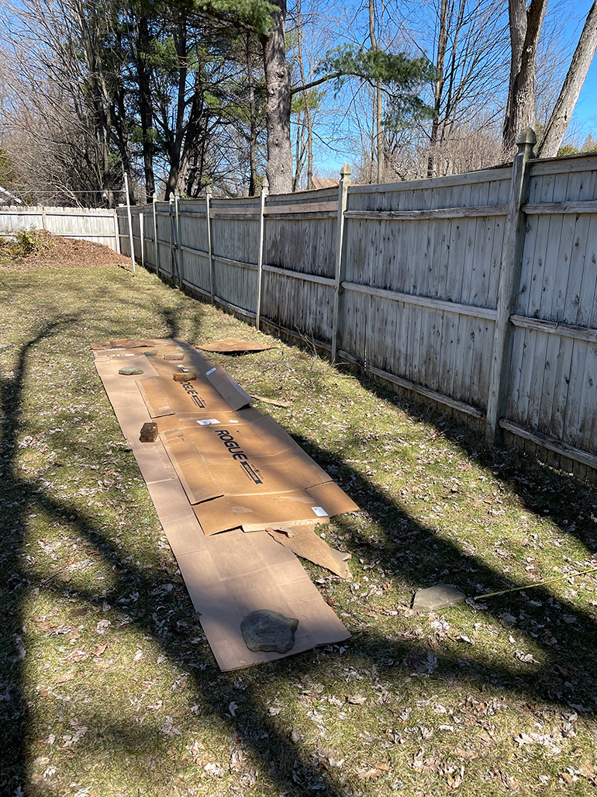

+++
date = "2022-08-09T07:05:00-04:00"
draft = false
title = "The Garden Year 1: Establishing Blueberries"
categories = ["Garden"]
tags = ["Gardening", "Berries", "Blueberries", "Hügulkultur", "Lasagna Gardening"]
description="How I established my blueberry bed using hügulkultur."
summary = "How I established my blueberry bed using hügulkultur."
+++

2022 is my first full year in the house and in turn my first full year in the garden. I wanted to take on some manageable first projects this year, and chief among them is establishing blueberries. My mom has ten blueberry plants in her garden, and they are prolific producers by this point, giving her enough berries that she can freeze them and eat them all winter long. Blueberries are also one of my favorite foods in general, so I knew I wanted to at least try them. They take a few years to get established and productive, so I wanted to start as soon as possible.

## Selecting varieties

I mostly just went with the varieties my mom uses, and asked a neighbor who also has blueberries which plants are great producers for the specific climate we are in.

I settled on two plants each of Bluecrop, Blueray, and Patriot, all northern highbush varieties. Having multiple varieties helps with cross-pollination and, in turn, more berries. I also wanted to have some variety in ripening time, and Blueray and Patriot ripen a bit before Bluecrop, allowing for, ideally, a good crop of berries for all of July and into the beginning of August. I was particularly excited for Patriot, a variety created at the University of Maine, which has great fall color and tastes excellent.

## Selecting a location and preparing the bed

Blueberries like sunny, relatively dry locations. They can also get quite big, up to 6+ feet tall depending on the variety. I chose the sunniest spot along the back fence, with the thought that the blueberries would eventually create a nice green border. That corner of the yard does accumulate water in the spring thaw/freeze season, though, which isn't great for blueberries as they don't like to be too wet. So I knew I needed to find a way to raise the blueberries off the ground a bit.

#### Hügelkultur

I chose to do pseudo-lasagna gardening/hügelkultur for the blueberry bed. Lasagna gardening is a no-till method where you do layers of cardboard and then brown and green compost. It's basically like composting in place, while also smothering existing weeds/turf. Hügelkultur is mounding woody material (traditionally in a shallow trench) and then layers of green/brown compost, leaves, and sometimes upside-down turf to create a mounded garden bed that also composts in place. The woody material in the bottom of the bed provides more even moisture and breaks down slowly over time.

There are some considerations when doing hügelkultur, namely that the wood breaking down will use nitrogen, so supplementing with nitrogen in the first year might be required for plants who need it. I didn't supplement with nitrogen in the blueberry bed (or in other beds where I added woody material), but that is something to consider if you see signs of nitrogen deficiency in your plants.

In mid-March, once the snow had melted, I started with a layer of cardboard and then added a layer of woody material (brush, fallen tree branches, etc.)

  </img>
  

    
Laying down cardboard for the start of the blueberry bed.

  

I then laid down leaves from the [leaf pile pile we inherited](https://www.hannasthoughts.com/the-garden-year-0/#compost). I mixed layers of more recent, crispy brown leaves and then a layer of older, more decayed leaf mould.

  </img>
  

    
Laying down leaves and leaf mould.

  

My neighbor was building a chicken coop and removed a lot of turf for that project, so I also took a few wheelbarrows full of turf and laid them upside down to build up the height of the bed. Finally, I also ordered a truck load of compost for all my garden projects this year since I didn't have enough of my own, so I also added some finished compost to the top of the bed.

  </img>
  

    
Adding a layer of finished compost.

  

Once I had a mounded bed (about 6-8" above the soil line), I laid down a relatively thick layer of wood chips (available for free from our town dump.) The wood chips serve as a mulch layer, and there is some evidence that they help to increase the acidity of the soil, which blueberries need. Finally, I used bricks to create a border around the bed and to help keep the mounded soil in place.

### Acidic soil and planting

  </img>
  

    
The results of the home soil test: slightly acidic.

  

As I wrote above, blueberries need acidic soil with a pH level between 4.5–4.8. I got a basic soil testing kit from the hardware store and measured the acidity of the soil at first to establish a baseline, and then amended the soil around where I would be planting the blueberries with elemental sulfur, using the guide on the bag to roughly estimate the amount needed to get the soil more acidic. I didn't measure the soil after amending. If I have issues with berry production or growth in the next few years, I will get a more accurate soil test (likely from the county extension office) and work on a more detailed plan to amend the soil, but for now, this worked fine.

  </img>
  

    
Planting the blueberries and amending the soil with elemental sulfur.

  

As for planting the blueberries, I mostly used the [Nourse Farms planting guide](https://www.noursefarms.com/how-to-grow/blueberries/). I ended up spacing my plants a little bit tighter than they describe there to fit 6 plants into my 20' long bed. I received my plants at the beginning of May, so the bed had about a month to settle before I planted the berries. I planted each variety as far away from the bush of the same variety as possible, which probably isn't strictly necessary, but I liked the aesthetics of having each variety evenly spaced from the other, and in theory, this means cross-pollination is a bit easier and more likely.

  </img>
  

    
The newly-planted blueberries! The four plug plants are barely visible against the mulch.

  

### Bird netting and my first harvest

I sourced my Patriot bushes from a different nursery than the other four plants, so they were the only plants big enough to produce berries this year. I bought the other four plants as plugs, which means they aren't ready to produce berries until a year or two after planting. I made sure to prune any flowers that these four plants made so they could focus all their energy on establishing themselves. There is an excellent [pruning guide](https://www.uvm.edu/vtvegandberry/factsheets/PruningHighbushBlueberries.html) from the University of Vermont that I intend to follow for my blueberries as time goes on if you are interested in learning more about pruning blueberries.

To protect my Patriot crop from birds, I strung up bird netting by draping it across plastic stakes with clay pots on top and then securing the bottom of the nets with some bricks. Throughout July, we got a few handfuls of delicious berries. I'm looking forward to the shrubs growing, and to all the bushes producing for hopefully years to come!

The only other work I did, other than weeding and deep watering every few days, was removing a strip of turf from around the bricks on the border of the bed. I didn't want to deal with weeds growing where the mower couldn't quite reach, and removing the turf there is at least temporarily stopping weeds from growing in a spot that is hard to trim. I'm still deciding on what I want to do with the space between my raised beds and other garden beds—long term, some type of path rather than grass seems ideal, but it's too early to take action on that.

  </img>
  

    
The blueberries in late June, with netting to protect the Patriot bushes from the birds.

  

