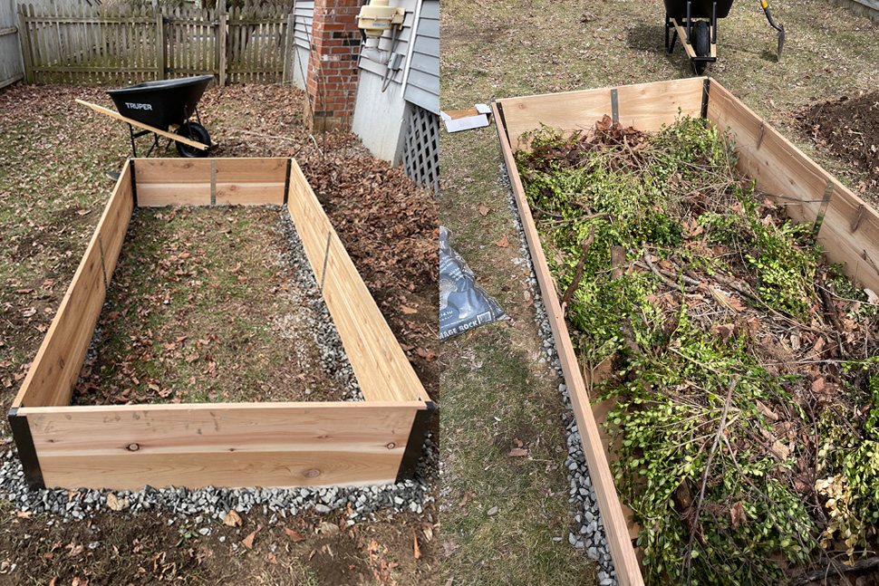
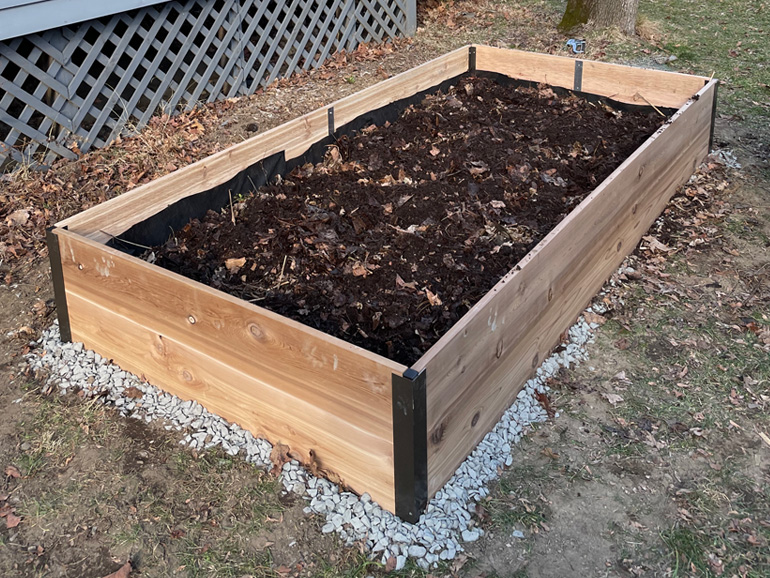
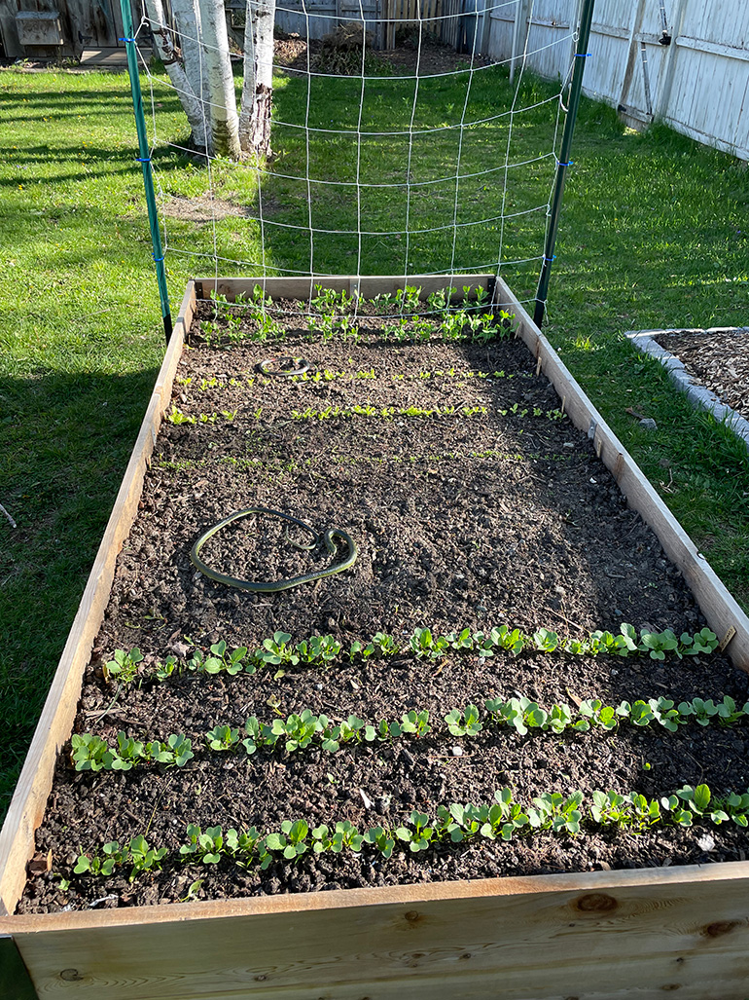
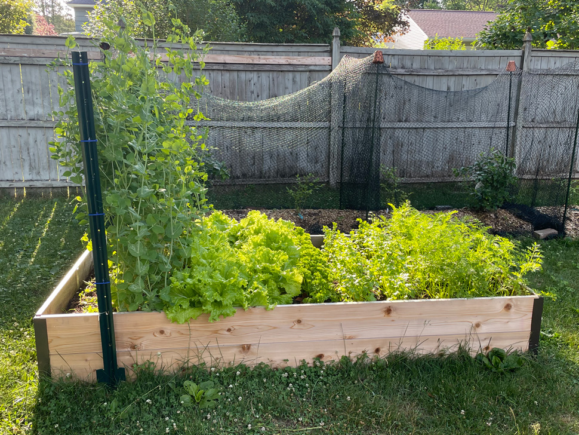
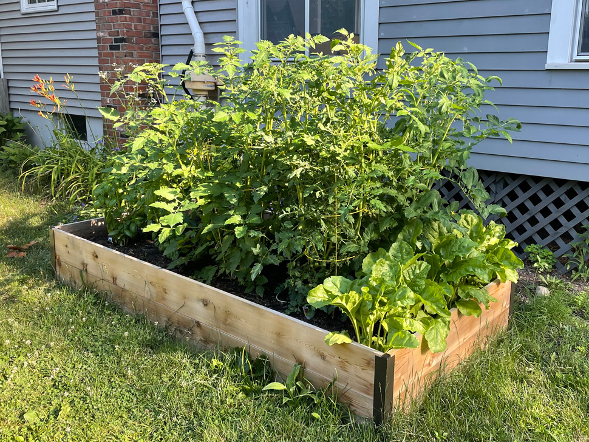

+++
date = "2022-09-21T07:00:00-04:00"
draft = false
title = "The Garden Year 1: Raised Beds for Vegetables"
categories = ["House", "Garden"]
tags = ["Gardening", "Vegetables", "Raised Beds", "Hügulkultur"]
description="How I started my vegetable garden in raised beds."
summary = "How I started my vegetable garden in raised beds."
+++

One big plan for the garden this year was to get a vegetable garden going. I wanted to use raised beds for my vegetables because I like they way they look, I like that they are a little more ergonomic to work in, they are naturally protected against some animals like rabbits, and I can have greater control over the soil quality in them.

## Building and Filling the Beds

I bought and planted two 15" tall 4' x 8' cedar raised beds from Gardner's Supply Company this year. They're pricey, but I wanted the ease of a kit that was mailed directly to my house. I also knew I wanted a deep bed, both for the ergonomics of working in it, but also so that I would have more space for deep-rooted vegetables like tomatoes, so I like that they offered deep beds.

I started by putting down a layer of cardboard to suppress weeds and digging a small, shallow trench around the circumference of the bed and filling it with gravel. I did this so the wood of the raised bed would sit on this bed of gravel, in the hope that it wouldn't be sitting in water for extended periods of time. Both these steps are probably overkill, in retrospect, but it wasn't too hard to do.

I also chose to put down a layer of hardware cloth. I did this partially to stop potential pests like voles from digging up into the bed, but also to help stop tree branches from encroaching in the bed. I had originally started with both hardware cloth and a weed barrier, but I ended up removing the weed barrier, with the thought that some of my own vegetables would probably want to tap into the native soil beneath the bed, and also to allow earthworms to come into the bed more easily.

  </img>
  

    
The empty raised bed on a bed of gravel, and then beginning to fill it with woody material.

  

  </img>
  

    
The raised bed, mostly filled with leaf mould.

  

A lot of my technique for building up my raised beds is similar to how I built my [blueberry bed](../the-garden-year-1-establishing-blueberries). I did pseudo-hügelkultur by filling in the bottom with woody material: branches, sticks, etc, and then layering leaves and leaf mould on top. Luckily, I had the giant inherited pile of leaves/leaf mould that was sitting in the corner of the yard from when we bought the house. I ended up using almost the entire pile to fill the raised beds and develop the blueberry beds. I finished off with a small layer of purchased topsoil and a few inches of finished compost that I ordered for the garden this year.

## Planting: Seeds and Seedlings

I chose two of the sunniest spots for the beds: one on the southern side of the house, and one by my blueberry beds. The south bed would be home for sun-loving seedlings like tomatoes and peppers. The bed by the blueberries gets some morning shade, and is where I planted almost all of my seeds, especially ones that need a bit of shade, like snap peas and lettuce.

I sourced my seeds from [FedCo](https://www.fedcoseeds.com/), a seed company based in Maine. My sister is a farmer and buys a lot of her seeds from them, so I figured they were worth trusting for my small garden. They have good notes about growing time and varieties that are suited to New England.

I used a few books for references on what to grow in New England, and vegetable gardening in general: [Rodale's Basic Organic Gardening](https://www.amazon.com/Rodales-Basic-Organic-Gardening-Beginners/dp/1609619838?keywords=rodale%27s+basic+organic+gardening&qid=1663766235&sprefix=rodale%27s+basi%2Caps%2C120&sr=8-1&linkCode=ll1&tag=d01a3488-20&linkId=c9401952bc21030084ba56afc1f524af&language=en_US&ref_=as_li_ss_tl) and [Grow Great Vegetables In Massachusetts](https://www.amazon.com/Vegetables-Massachusetts-Regional-Vegetable-Gardening/dp/1604698837?keywords=grow+great+vegetables+massachusetts&qid=1663766271&sprefix=grow+great+v%2Caps%2C166&sr=8-1&linkCode=ll1&tag=d01a3488-20&linkId=56c0b471682fb4d5d86d0ccd8553210a&language=en_US&ref_=as_li_ss_tl).

I planted [snap peas](https://www.fedcoseeds.com/seeds/sugar-snap-organic-snap-pea-893), [lettuce](https://www.fedcoseeds.com/seeds/slobolt-looseleaf-lettuce-2783), [parsley](https://www.fedcoseeds.com/seeds/krausa-organic-parsley-3169), [cilantro](https://www.fedcoseeds.com/seeds/caribe-organic-cilantro-4517), carrots ([coral](https://www.fedcoseeds.com/seeds/coral-early-carrot-2028),[naval](https://www.fedcoseeds.com/seeds/naval-organic-main-season-carrot-2062), and [purple haze](https://www.fedcoseeds.com/seeds/purple-haze-main-season-carrot-2096)), [beets](https://www.fedcoseeds.com/seeds/3-root-grex-organic-beet-2128) and [radishes](https://www.fedcoseeds.com/seeds/cherry-belle-radish-2214) from seed in April and May. I purchased basil, tomato (Juliet, Sun Gold, Sunrise Bumble Bee, and Black Prince–the Juliets and Sun Golds did the best), and pepper (Carmen and bell peppers) seedlings, and planted them once the soil warmed in late May. I also potted up some mint and chives to live on my deck as an herb garden. I also had surprise success with a potted cayenne plant this year.

I ended up making a temporary barrier of hardware cloth to cover the seeds to protect the soil from squirrels (and cats!) I also used fake plastic snakes to deter birds and squirrels...unclear how effective it was.

  </img>
  

    
My seeds taking off!

  

## Results and Future Experiments

I'm pleased to say that everything turned out really well! Unfortunately, we had a bad drought in the last half of the summer, but by then most of the plants had been established. Though, the tomato crop suffered a bit from the drought, I think.

  </img>
  

    
This bed was all grown from seed. Here's how it looked at the end of June. It includes snap peas, lettuce, parsley, cilantro, carrots, and radishes.

  

Next year I will be more aggressive about thinning (lettuce and carrots, especially), and probably tweak what I plant a bit (did we really need two rows of cilantro: turns out, no.) I plan to expand to another raised bed next year in order to have more tomatoes (as the [song goes](https://www.youtube.com/watch?v=1-QzLIjL1u4), there's only two things that money can't buy: that's true love and homegrown tomatoes), and I'm going to move my peas to a bed in the ground in order to give them a bit more space to climb.

  </img>
  

    
This is how my bed that mostly started from seedlings looked in June. It includes basil, peppers, tomoatoes, and beets (from seed).

  

I also need to be more aggressive about treating blight in the tomatoes. I think it's inevitable that tomatoes will suffer from some type of blight, but I should have removed the diseased branches when I first saw them. I also need to stake them better. They grew very well, blight and all, but I lost some branches because I didn't stake them well enough.

Overall, though, I'm very happy with how the vegetable beds turned out this year. Right now I'm experimenting with some fall beets and snap peas that I planted in August, and still getting some tomatoes and peppers while warm September days last. I'm also experimenting with a 50/50 mix by weight of oats and hairy vetch (to fix nitrogen) seeds as a cover crop/green mulch. I'll probably report back on that next year.
