+++
date = "2025-11-02T07:15:00-04:00"
draft = false
title = "The Patio Garden Project"
categories = ["Garden"]
tags = ["Gardening", "Garden Design", "Sunporch Bed", "Patio Bed", "Native Plants", "Lasagna Gardening"]
description="Designing and planting a native perennial garden to wrap around my patio."
summary = "Designing and planting a native perennial garden to wrap around my patio."
+++

I've been doing a lot of work in the garden over the past three years. This project is a nice example of the type of projects I'm tackling, and the type of thinking I'm doing around gardening with native plants for ecological benefits, but also thinking about designing gardens and spaces that are beautiful and functional for people, too.

## Planning/Vision

Our backyard has a lot of hardscaping that predates us. We have a two-tiered wooden deck that flows down into a large Goshen stone patio. We have a sunporch that wraps around the deck, and the patio extends beyond the sunporch a bit into the yard. In 2022, [I planted a garden along the side of the sunporch](https://www.hannasthoughts.com/other-garden-projects-from-the-first-year/). I chose to use all native plants for this bed. I didn't really know what I was doing, but it was my first foray into perennial gardening and into planting native plants, and after that first summer, I was hooked.

In 2024, I enrolled in an online class called Designing with Native Plants through the [Native Plant Trust](https://www.nativeplanttrust.org/education/) here in Massachusetts. The main project for that class was designing a garden, and I chose to design an extension to the sunporch bed that would wrap around the patio.

The class was useful for many things, but a big lesson I learned was the importance of creating a base map. A base map is a to-scale topographical view of your garden and any structures that currently exist there. Using that, you can then create a plan that is realistic to the space available. Using a measuring tape and triangulating off of structures like my house and fence, and then translating those measurements to graph paper, I could get a reasonably accurate map of the corner of my yard that I was interested in designing. I also happened to have some aerial photography of my house due to a neighbor who lent me their drone, so I ended up doing some sketching in Photoshop on top of those photographs as I experimented with the shape and placement of the new bed.

  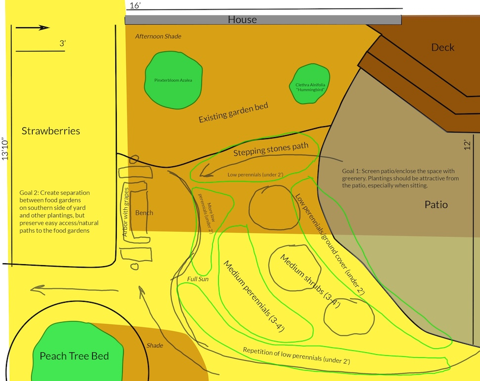</img>
  

    
The concept map for the patio garden, showing measurements of existing structures and beds, shade, desired pathways through the garden, and desired plant heights/plant types.

  

I try to think about the purpose of each bed I plan. For example, the sunporch bed, as I've evolved its design over the years, has a lot of tall plants that I can enjoy from inside my sunporch. I love to sit on the porch in summer and look out on Joe Pye weed, cutleaf coneflower, bee balm, and ironweed, and see the insects and birds enjoying the flowers as much as I do.

  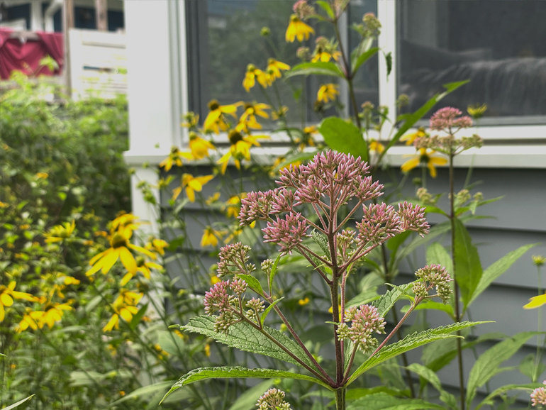</img>
  

    
Detail of the sunporch bed in bloom in late July 2023, with Joe Pye weed and cutleaf coneflower blooming.

  

I also try to think about using landscape design to either create outdoor rooms to make a new space to rest or relax in, or to guide people through a space (either visually or physically, with paths). The patio bed would serve a few purposes. First, it would envelop the patio on one side, creating a sense of privacy and structure to the patio itself. Rather than having the patio float out into my yard, mostly surrounded by lawn, I could give it a bit of structure and make it feel more like an outdoor room.

I also created another seating area on the other side of the new bed. I wanted a clear dividing line between the food gardens on the south side of my yard (raised beds and a [strawberry patch](https://www.hannasthoughts.com/a-lasagna-garden-strawberry-patch/), primarily) and the perennial gardens in front of them. I decided to put up a trellis to serve as this dividing line between food and pleasure gardens. I planted grapes on it and placed a glider underneath it. That meant that the patio bed would be observed from both sides–from the patio on one side, and from the glider on the other side. So while I wanted to create a little sense of privacy and border along the patio, I didn't want it to be too tall a border, and I wanted it to look good from both sides.

This meant I was naturally constrained by plants that didn't get too tall, ideally plants that got no taller than four to five feet or so. I wanted a backbone of smaller shrubs along the patio to define that border, and then herbaceous plants to fill in the rest, primarily viewed from the glider side. I also wanted good fall interest and blooms from spring to fall.

Another feature I was interested in was scent. Of course, I think a lot about visual design from foliage and flowers, but one of the cool things about gardening is you can engage your other senses. I love fragrant blooms, and, happily, there are a number of shrubs that don't get too tall but also create fragrant blooms. I wanted to be able to sit on my patio or on the glider and enjoy the scent of flowers throughout the year.

So, armed with those requirements and the knowledge that this new bed was mostly full sun (but, due to the position of the sunporch, not harsh late afternoon and evening sun), on average, to moist soil, I started to assemble a plant list.

  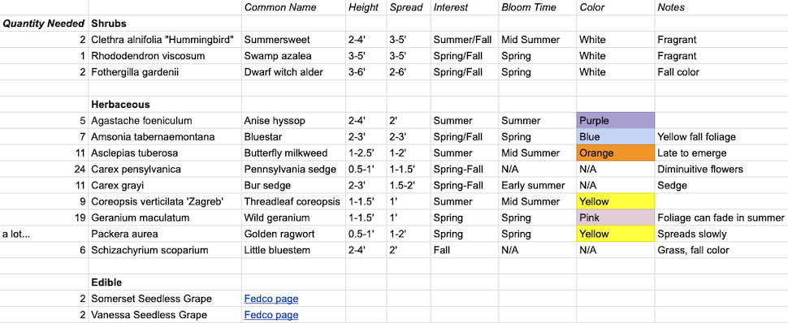</img>
  

    
The initial plant list for the patio garden project.

  

My fragrant shrub backbone was made up of: Clethra alnifolia "Hummingbird", common name summersweet, one of my favorite shrubs: a late summer bloom that is extremely fragrant and very attractive to pollinators and has nice yellow fall color, and the hummingbird cultivar stays compact. Fothergilla gardenii, common name dwarf witch alder, an early spring bloom that smells like honey, interesting lush blue-green foliage through summer, and amazing fall foliage, and then on the end of the bed a slightly larger shrub, Rhododendron viscosum "Pink mist", common name swamp azalea, a mid-summer fragrant bloom of pale pink flowers.

For the flowering herbaceous plants, I wanted some continuity with the existing sunporch bed, so I included purple coneflowers, butterfly milkweed, and 'Zagreb' coreopsis (well, 'Zagreb' was the plan, but I couldn't source it in time, so I ended up using a different coreopsis I grew from seed called 'Early sunrise.') Those flowers, in addition to anise hyssop, provide mid to late summer blooms. For spring and early summer, I included wild geranium, Eastern bluestar, wild Columbine, and foxglove beardtongue. Later on in the season, I fit in some smooth asters to provide fall blooms (the sunporch bed also has New England asters to cover fall.)

Finally, I included some grasses and ground covers. I'm a big fan of green mulch, so I planted Pennsylvania sedge and Packera aurea, Golden ragwort, under the shrubs to fill in between them. The ragwort also has a beautiful, cheery yellow and long-lived spring bloom. Finally, I added common bur sedge and little bluestem as two structural grasses/sedges. The bluestem gives fall interest and color, too, and the bur sedge has an interesting bloom.

Using a compass tool to draw to-scale circles to represent the plants, my initial design looked like this. I tried to group plants together in drifts of three or five plants, and repeated blocks of many of them throughout the bed. I ended up fitting in more species and plants than this initial design, but this detailed design gave me a strong starting point.

  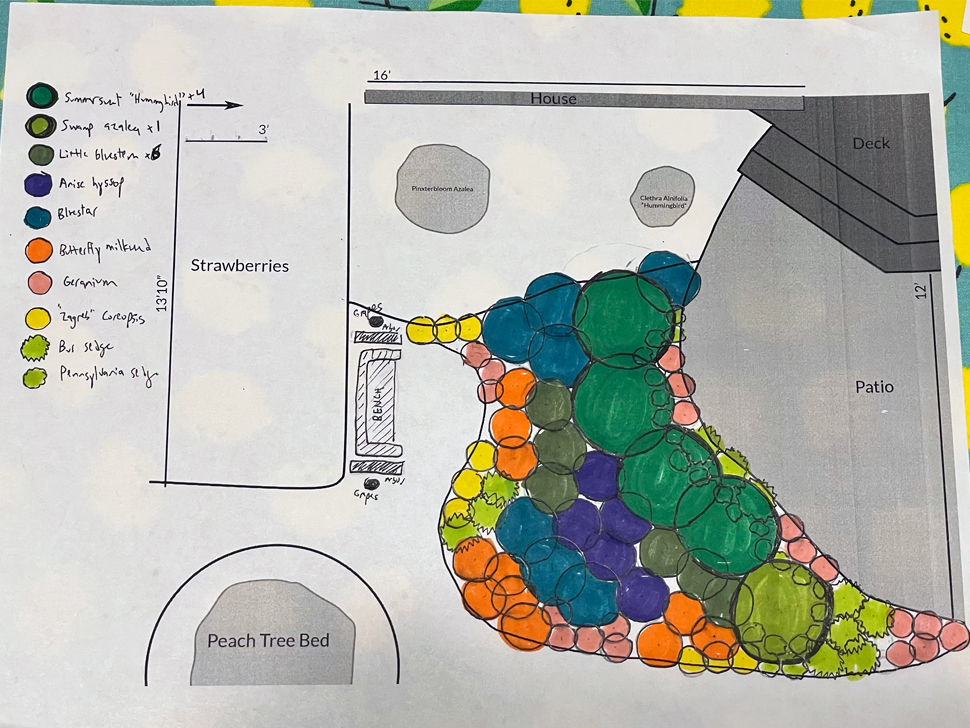</img>
  

    
The finished plan for the patio garden.

  

## Creating the Bed

In the fall of 2024, I started shaping fallen leaves in the rough shape of the garden bed and layered cardboard and more leaves on top. I am now very familiar with this lasagna garden method of creating beds. I did it to [create my strawberry patch](https://www.hannasthoughts.com/a-lasagna-garden-strawberry-patch/) in 2022, and have used it to kill grass and suppress weeds in other new garden beds.

  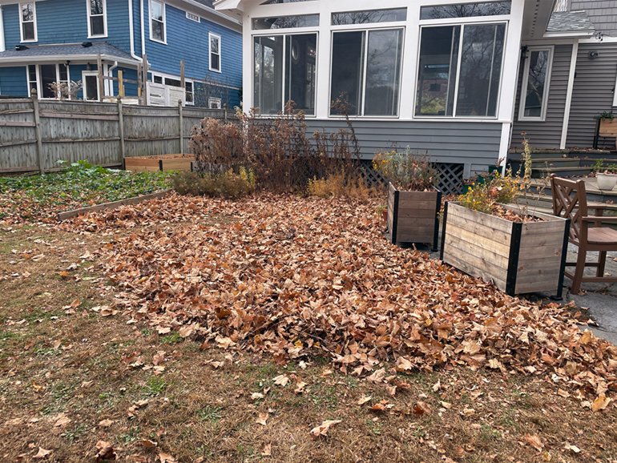</img>
  

    
Fall 2024, using leaves to smother the grass where the patio bed will go.

  

  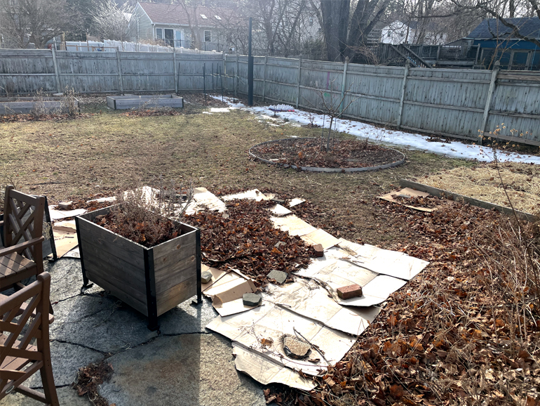</img>
  

    
In early spring 2025, the cardboard has survived the winter.

  

In the spring of 2025, once the snow had melted, I used a garden hose to start visualizing the edges of the bed. I like using a garden hose because you can easily create natural curves. I made sure that I could fit my lawn mower around the new shapes I was creating, and once I had a final shape I liked, I laid more cardboard down and cut it to meet the exact correct shape of the bed. My biggest lesson with creating garden bed shapes is that long, gradual curves are almost always the best choice in terms of design, but also make it easier to mow/maintain paths.

I ended up expanding the peach tree bed at the same time as I created this new patio bed, so I mirrored the curves of the patio bed in the peach tree bed to create a natural-looking grass path between both beds. I’ve left the expanded peach tree bed empty this year, but my intention is to plant more fruit trees there next spring to take advantage of the full sun they will get there, and to prune them to stay small. Maybe I’ll write a post about that next year!

  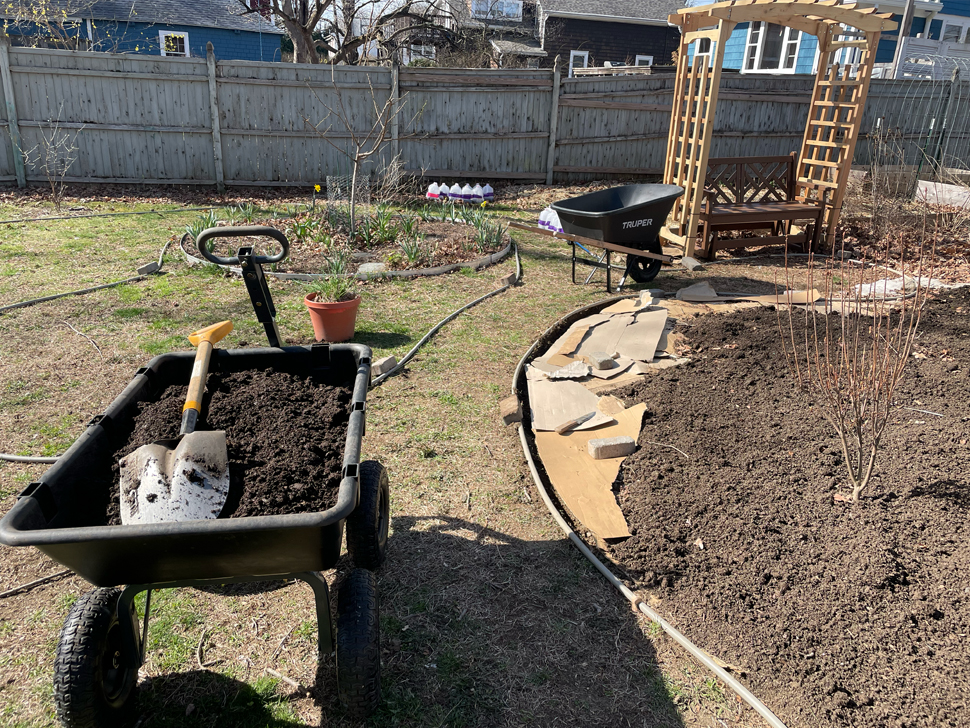</img>
  

    
April 2025: the trellis is up, and I'm defining the edges of the beds with a garden hose and beginning to layer compost on top. Also, the swamp azalea is in the ground here!

  

I also covered the cardboard and leaves in my new bed with a layer of finished compost. I've done this exact same method before in other native garden beds, though I don't actually know if it's necessary. There is a potential argument to not do this at all: native plants are well adapted to poor soil, and amending a bed with compost might actually make things too rich or loamy. But I still find that adding compost on top of the cardboard gives a nice starting point, and makes the bed look more finished visually earlier. For good measure, I also put a layer of old leaves on top of the compost to stop it from washing away.

  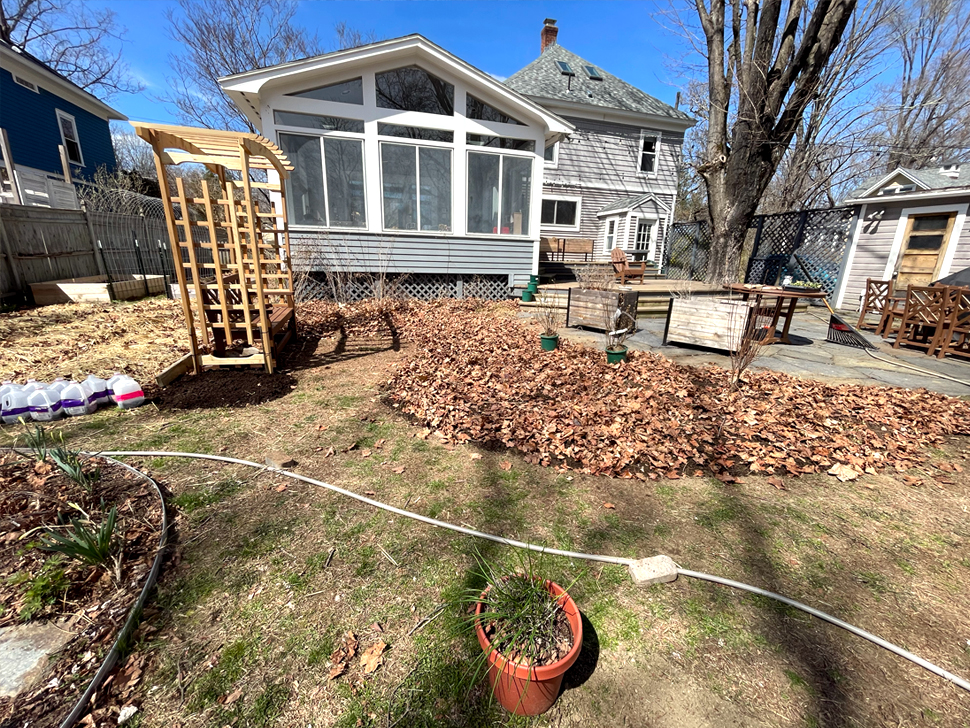</img>
  

    
Another view from April 2025, after putting some leaves back on top of the finished compost. I've sourced some shrubs by this point, and am beginning to set them out where they will be planted.

  

Also, once I planted the bed, I put a layer of wood chips on top to act as another mulch layer. I get these for free in my neighborhood. Wood chips will break down and improve soil health over time.

All in all, this is probably more intensive than necessary for a bed like this, but it's the method I've used before, so I stuck with it.

## Planting the Bed

I sourced a lot of the plants from [Prairie Nursery](https://www.prairienursery.com/), a native plant nursery based in Wisconsin that ships across the country. A lot of plants that are native to the Upper Midwest are also native or near-native to New England, so they had a lot of what I wanted to plant. I've found that ordering from online nurseries when I have a lot of plants to source is a good balance between price and size.

I bought the shrubs from local nurseries, along with some fill-in plants, as needed. I also grew the purple coneflower, coreopsis, and some of the butterfly milkweed and foxglove beardtongue from seed myself. I’m increasingly trying to grow more from seed because it’s fun, economical, and promotes genetic diversity (though many native plants that I buy are also grown from seed). This was the first year of growing perennials from seed, and I’m excited to do more in the following years.

  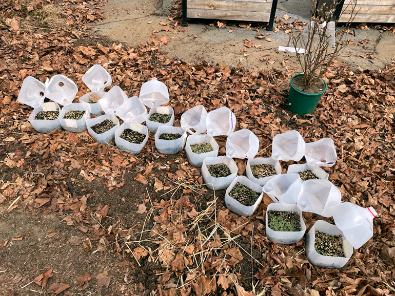</img>
  

    
Some of the native perennials I started from seed. They overwinter in milk jugs outside, as many species need to be exposed to cold, moist conditions for months to break dormancy.

  

I started by planting the shrubs, and carefully spaced them out according to my plan. Once they were in the ground, I could place the rest of the plants. I plant more densely than the label recommends, which is how plants grow in nature, and this means that I will have more soil coverage more quickly, helping with weed suppression. In general, I follow the principle of planting more plants more densely. Native plants are, by and large, evolved to be planted densely, and for taller plants like the grasses and coneflower, planting densely also means that the plants hold each other up.

  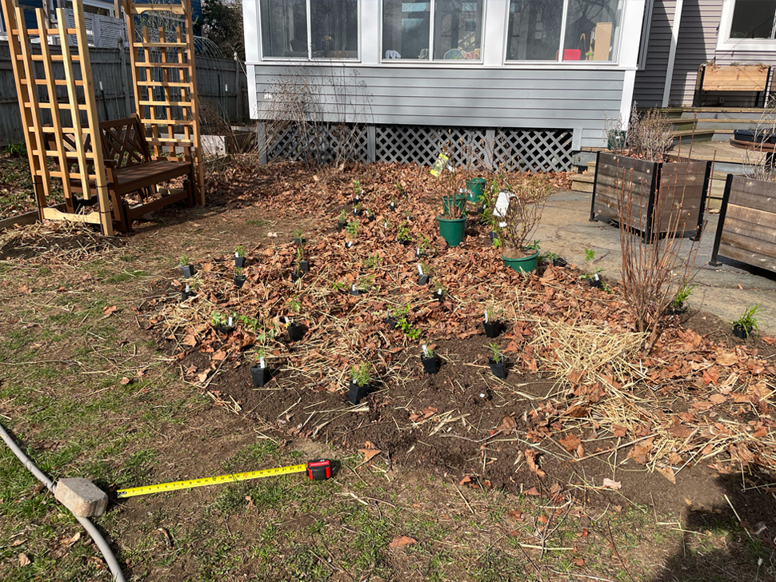</img>
  

    
Late April 2025, planting begins in earnest!

  

I watered weekly for the first few months as needed, too. As plants get established, it's important to make sure they get enough water to set them up for success. In the coming years, I won't need to water at all.

## Results from Year 1

Overall, I was extremely happy with how this garden bed turned out. I wasn't expecting much from year one, and, really, when planting perennials, I really don't expect to get a vision of how it will look until at least year three, when the plants are established and reaching their mature size. I still think that by late summer the garden filled in very nicely.

  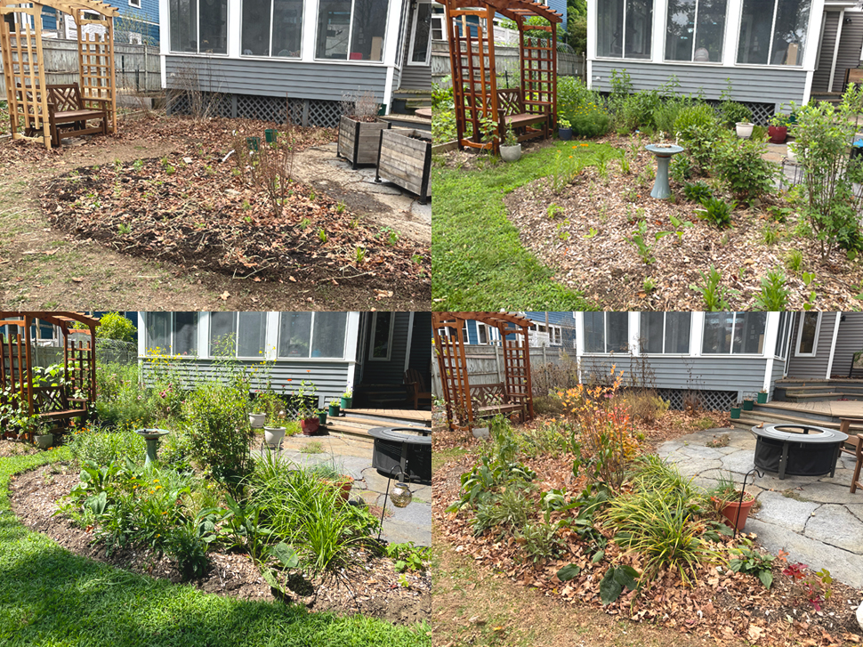</img>
  

    
The progression of the patio garden in 2025: late April, late June, early August, and early November.

  

I was most impressed with the bur sedge, which really took off where I planted it. And I was also pleasantly surprised by how much the coreopsis took off, especially considering that I started it from seed just a few months before! The coreopsis was also a champion bloomer: it started blooming in mid-July, and as I'm writing this in mid-September, it's still going strong. Other plants that are doing well this first year: cone flowers, little bluestem, and anise hyssop.

  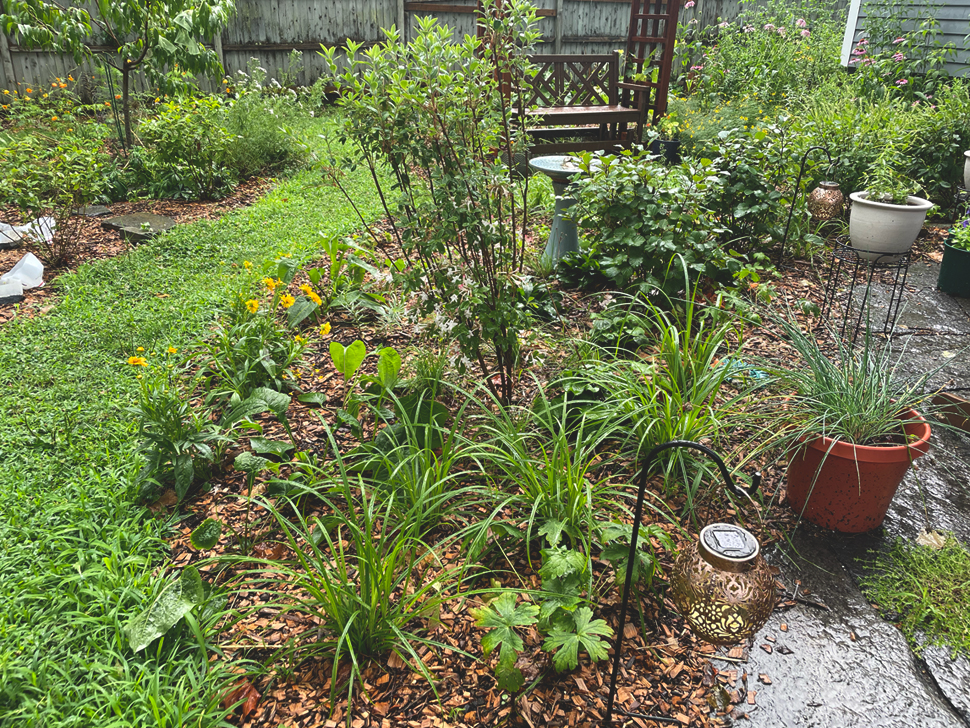</img>
  

    
The bur sedge is the grass-like plant in the front of the bed here, on a wet day in mid-July. The coreopsis is the yellow blooming flower.

  

I've never had much luck with butterfly milkweed, which is unfortunate, because it is such a vibrant bloomer, doesn't get too tall, and, of course, is a monarch host plant. I had some milkweed starts that didn't make it, but I kept planting more: some larger pots purchased at a nursery, and another round of starts that I planted at the end of the summer.

Butterfly milkweed fills an important design niche that I'm still trying to solve: relatively low-growing native plants with nice blooms. One plant I'm considering as a replacement if the milkweed doesn't take in the next year or so is yellow wild indigo (Baptisia tinctoria). It also takes full sun, stays low, and has yellow blooms. It's not as brilliant a bloomer as the orange blossoms of butterfly milkweed, but it fills a similar space and bloom time.

  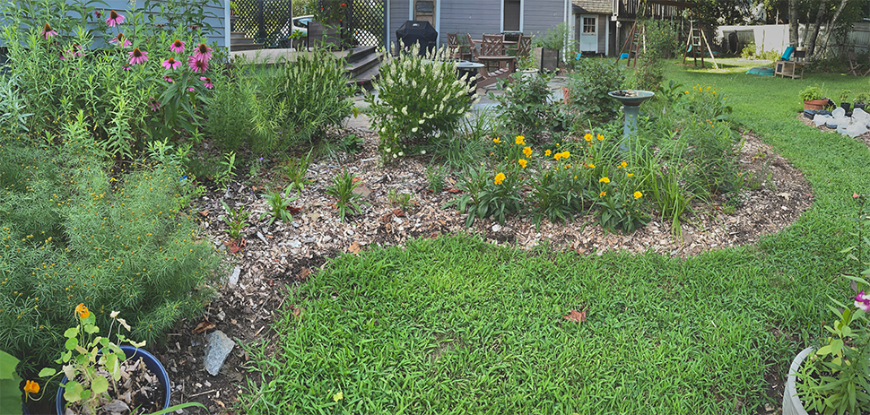</img>
  

    
The bed from the glider under the arbor in early August. There are still gaps, some of them because the butterfly milkweed failed to thrive in spots.

  

I also finally added a bird bath to my garden in this bed. The more I read about gardening for wildlife, the more important I realized water sources in my garden are. I got a simple ceramic bird bath and added rocks so that insects can also easily drink from it. I also got a small solar bubbler, as moving water is more attractive to birds. I make sure to change the water and clean it regularly, but it's a tiny amount of maintenance for something that gets daily use from birds and insects.

  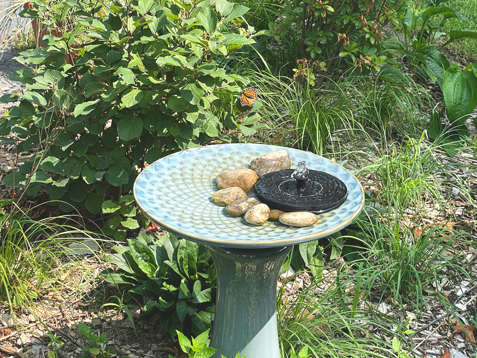</img>
  

    
The bird bath with rocks and a solar bubbler. Also note the monarch: I saw a lot more monarchs in the yard this year than in years past.

  

Later in the summer, I used a shovel to carve out a hard edge for the bed. I'm still trying to come up with my preferred edging method. I've used aluminum edging and bricks in some places, but the simplicity of a hard cut edge worked for me here, plus I like the way it looks.

  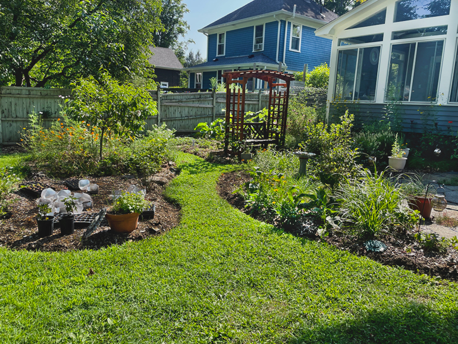</img>
  

    
The patio bed and expanded peach tree bed (future home of more fruit trees) after giving it a nice, hard edge.

  

As I'm finishing this post in November, the garden still looks great because of the fall color, and the structure that the grasses and sedges are still providing. I'm excited to see how this garden grows and expands and changes as the plants mature.

  </img>
  

    
The brilliant fall color of Fothergilla gardenii.

  

Here is the final plant list form year one that I used in the bed:

#### Shrubs:

| Latin Name                        | Common Name       | Height | Spread | Bloom Time   | Notes                                                                        |
| --------------------------------- | ----------------- | ------ | ------ | ------------ | ---------------------------------------------------------------------------- |
| Clethra alnifolia "Hummingbird"   | Summersweet       | 2-4'   | 3-5'   | Mid Summer   | Fragrant, white blooms, yellow fall leaves, likes it moist, late to leaf out |
| Rhododendron viscosum "pink mist" | Swamp azalea      | 3-5'   | 3-5'   | Early summer | Fragrant, light pink blooms                                                  |
| Fothergilla gardenii              | Dwarf witch alder | 3-6'   | 2-6'   | Early Spring | Frgrant, white blooms, brilliant orange and yellow fall color                |

#### Grasses and Sedges:

| Latin Name              | Common Name        | Height | Spread | Bloom Time   | Notes                                           |
| ----------------------- | ------------------ | ------ | ------ | ------------ | ----------------------------------------------- |
| Schizachyrium scoparium | Little bluestem    | 2-4'   | 2'     | N/A          | Bluish green foliage, fall interest             |
| Carex grayi             | Common bur sedge   | 2-3'   | 1.5-2' | Early Summer | Distinctive mace-shaped blooms                  |
| Carex pensylvanica      | Pennsylvania sedge | 0.5-1' | 1-1.5' | Late Spring  | Diminuitive blooms, spreads slowly, green mulch |

#### Flowers:

| Latin Name                            | Common Name             | Height  | Spread | Bloom Time         | Notes                                                     |
| ------------------------------------- | ----------------------- | ------- | ------ | ------------------ | --------------------------------------------------------- |
| Agastache foeniculum                  | Anise hyssop            | 2-4'    | 2'     | Mid to late summer | Purple blooms                                             |
| Amsonia tabernaemontana               | Eastern bluestar        | 2-3'    | 2-3'   | Spring             | Blue blooms, yellow fall foliage                          |
| Aquilegia canadensis                  | Columbine               | 2'      | 0.5'   | Spring             | Red blooms                                                |
| Asclepias tuberosa                    | Butterfly milkweed      | 1-2.5'  | 1-2'   | Mid summer         | Orange blooms, late to emerge, deadhead for another bloom |
| Aster laevis                          | Smooth aster            | 2-4'    | 1-1.5' | Fall               | Blue blooms                                               |
| Coreopsis grandiflora "Early Sunrise" | Early sunrise coreopsis | 1.5'-2' | 1-2'   | Summer to Fall     | Yellow blooms                                             |
| Echinacea purpurea                    | Purple coneflower       | 3-4'    | 1.5-2' | Mid to late summer | Purple blooms, seedheads provide fall interest            |
| Geranium maculatum                    | Wild geranium           | 1-1.5'  | 1'     | Spring             | Pink blooms, foliage can fade in summer                   |
| Packera aurea                         | Golden ragwort          | 0.5-1'  | 1-2'   | Spring             | Yellow blooms, spreads slowly, green mulch                |
| Penstemon digitalis                   | Foxglove beardtongue    | 2-3'    | 1'     | Early summer       | White blooms                                              |
