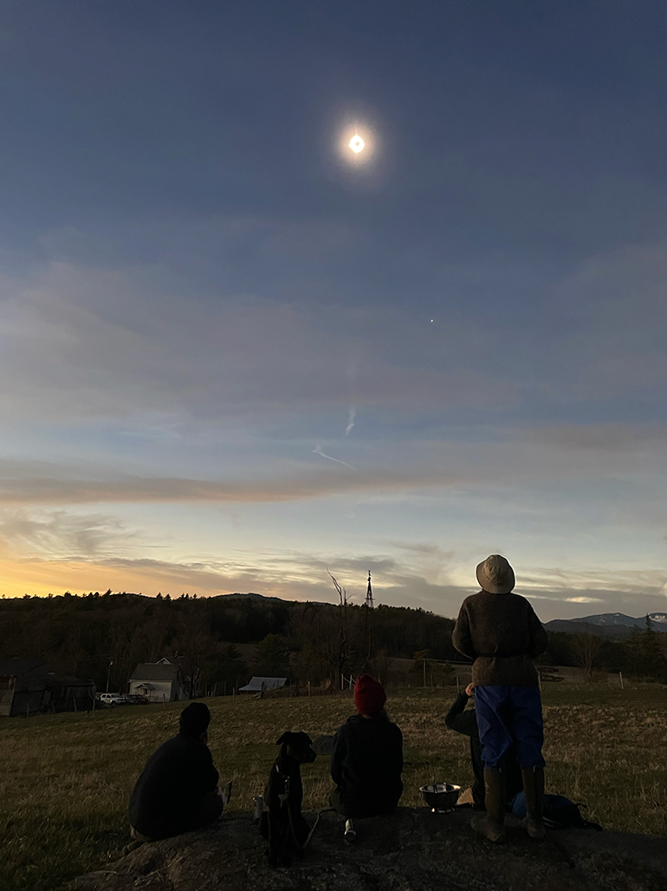

+++
date = "2024-04-10T07:15:00-04:00"
draft = false
title = "The Totality and Me"
categories = ["Personal"]
tags = ["Solar Eclipse", "Totality", "Travel", "Astonomy"]
description="I wasn't prepared for how incredible seeing a total solar eclipse would be."
summary = "I wasn't prepared for how incredible seeing a total solar eclipse would be."
+++

I didn’t initially think I was going to try to see the totality when I first started reading that it would cross the United States in 2024. Our own backyard was supposed to experience around 94% coverage, and if you just see the number 94, you think, "Oh yeah, that's close enough to 100%, why drive hours for 6%?" But then I did some reading about the experience of totality and my parents were planning a trip to my sister's farm up by Lake Champlain, which is well within the path of totality. So, at the last minute, I decided to join them. I'm so glad I did!

After anxiously checking the weather all day, we went to the sheep pasture behind my sister's house. There were some high clouds in the sky, but otherwise, it was as clear as you could hope for. The pasture is on a gentle hill overlooking the high peaks of the Adirondacks. We settled in and made ourselves comfortable on a large granite outcrop about an hour before totality.

In the few minutes before totality, the quality of the daylight noticeably shifted, turning almost sepia-toned. Then, within seconds, it simply became dark—like deep twilight. But you could actually see the darkness approaching, like a massive storm rolling toward us from the snowcapped mountains ahead. The closest comparison I can think of is some of those shots in the Lord of the Rings movies of [Mordor](https://static.wikia.nocookie.net/lotr/images/0/07/Early_Mordor_-_TRoP.png/revision/latest?cb=20221015041756): a spreading darkness covering the sky, but a smoldering glow on the horizon as well. In this case, not Mount Doom, but the edges of sunlight on multiple horizons. This was one of the most breathtaking parts about the entire experience: an amazing multiple sunrise effect on multiple horizons. This is only visible if you can actually see into the distance in multiple directions, and since we were high up in a pasture, our horizons were the Green Mountains in Vermont to the southeast and the Adirondacks ahead of us, so you just saw an entire horizon in multiple directions of sunrise on the mountains.

  <video controls width="970">
  <source src="./eclipse-totality.mp4" type="video/mp4">
  Your browser does not support the video tag.
</video>
  

    
Three minutes of the sky changing from daylight to twilight during the total solar eclipse, spend up to ten seconds.

  

And then, above us, the corona appeared—an otherworldly, brilliantly shining ring surrounding the dark void of the moon. You could immediately see planets, too, I think Venus and Jupiter. There was even a clearly visible solar flare shining brightly on the edge of the corona.

The world around us grew quiet and cool. My sister's sheep stopped bleating. We could see people in the distance on other farms looking up at the sky, totally transfixed. It was truly the most otherworldly thing I have ever seen. I know this thought has been shared before, but it really makes you think about what our ancestors would have thought if they saw this—it would have been a religious experience, or the start of religion, maybe. The eclipse also highlighted the incredible power of our sun. We all experience nighttime every day, but to have it happen so suddenly and completely and then become undone in front of your eyes over a few minutes was astonishing.

  </img>
  

    
No phone photo can do the experience justice, but even my old iPhone managed to capture a tiny bit of the corona.

  

Experiencing the totality was also one of those celestial events that puts the scale of our planet and the solar system in perspective. Outside of the moon, there is nothing else that we have access to on earth with our naked eye that puts our position as a tiny spinning hunk of rock in perspective. Maybe seeing the Milky Way on a very dark night is the closest analog (which is also something that always inspires awe in me.) But to be able to really look at the sun while it's covered by the moon, and to get the sense of the scale of the moon vs the sun vs us was also very meaningful and unlike anything I'd experienced before.

It’s hard to put into words what an experience it was. I highly recommend trying to see the totality if it's even remotely come close to you in the future. I get why people travel so far at the chance to see it.

And a lot of people travelled to see it in my corner of the world! I had a wild drive back through Vermont. Despite waiting hours to leave, my sleepy local interstate 91 turned into the Garden State Parkway (as someone who used to live right off the Parkway, I feel qualified to say this.) To get to 91, I drove on state highways that were just endless lines of red taillights heading south across the darkening landscape. That was actually also an interesting thing to see, but I was glad to get home safely.
