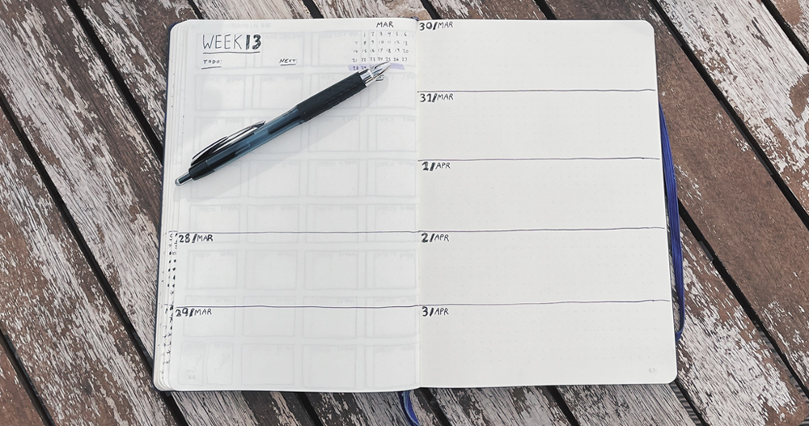
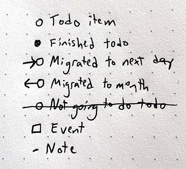

+++
date = "2021-03-26T10:31:38-05:00"
draft = false
title = "What Is a Bullet Journal, and Why I Love It"
categories = ["Guides"]
tags = ["Bullet Journaling", "Organization"]
featured = ["true"]
images=["/twitter-card-what-is-a-bullet-journal.jpg"]
summary = "My guide to what bullet journaling is and why I think it's such a good system for organization and also a system that can drive behavioral change."
+++

Bullet journaling changed my life–seriously! Bullet journaling changed the way I organize my life and is also a helpful system for discovering what is actually worth spending my mental energy on. I started bullet journaling almost exactly two years ago. I went down a deep rabbit hole of the "bujo" influencer community on social media (this is a real thing!), and then actually tried to keep my own journal. I've had a few people ask me for advice and recommendations, so here it is for them, and anyone else who finds this interesting.

  </img>
  

    
The empty weekly spread of my bullet journal.

  

## What Is Bullet Journaling?

Honestly, the [intro video](https://bulletjournal.com/pages/learn) on bulletjournal.com is really good and explains what bullet journaling is in a nutshell.

I like to describe it as a running to-do list, organized over various time domains, in addition to...whatever else you need it to be. For me, I use my bullet journal as a mini diary, to keep track of projects, ideas, goals, habits, and a large variety of lists.

### Time Domains

The heart of bullet journaling is, as I wrote above, splitting your life into time domains to keep track of to-dos and events. Traditionally, a bullet journal is broken down into the following time domains:

- A "future log" for the year
- A monthly section
- And then daily logs

I use a slightly modified system. I keep the future log and month sections, but I also create weekly "spreads" (basically, two open pages in a journal) to keep track of the current week.

You put tasks or events or notes into those time domains. For example, I might put my friend's wedding in September in the future log under September. Every month I would like to, say, call my Grandma, so I'll put that in the current month as a to-do item. And then daily to-dos go into their respective days: do laundry today, follow up on this work thing on Tuesday, etc.

### The Bullet Points/Symbols

Every item you write into these time domains gets assigned a symbol or a type of bullet point. Traditionally, you use a dash for a note, a bullet point for a to-do item, and an open circle for an event. You can tell this system was invented by a designer because this is a beautiful, legible-at-a-glance system of organizing information.

I happen to use slightly different symbols, inspired by [Amanda Rach Lee](https://www.instagram.com/amandarachlee/). I use an open circle for todos, fill in the circle for completed tasks, and an open box for events. It doesn't matter what symbols you choose, as long as you understand them, though.

  </img>
  

    
The symbols I use in my bullet journal.

  

### Migrations

The _key_ part of bullet journaling, though, and something that makes it a daily habit that actually helps you evaluate the things you are choosing to keep track of and spend mental energy on, though, is _migrating_ to-dos from one day to the next, or, deciding to move them to the monthly time domain.

For example, I have aspirations to organize my closet. I put it on tomorrow's section as a to-do item. At the end of the day, I scan the list of to-dos that are unfinished and decide what to do with them. I didn't organize my closet, so I mark it with a forwards arrow and add it to the next day. On that following day, though, I still haven't organized my closet. Should I move it up to the monthly time domain, as something to do soon, but not immediately? If so, mark it with a backward arrow, and add it to the monthly time-domain list.

Maybe I've migrated a task over and over again from one day to the next. Now it's time to evaluate: is this to-do worth the mental energy and space it is taking up? Will I do it tomorrow or this month? The answer might be no, so then I simply cross it off. The act of migrating, and looking at patterns in what I actually do and don't do, is really helpful for me in deciding what to prioritize. This prioritization has been one of the best things about bullet journaling for me: that extra clarity into what is actually important.

This is where bullet journaling can change from an organizational system into a system that can help change your _behavior_.

### The Index and Freedom For...Anything

The final important note about understanding the bullet journal system is the concept of an index. The only "rule" of a bullet journal is that the pages are numbered. This is important because you set aside a few pages at the beginning of the notebook or journal for an index, and then whatever you add to the subsequent pages gets added to the index.

This sounds simple but is very freeing. On pages 2 and 3 I have, say, my January monthly spread. Pages 4 and 5 are the first week of January. But all of a sudden, I want to start planning for a trip I'm taking this summer, and think my bullet journal is a great place to store those notes and lists. Instead of setting aside pages in another section or something, I just make pages 6 and 7 my travel planning pages. I add them to the index, and then the second week of January gets added after them. If I realize I need more pages for my travel plans, I can just add them to the next open page, even if they aren't directly behind the other travel pages. The index is the single source of truth for organization, and that allows me to not stress and try to save pages that I may nor may not need for a given project.

Somehow, this also frees my bullet journal into being...whatever I want it to be! It's not just a task list and a calendar. It can be all those things but also a place for quotes I like, a financial planner, a habit tracker, a space for doodles, a gratitude journal, notes on how to care for my houseplants, truly, anything. I just have to stick whatever I do in the index, and now it's a part of my bullet journal, no matter how disparate it may seem.

## Why This Works for Me

I was the type of person to get into bed, and then before falling asleep, I would grab my phone and write myself an email about the things I wanted to do the following day. My inbox is _littered_ with, frankly, absurd to-do list emails written to myself right before I fell asleep. I would keep random lists of stuff I wanted to do on scraps of paper. I would keep notes on my phone about doctor's visits, movies I wanted to watch, all kinds of stuff. I didn't have a single, coherent system for organizing this, and, honestly, the anxiety that comes with it.

My bullet journal gives me one place for everything. Its free-form nature combined with the time domain system is so freeing for me. I can put anything I want in there, and because of the concept of an index, I can also find anything with relative ease. It's been hugely freeing for me.

Do you bullet journal? I love learning about how people use journals or organization systems, whether it's a bullet journal or some other method, so please [send me a Tweet](https://twitter.com/lieblhan) or email me (first name dot last name at gmail dot com!) if you want to chat more.
